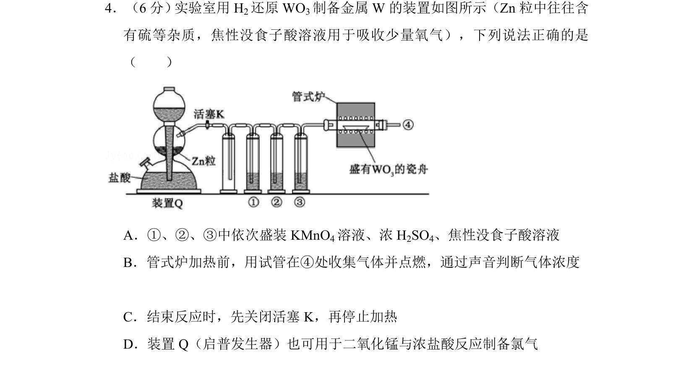
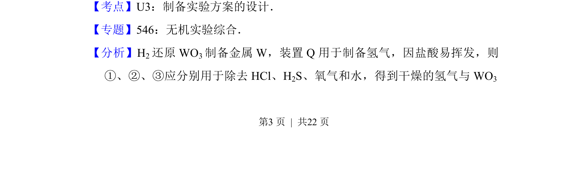
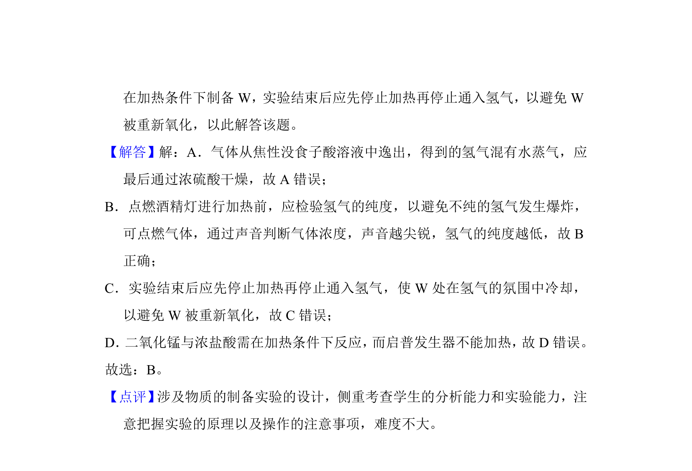

## 题面

## 摘要

实验室制备金属钨，考查氢气还原WO3的装置除杂、操作顺序及启普发生器适用条件。

## 关联考点

- [[制备实验方案的设计]]
- [[气体的除杂与干燥]]
- [[启普发生器的使用]]
- [[实验操作安全]]

## 答案与解析

> 📄 原 PDF 第 3 页：`素材/真题/湖南/2008-2024·（湖南）化学高考真题/2017年高考化学试卷（新课标Ⅰ）（解析卷）.pdf`
