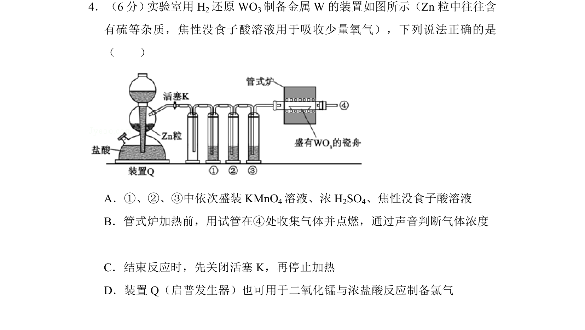
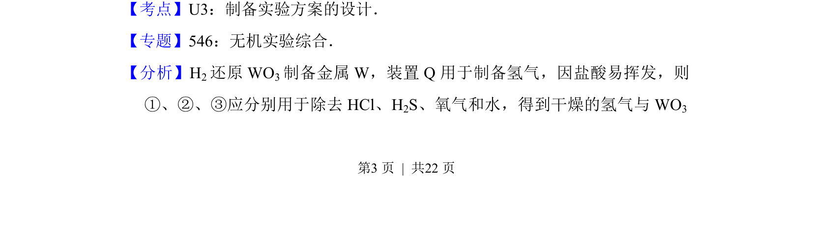
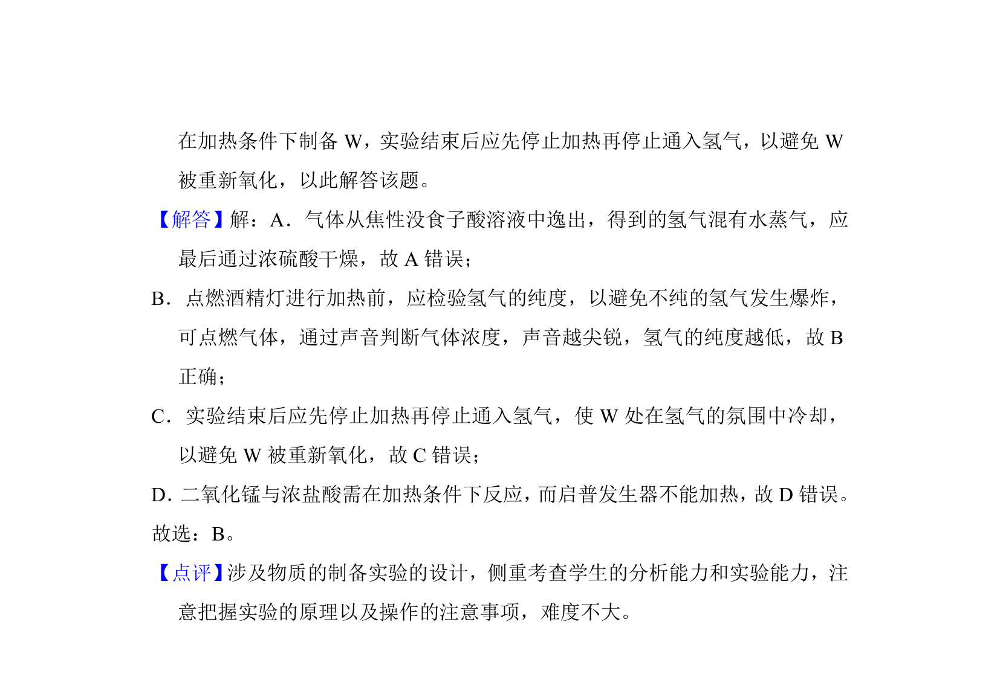

## 题面

## 摘要

实验室制备金属钨，考查氢气还原WO3的装置除杂、操作顺序及启普发生器适用条件。

## 关联考点

- [[制备实验方案的设计]]
- [[气体的除杂与干燥]]
- [[启普发生器的使用]]
- [[实验操作安全]]

## 答案与解析

> 📄 原 PDF 第 3 页：`素材/真题/湖南/2008-2024·（湖南）化学高考真题/2017年高考化学试卷（新课标Ⅰ）（解析卷）.pdf`

<!-- 题干文本-start -->
## 题干文本
4．（6分） 实验室用H2还原WO 3制备金属W的装置如图所示（Zn粒中往往含
有硫等杂质，焦性没食子酸溶液用于吸收少量氧气），下列说法正确的是
（　　）
A．①、②、③中依次盛装KMnO 4溶液、浓H 2SO4、焦性没食子酸溶液
B．管式炉加热前，用试管在④处收集气体并点燃，通过声音判断气体浓度
C．结束反应时，先关闭活塞K，再停止加热
D．装置Q（启普发生器）也可用于二氧化锰与浓盐酸反应制备氯气
<!-- 题干文本-end -->

<!-- 解析文本-start -->
## 解析文本
【考点】U3：制备实验方案的设计．菁优网版权所有
【专题】546：无机实验综合．
【分析】H2还原WO 3制备金属W，装置Q用于制备氢气，因盐酸易挥发，则
①、②、③应分别用于除去HCl、H 2S、氧气和水，得到干燥的氢气与WO 3
<!-- 解析文本-end -->
