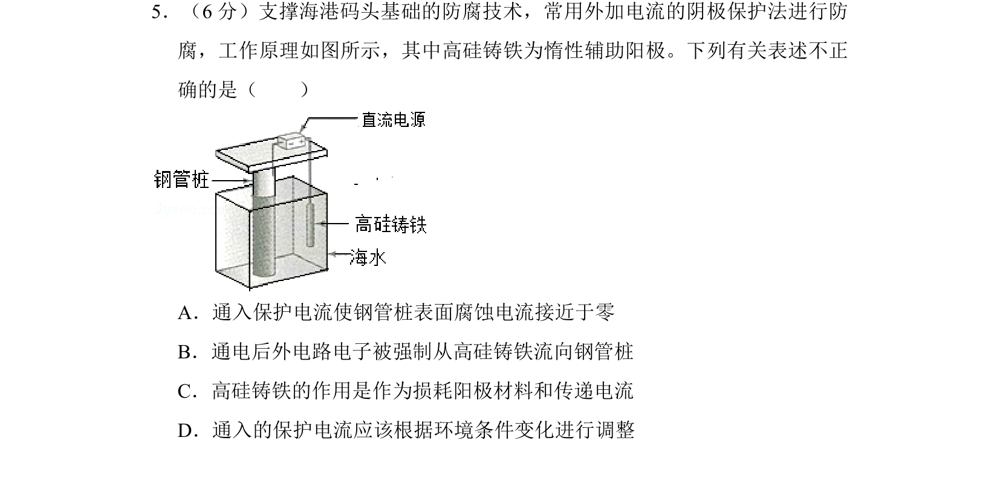
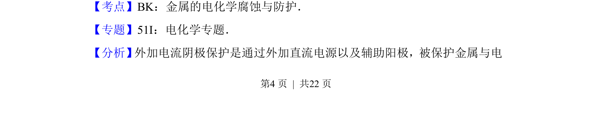
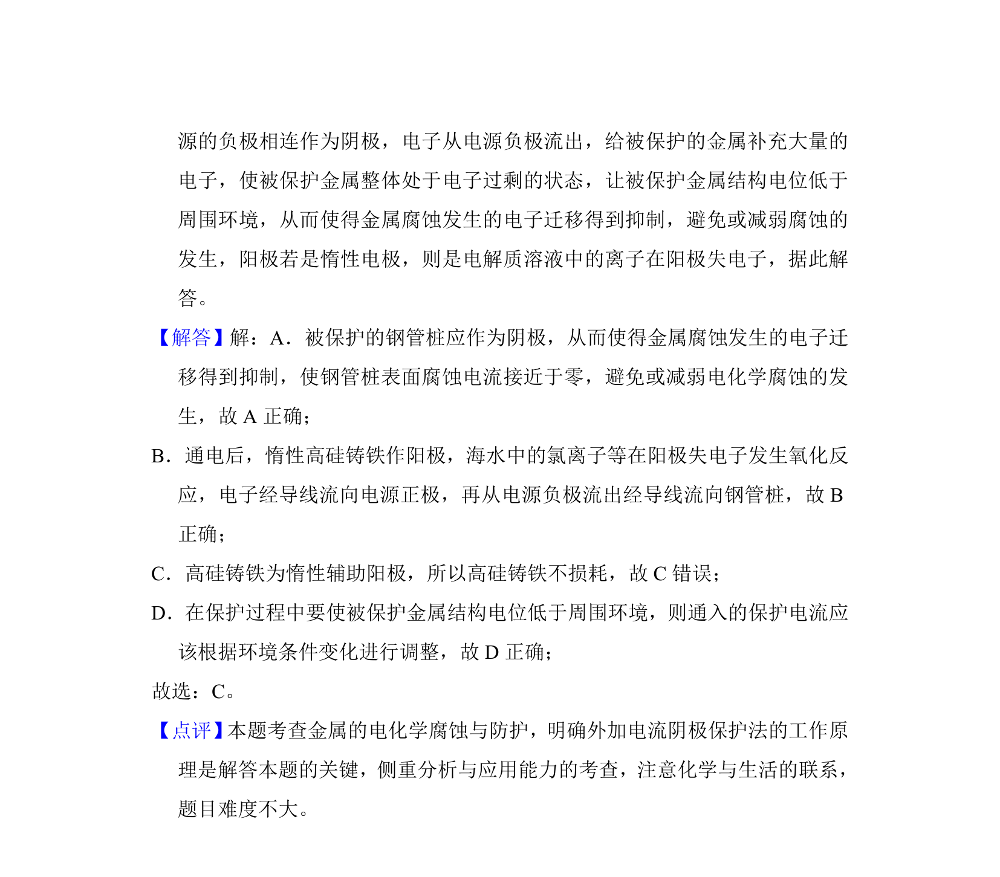

## 题面

## 摘要

考查外加电流阴极保护法原理，分析钢管桩、高硅铸铁作用及电流调节。

## 关联考点

- [[962-金属的电化学腐蚀与防护|金属的电化学腐蚀与防护]]
- [[外加电流阴极保护]]
- [[368-电解池|电解池]]

## 答案与解析

> 📄 原 PDF 第 4 页：`素材/真题/湖南/2008-2024·（湖南）化学高考真题/2017年高考化学试卷（新课标Ⅰ）（解析卷）.pdf`
