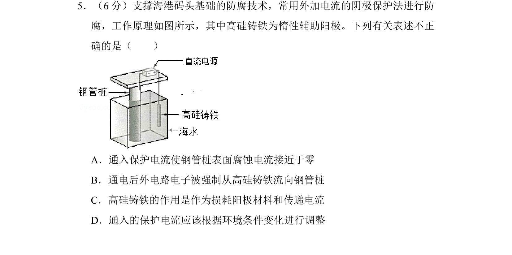
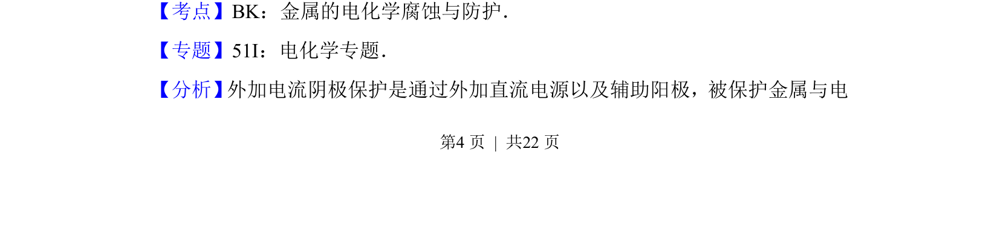
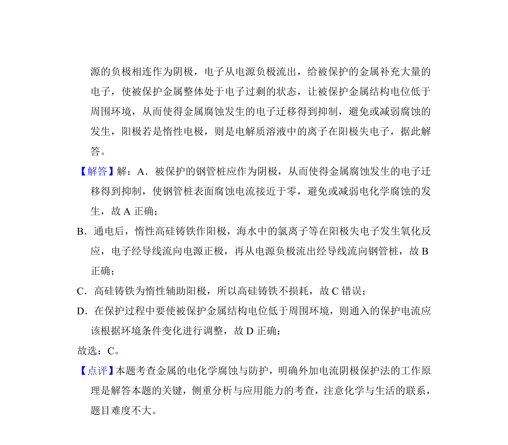

## 题面

## 摘要

考查外加电流阴极保护法原理，分析钢管桩、高硅铸铁作用及电流调节。

## 关联考点

- [[962-金属的电化学腐蚀与防护|金属的电化学腐蚀与防护]]
- [[外加电流阴极保护]]
- [[368-电解池|电解池]]

## 答案与解析

> 📄 原 PDF 第 4 页：`素材/真题/湖南/2008-2024·（湖南）化学高考真题/2017年高考化学试卷（新课标Ⅰ）（解析卷）.pdf`

<!-- 题干文本-start -->
## 题干文本
5．（6分）支撑海港码头基础的防腐技术，常用外加电流的阴极保护法进行防
腐，工作原理如图所示，其中高硅铸铁为惰性辅助阳极。下列有关表述不正
确的是（　　）
A．通入保护电流使钢管桩表面腐蚀电流接近于零
B．通电后外电路电子被强制从高硅铸铁流向钢管桩
C．高硅铸铁的作用是作为损耗阳极材料和传递电流
D．通入的保护电流应该根据环境条件变化进行调整
<!-- 题干文本-end -->

<!-- 解析文本-start -->
## 解析文本
【考点】BK：金属的电化学腐蚀与防护．菁优网版权所有
【专题】51I：电化学专题．
【分析】 外加电流阴极保护是通过外加直流电源以及辅助阳极，被保护金属与电
<!-- 解析文本-end -->
