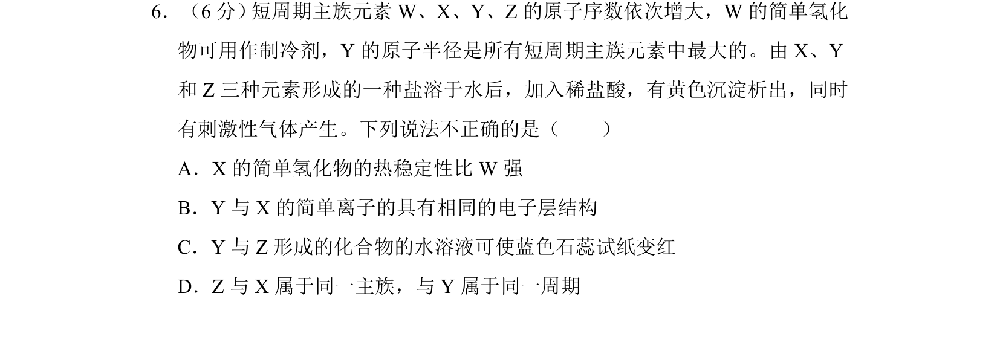
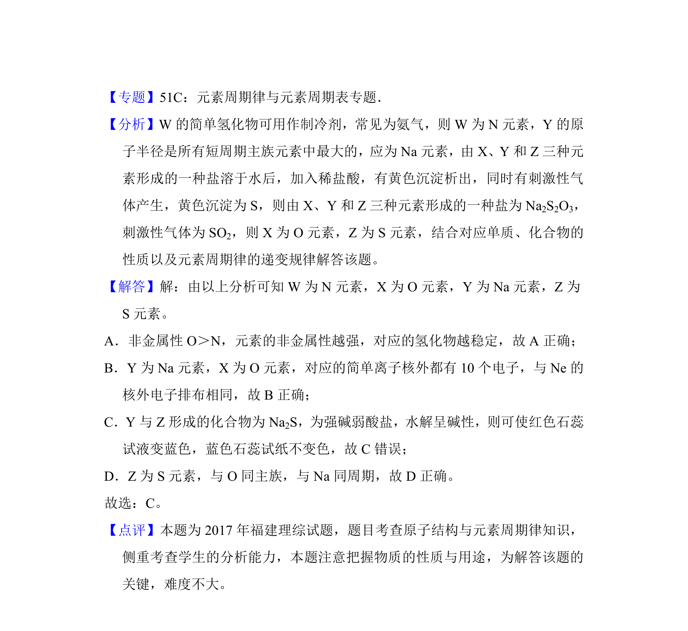

## 题面

## 摘要

考查短周期元素推断及元素周期律、物质性质判断。

## 关联考点

- [[530-原子结构与元素周期律|原子结构与元素周期律]]
- [[597-元素推断|元素推断]]
- [[氢化物热稳定性]]
- [[物质水溶液酸碱性]]

## 答案与解析

> 📄 原 PDF 第 5 页：`素材/真题/湖南/2008-2024·（湖南）化学高考真题/2017年高考化学试卷（新课标Ⅰ）（解析卷）.pdf`
