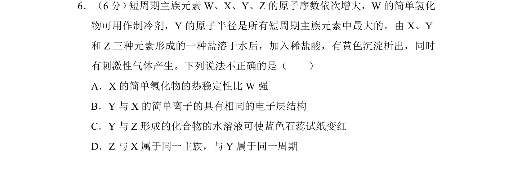
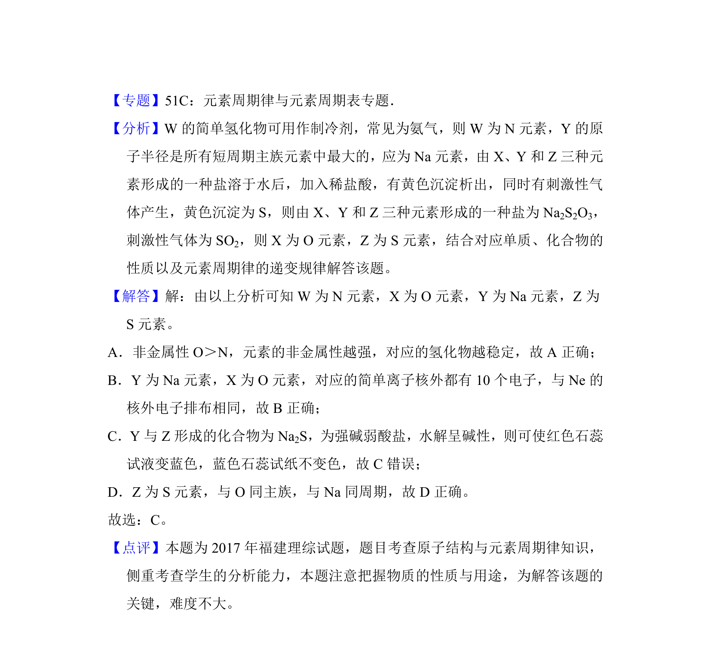

## 题面

## 摘要

考查短周期元素推断及元素周期律、物质性质判断。

## 关联考点

- [[530-原子结构与元素周期律|原子结构与元素周期律]]
- [[597-元素推断|元素推断]]
- [[氢化物热稳定性]]
- [[物质水溶液酸碱性]]

## 答案与解析

> 📄 原 PDF 第 5 页：`素材/真题/湖南/2008-2024·（湖南）化学高考真题/2017年高考化学试卷（新课标Ⅰ）（解析卷）.pdf`

<!-- 题干文本-start -->
## 题干文本
6．（6分） 短周期主族元素W、X、Y、Z的原子序数依次增大，W的简单氢化
物可用作制冷剂，Y的原子半径是所有短周期主族元素中最大的。由X、Y
和Z三种元素形成的一种盐溶于水后，加入稀盐酸，有黄色沉淀析出，同时
有刺激性气体产生。下列说法不正确的是（　　）
A．X的简单氢化物的热稳定性比W强
B．Y与X的简单离子的具有相同的电子层结构
C．Y与Z形成的化合物的水溶液可使蓝色石蕊试纸变红
D．Z与X属于同一主族，与Y属于同一周期
<!-- 题干文本-end -->

<!-- 解析文本-start -->
## 解析文本
【考点】8F：原子结构与元素周期律的关系．菁优网版权所有
<!-- 解析文本-end -->
