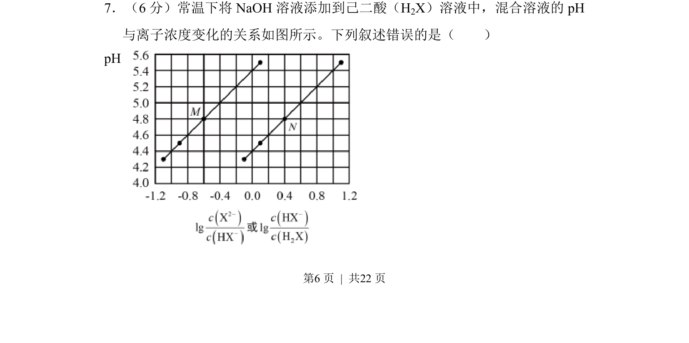
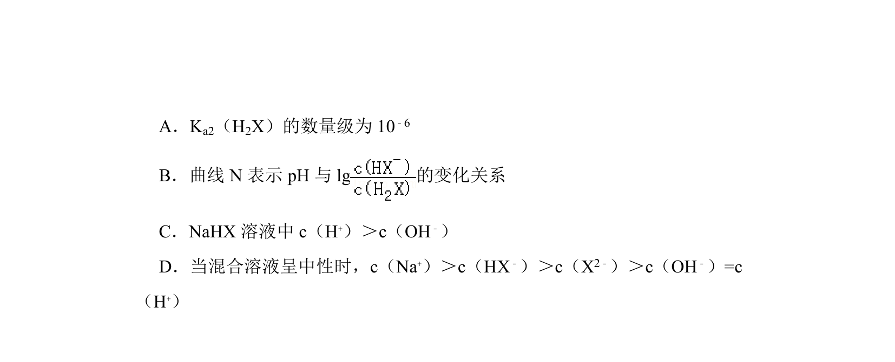
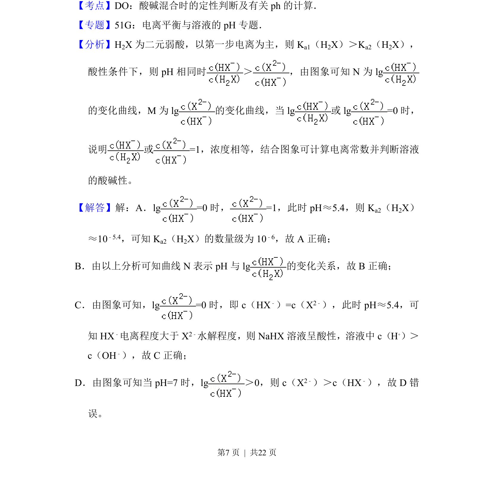
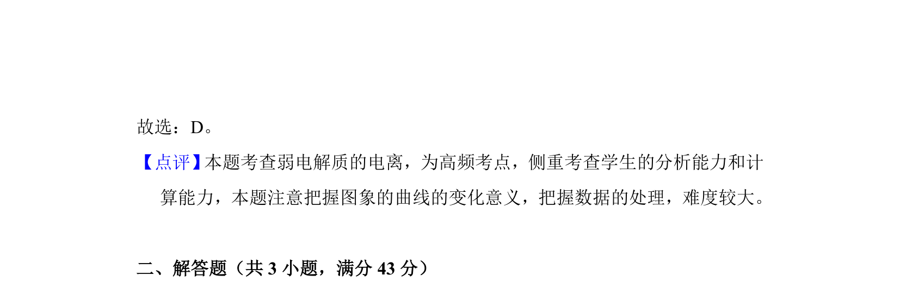

## 题面

## 摘要

考查NaOH滴定二元酸H2X时pH与离子浓度变化关系的图像分析与判断。

## 关联考点

- [[340-酸碱中和滴定|酸碱中和滴定]]
- [[分布系数与离子浓度比]]
- [[溶液pH计算]]
- [[564-图像分析|图像分析]]

## 答案与解析

> 📄 原 PDF 第 6 页：`素材/真题/湖南/2008-2024·（湖南）化学高考真题/2017年高考化学试卷（新课标Ⅰ）（解析卷）.pdf`
