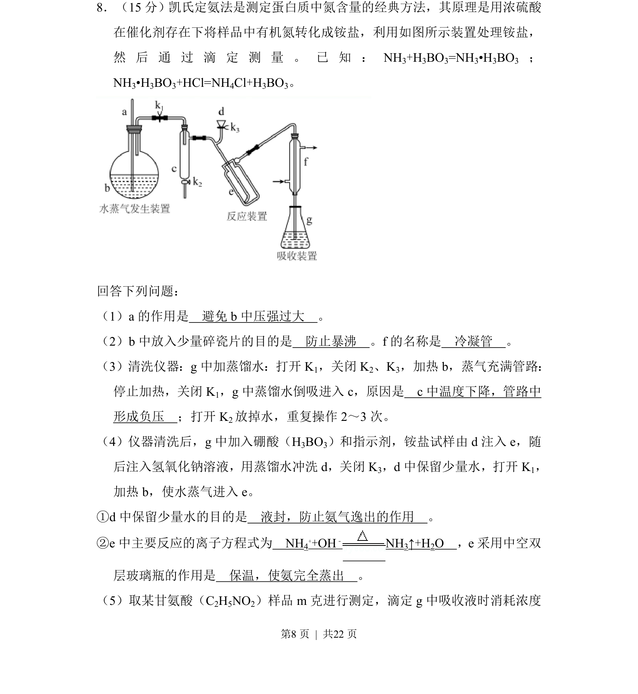
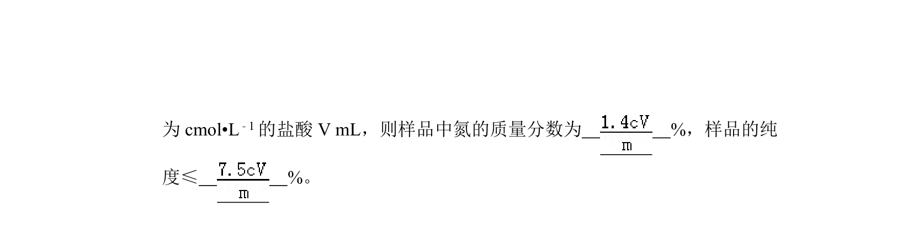
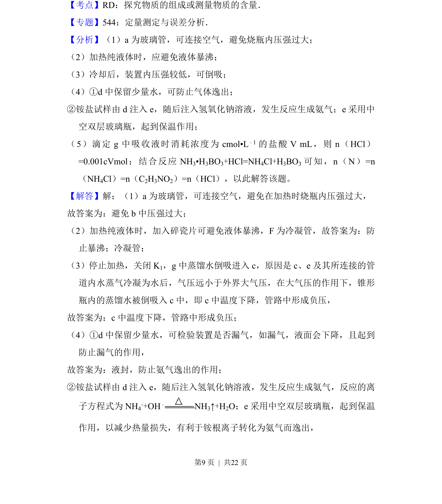
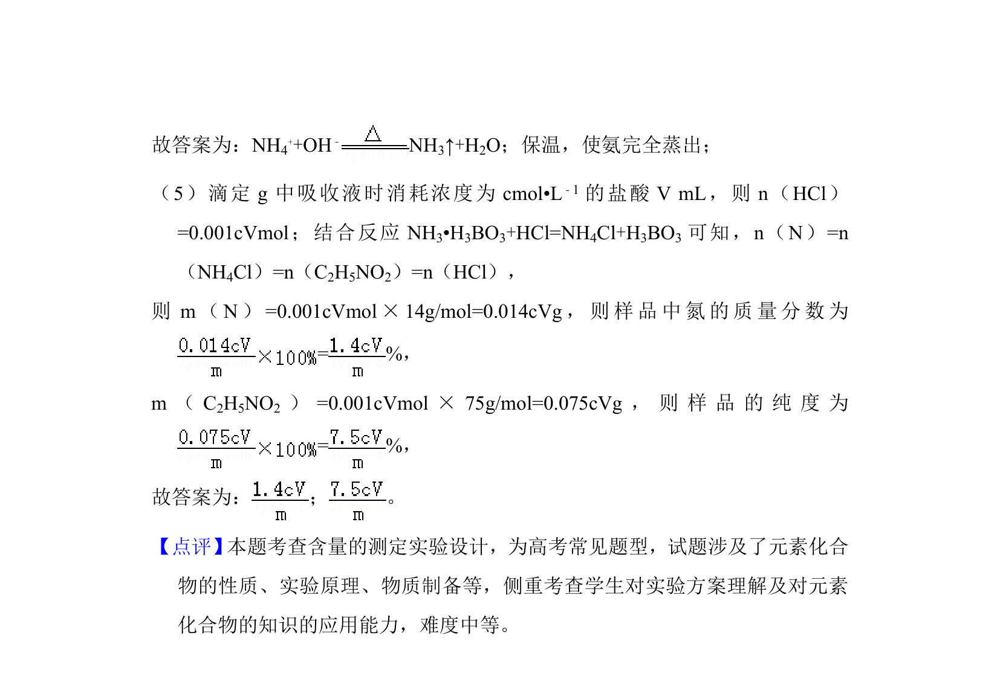

## 题面

## 摘要

考查凯氏定氮法实验装置、操作及原理，涉及安全、防暴沸、倒吸、液封、离子方程式和保温作用。

## 关联考点

- [[997-实验装置分析|实验装置分析]]
- [[667-实验操作与安全|实验操作与安全]]
- [[806-离子方程式书写|离子方程式书写]]
- [[定量测定原理]]

## 答案与解析

> 📄 原 PDF 第 8 页：`素材/真题/湖南/2008-2024·（湖南）化学高考真题/2017年高考化学试卷（新课标Ⅰ）（解析卷）.pdf`
