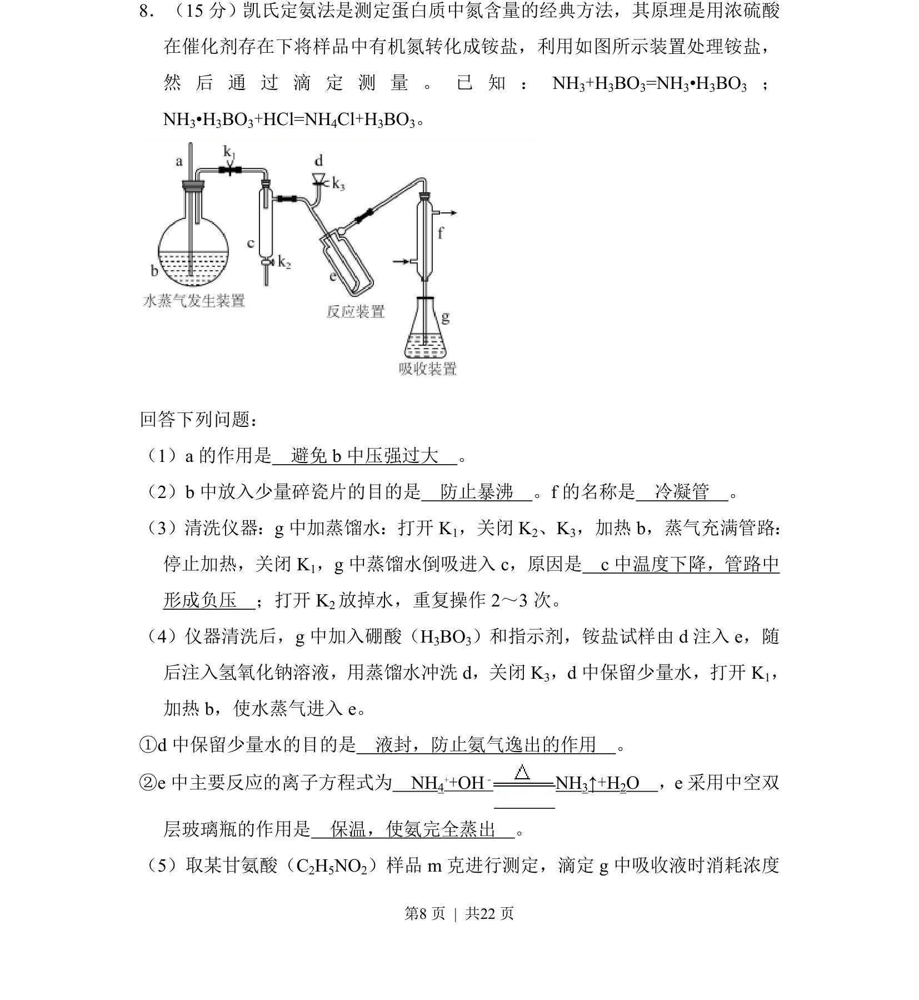
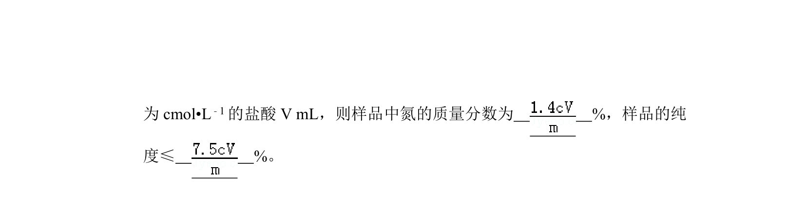
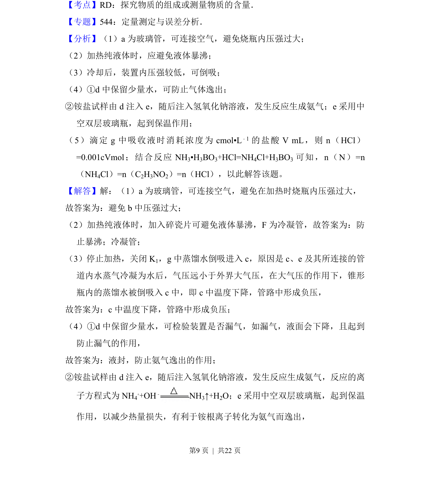
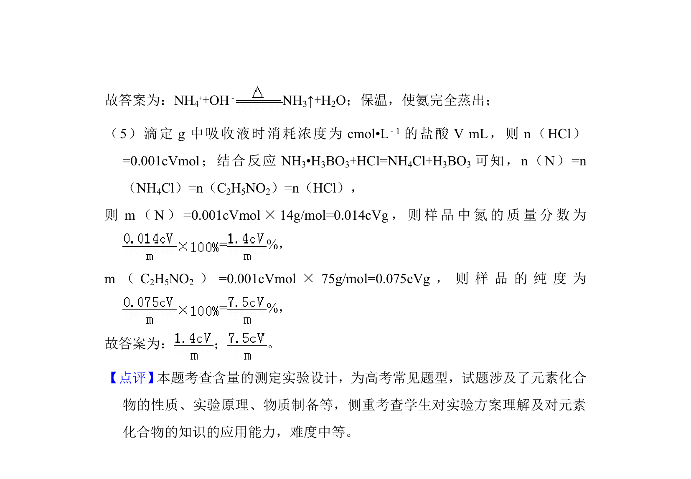

## 题面

## 摘要

考查凯氏定氮法实验装置、操作及原理，涉及安全、防暴沸、倒吸、液封、离子方程式和保温作用。

## 关联考点

- [[997-实验装置分析|实验装置分析]]
- [[667-实验操作与安全|实验操作与安全]]
- [[807-离子方程式的书写|离子方程式书写]]
- [[定量测定原理]]

## 答案与解析

> 📄 原 PDF 第 8 页：`素材/真题/湖南/2008-2024·（湖南）化学高考真题/2017年高考化学试卷（新课标Ⅰ）（解析卷）.pdf`

<!-- 题干文本-start -->
## 题干文本
8．（15分）凯氏定氨法是测定蛋白质中氮含量的经典方法，其原理是用浓硫酸
在催化剂存在下将样品中有机氮转化成铵盐，利用如图所示装置处理铵盐，
然 后 通 过 滴 定 测 量 。 已 知 ：NH 3+H3BO3=NH3•H3BO3 ；
NH3•H3BO3+HCl=NH4Cl+H3BO3。
回答下列问题：
（1）a的作用是　避免b中压强过大　。
（2）b中放入少量碎瓷片的目的是　防止暴沸　。f的名称是　冷凝管　。
（3）清洗仪器：g中加蒸馏水：打开K 1，关闭K 2、K3，加热b，蒸气充满管路：
停止加热，关闭K 1，g中蒸馏水倒吸进入c，原因是　c中温度下降，管路中
形成负压　；打开K 2放掉水，重复操作2～3次。
（4）仪器清洗后，g中加入硼酸（H 3BO3）和指示剂，铵盐试样由d注入e，随
后注入氢氧化钠溶液，用蒸馏水冲洗d，关闭K 3，d中保留少量水，打开K 1，
加热b，使水蒸气进入e。
①d中保留少量水的目的是　液封，防止氨气逸出的作用　。
②e中主要反应的离子方程式为　NH 4
++OH﹣ NH3↑+H2O　，e采用中空双
层玻璃瓶的作用是　保温，使氨完全蒸出　。
（5）取某甘氨酸（C2H5NO2）样品m克进行测定，滴定g中吸收液时消耗浓度
<!-- 题干文本-end -->

<!-- 解析文本-start -->
## 解析文本

<!-- 解析文本-end -->
