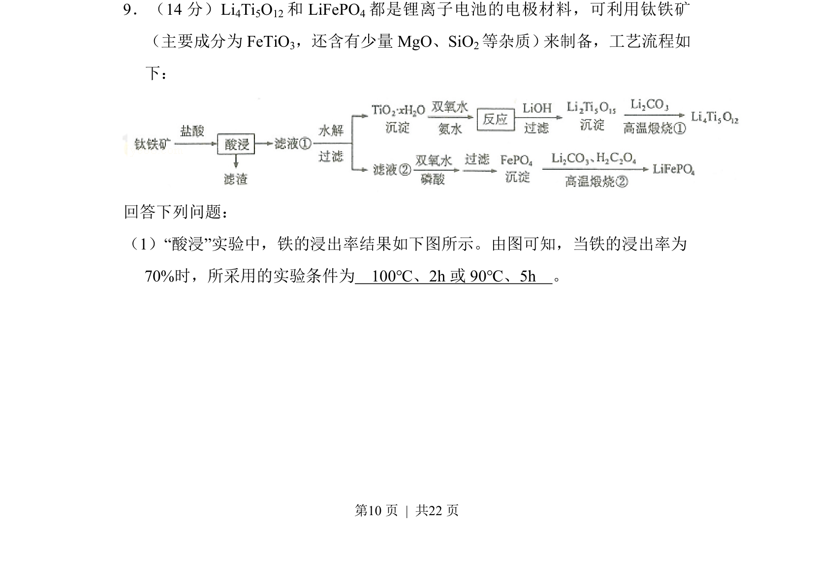
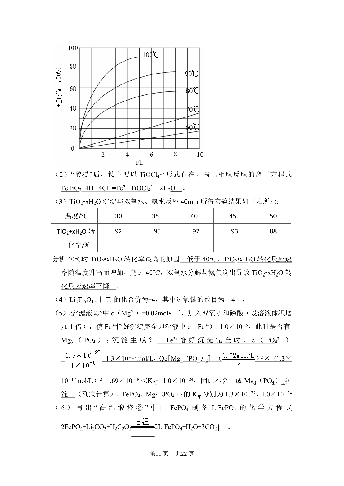
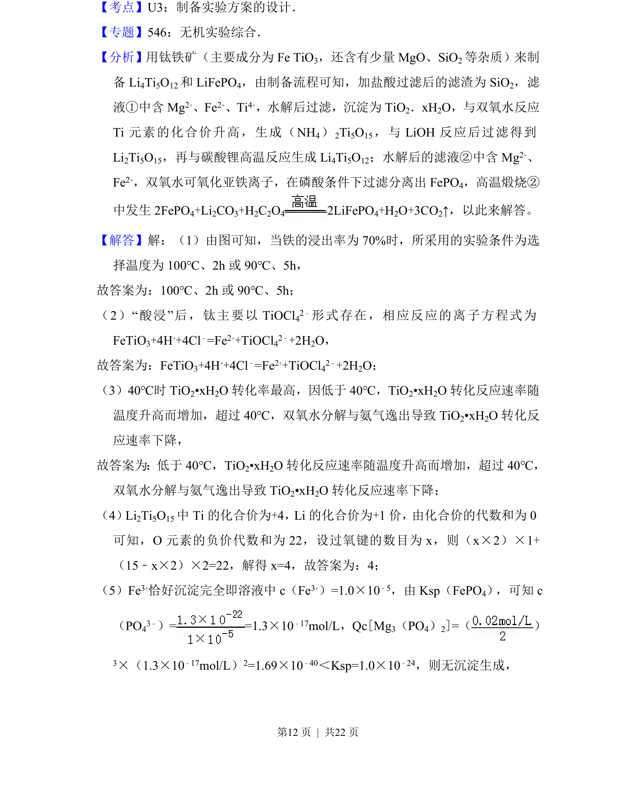
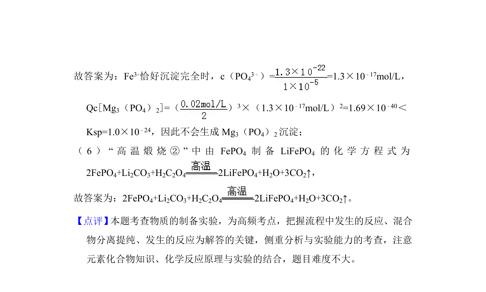

## 题面

## 摘要

该题考查根据酸浸中铁的浸出率图，选择满足条件的实验温度与时间。

## 关联考点

- [[化学反应条件控制]]
- [[564-图像分析|图像分析]]
- [[无机工艺流程]]

## 答案与解析

> 📄 原 PDF 第 10 页：`素材/真题/湖南/2008-2024·（湖南）化学高考真题/2017年高考化学试卷（新课标Ⅰ）（解析卷）.pdf`

<!-- 题干文本-start -->
## 题干文本
9．（14分）Li 4Ti5O12和LiFePO 4都是锂离子电池的电极材料，可利用钛铁矿
（主要成分为FeTiO 3，还含有少量MgO、SiO 2等杂质） 来制备，工艺流程如
下：
回答下列问题：
（1）“酸浸”实验中，铁的浸出率结果如下图所示。由图可知，当铁的浸出率为
70%时，所采用的实验条件为　100℃、2h或90℃、5h　。
<!-- 题干文本-end -->

<!-- 解析文本-start -->
## 解析文本

<!-- 解析文本-end -->
