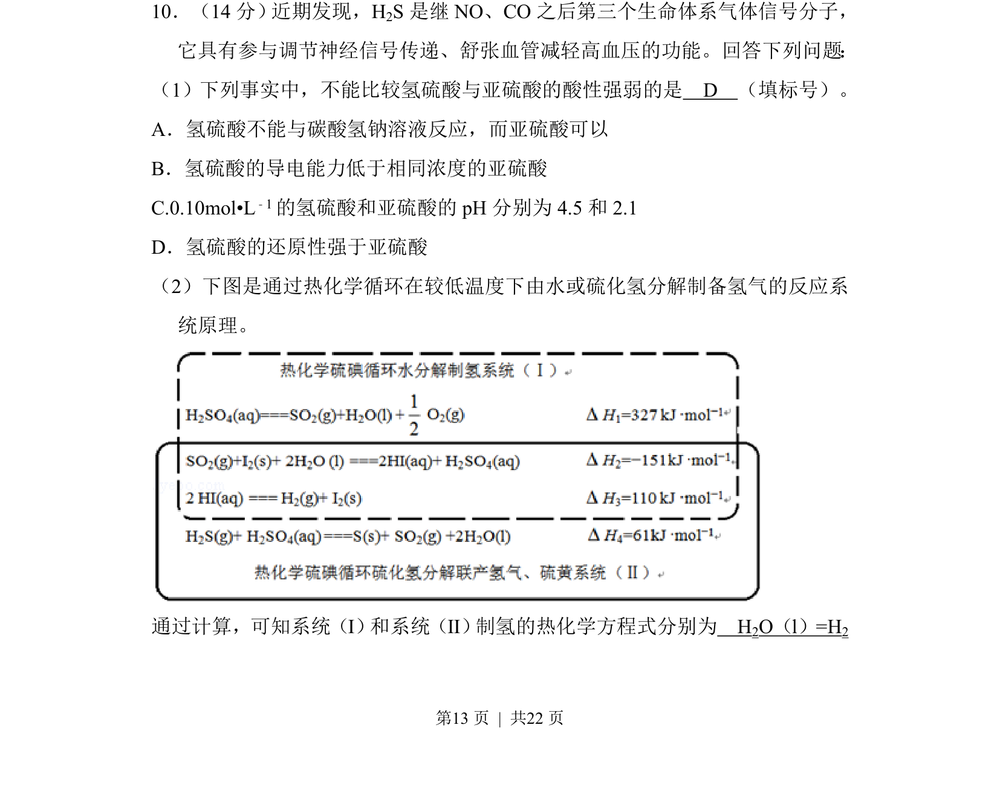
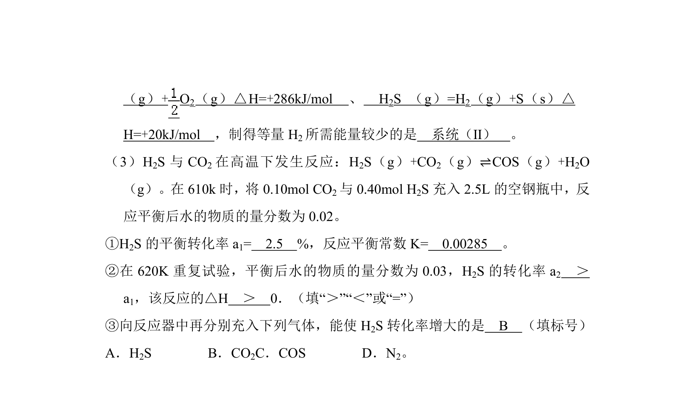
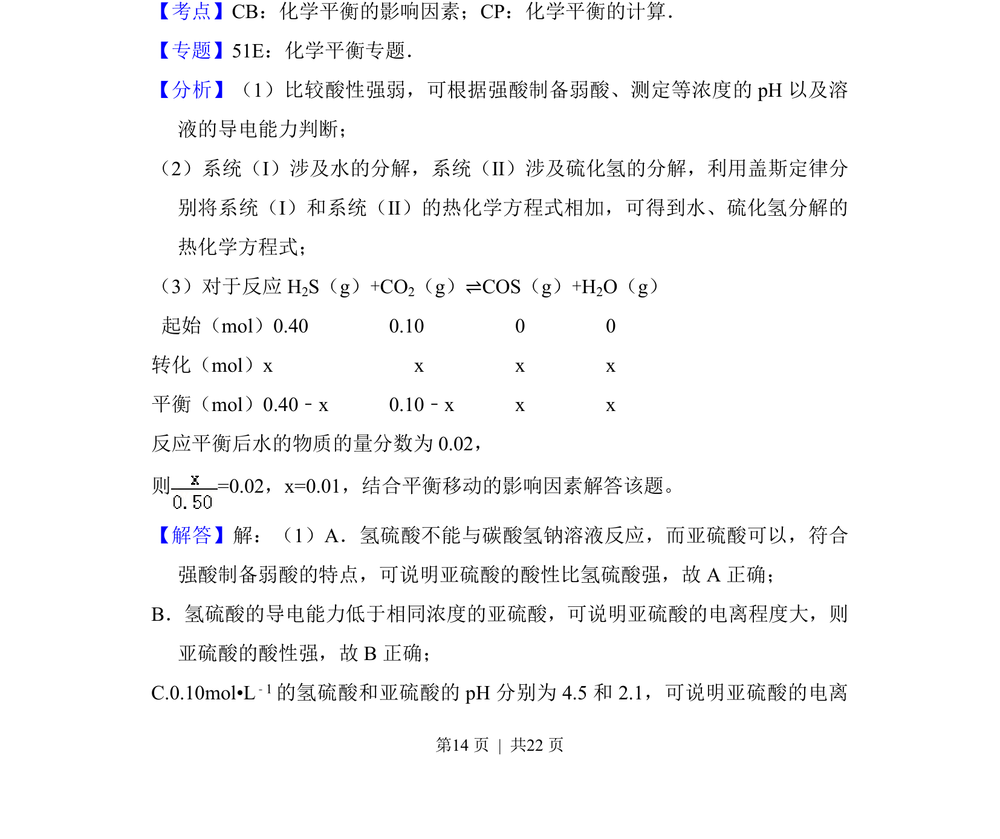
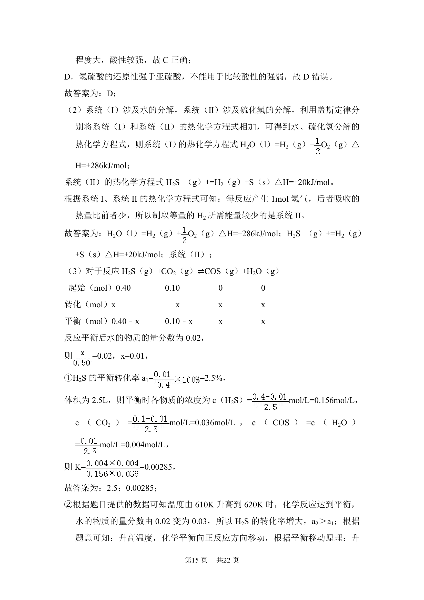
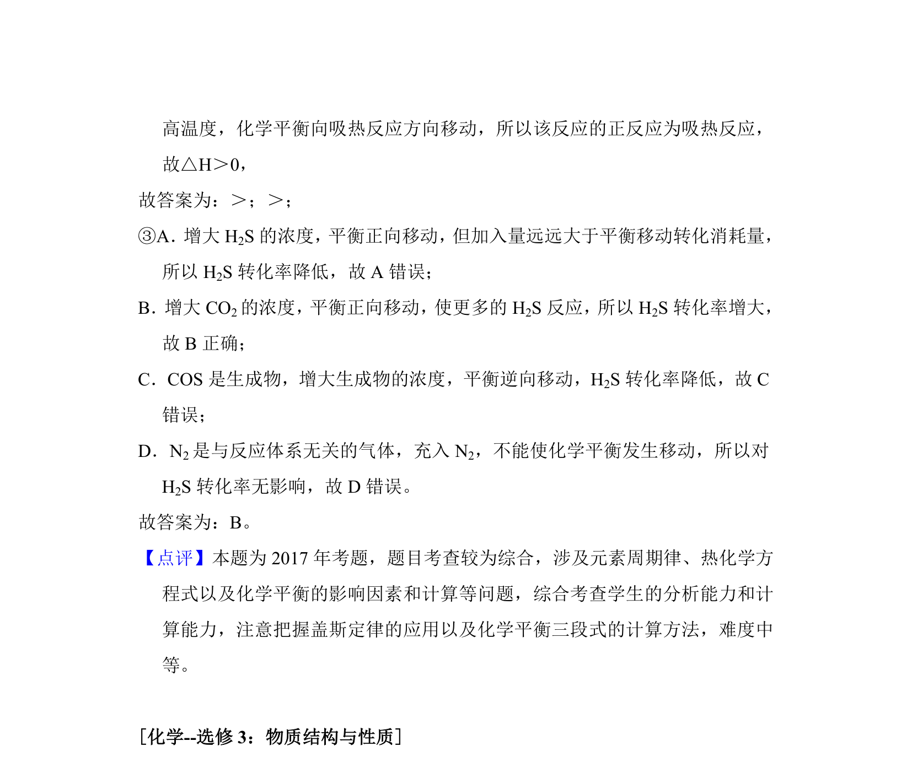

## 题面

## 摘要

本题通过实验事实比较氢硫酸与亚硫酸酸性强弱，并涉及热化学循环制氢方程式的书写。

## 关联考点

- [[852-酸性比较|酸性比较]]
- [[309-热化学方程式|热化学方程式]]
- [[还原性]]

## 答案与解析

> 📄 原 PDF 第 13 页：`素材/真题/湖南/2008-2024·（湖南）化学高考真题/2017年高考化学试卷（新课标Ⅰ）（解析卷）.pdf`
