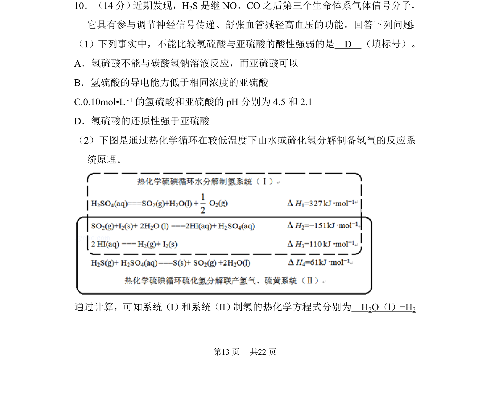
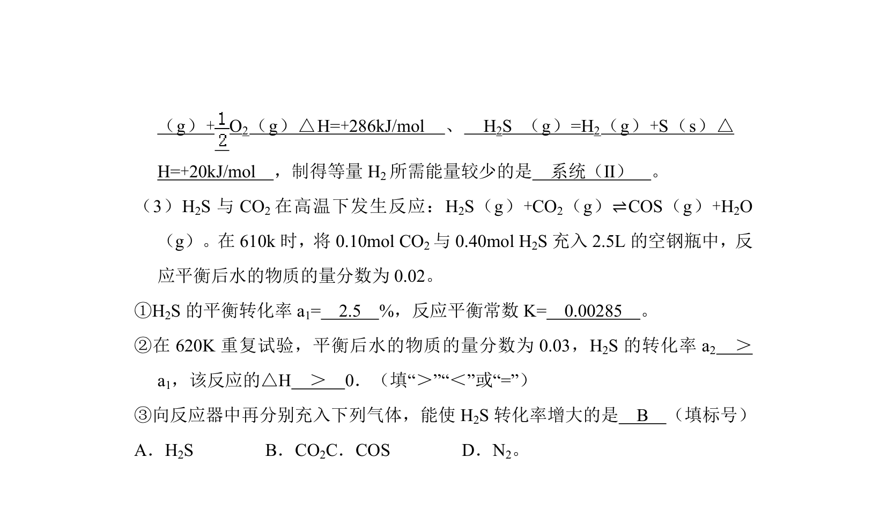
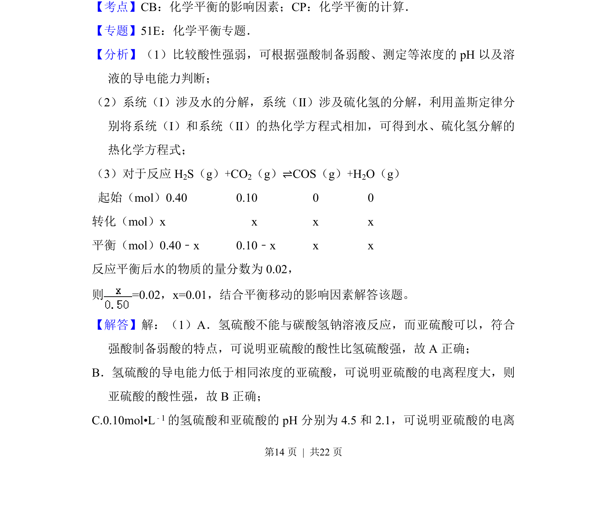
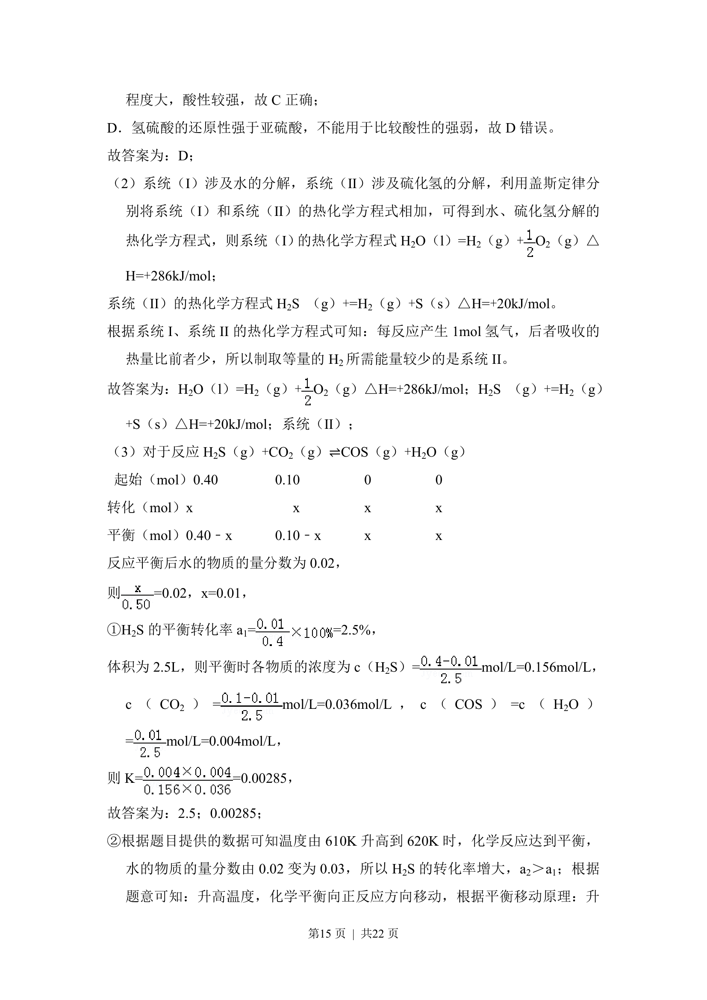
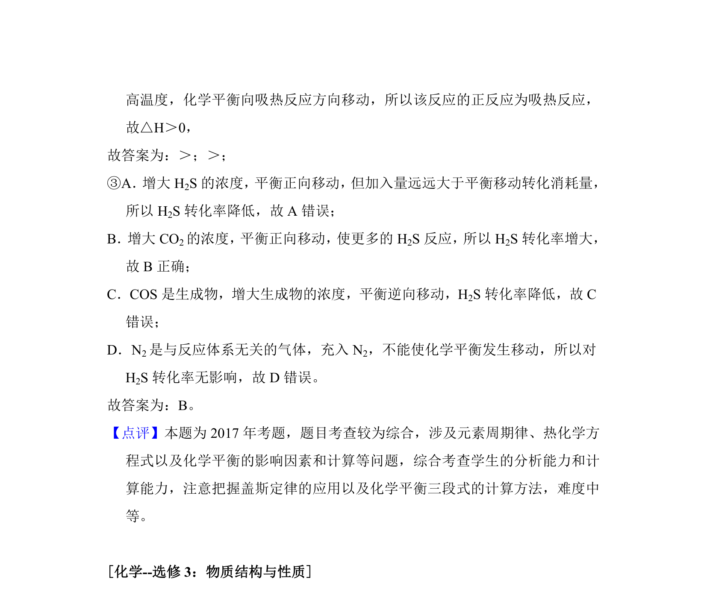

## 题面

## 摘要

本题通过实验事实比较氢硫酸与亚硫酸酸性强弱，并涉及热化学循环制氢方程式的书写。

## 关联考点

- [[852-酸性比较|酸性比较]]
- [[309-热化学方程式|热化学方程式]]
- [[还原性]]

## 答案与解析

> 📄 原 PDF 第 13 页：`素材/真题/湖南/2008-2024·（湖南）化学高考真题/2017年高考化学试卷（新课标Ⅰ）（解析卷）.pdf`

<!-- 题干文本-start -->
## 题干文本
10．（14分） 近期发现，H2S是继NO、CO之后第三个生命体系气体信号分子，
它具有参与调节神经信号传递、舒张血管减轻高血压的功能。回答下列问题：
（1）下列事实中，不能比较氢硫酸与亚硫酸的酸性强弱的是　D　（填标号）。
A．氢硫酸不能与碳酸氢钠溶液反应，而亚硫酸可以
B．氢硫酸的导电能力低于相同浓度的亚硫酸
C.0.10mol•L﹣1的氢硫酸和亚硫酸的pH分别为4.5和2.1
D．氢硫酸的还原性强于亚硫酸
（2）下图是通过热化学循环在较低温度下由水或硫化氢分解制备氢气的反应系
统原理。
通过计算，可知系统（Ⅰ） 和系统（Ⅱ） 制氢的热化学方程式分别为　H2O（l）=H2
<!-- 题干文本-end -->

<!-- 解析文本-start -->
## 解析文本

<!-- 解析文本-end -->
