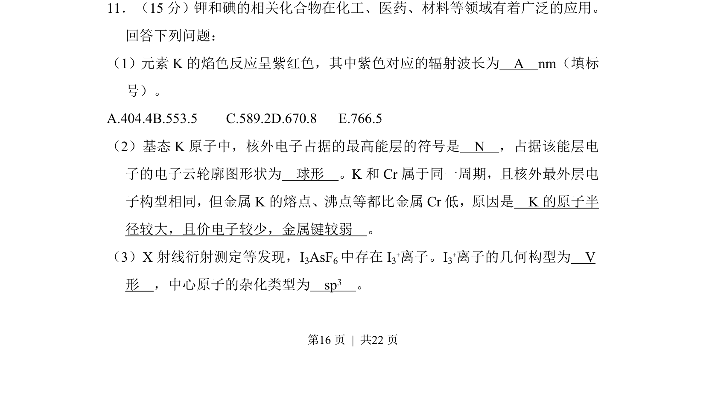
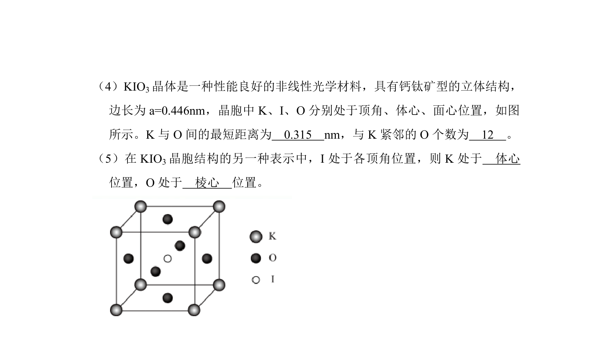
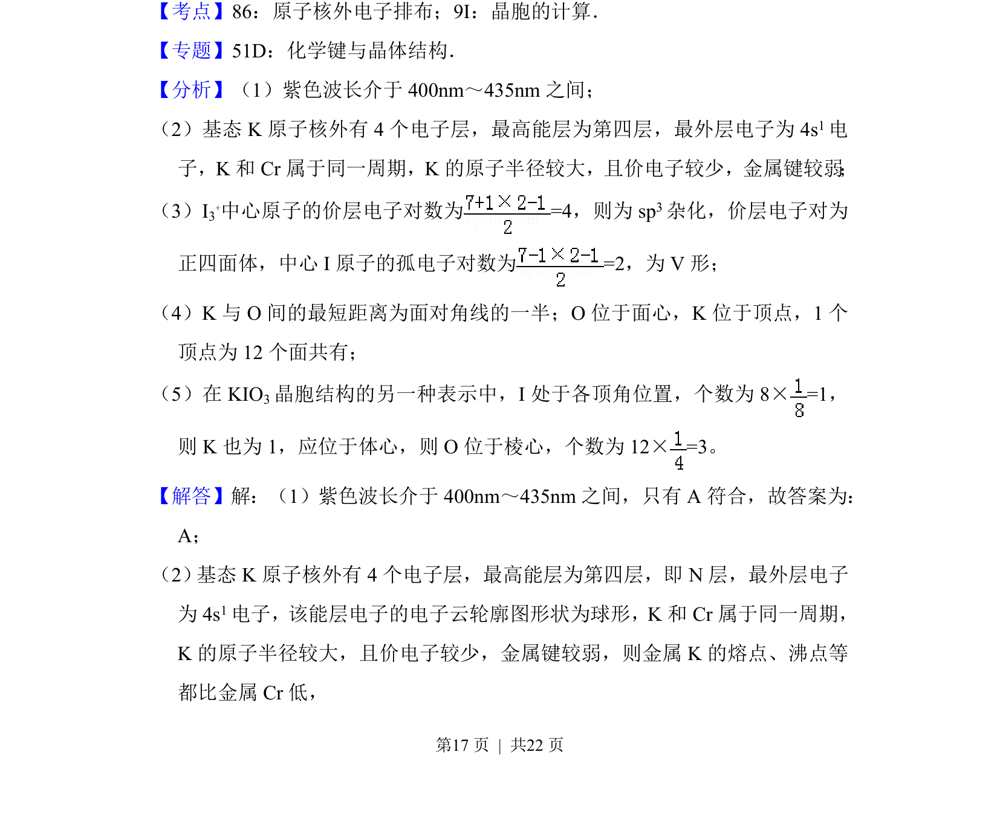
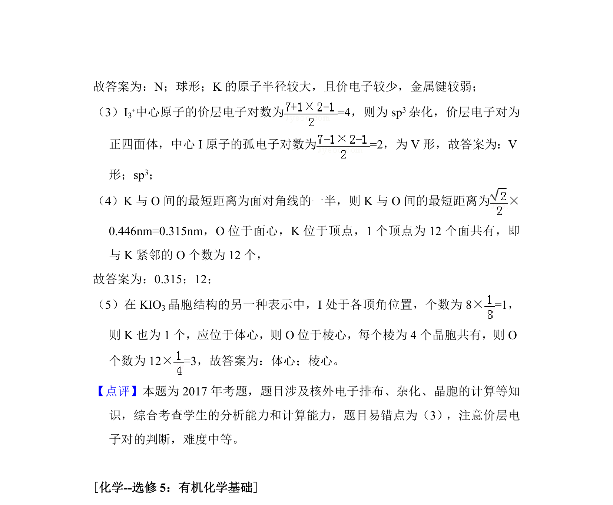

## 题面

## 摘要

一道题综合考查钾元素性质，涉及焰色反应、电子排布、金属键及离子构型杂化。

## 关联考点

- [[焰色反应波长]]
- [[电子云形状]]
- [[金属键强弱]]
- [[杂化与VSEPR]]

## 答案与解析

> 📄 原 PDF 第 16 页：`素材/真题/湖南/2008-2024·（湖南）化学高考真题/2017年高考化学试卷（新课标Ⅰ）（解析卷）.pdf`
