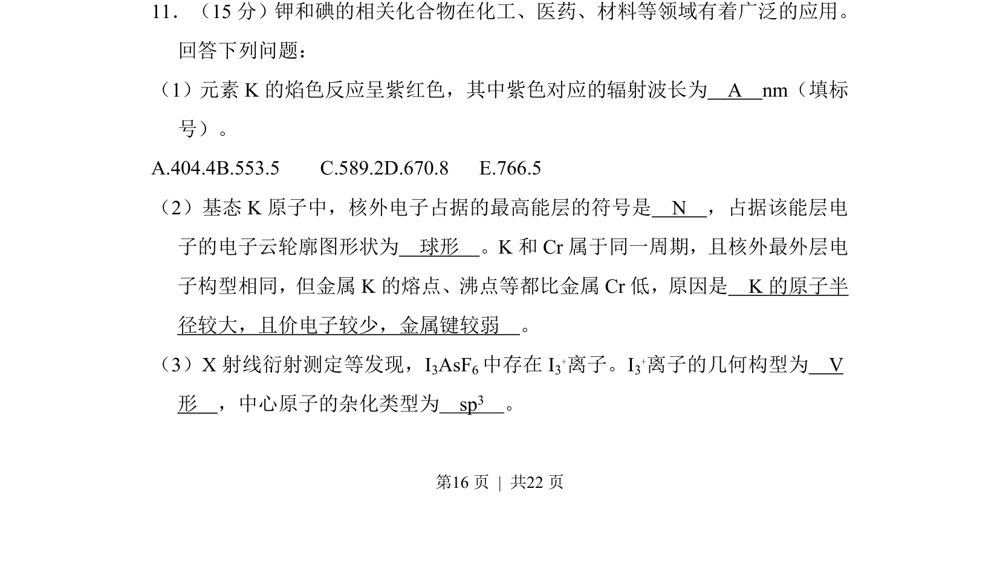
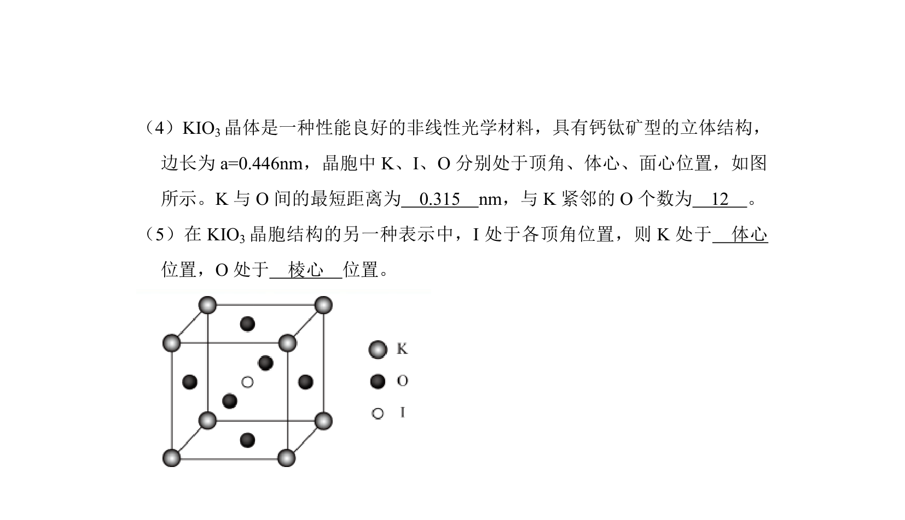
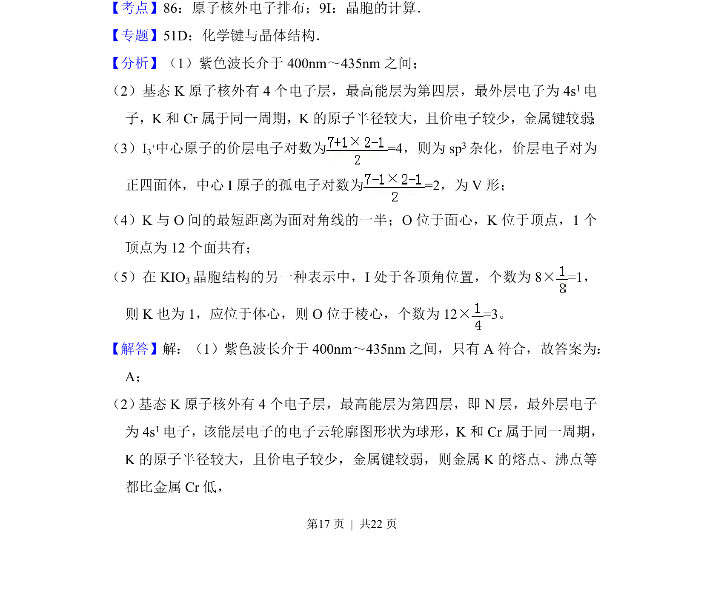
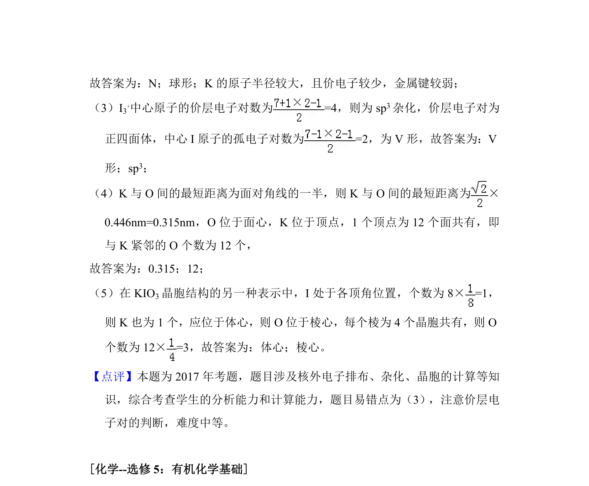

## 题面

## 摘要

一道题综合考查钾元素性质，涉及焰色反应、电子排布、金属键及离子构型杂化。

## 关联考点

- [[焰色反应波长]]
- [[电子云形状]]
- [[金属键强弱]]
- [[杂化与VSEPR]]

## 答案与解析

> 📄 原 PDF 第 16 页：`素材/真题/湖南/2008-2024·（湖南）化学高考真题/2017年高考化学试卷（新课标Ⅰ）（解析卷）.pdf`

<!-- 题干文本-start -->
## 题干文本
11．（15分）钾和碘的相关化合物在化工、医药、材料等领域有着广泛的应用。
回答下列问题：
（1）元素K的焰色反应呈紫红色，其中紫色对应的辐射波长为　A　nm（填标
号）。
A.404.4B.553.5    C.589.2D.670.8   E.766.5
（2）基态K原子中，核外电子占据的最高能层的符号是　N　，占据该能层电
子的电子云轮廓图形状为　球形　。K和Cr属于同一周期，且核外最外层电
子构型相同，但金属K的熔点、沸点等都比金属Cr低，原因是　K的原子半
径较大，且价电子较少，金属键较弱　。
（3）X射线衍射测定等发现，I 3AsF6中存在I 3
+离子。I3
+离子的几何构型为　V
形　，中心原子的杂化类型为　sp3　。
<!-- 题干文本-end -->

<!-- 解析文本-start -->
## 解析文本

<!-- 解析文本-end -->
