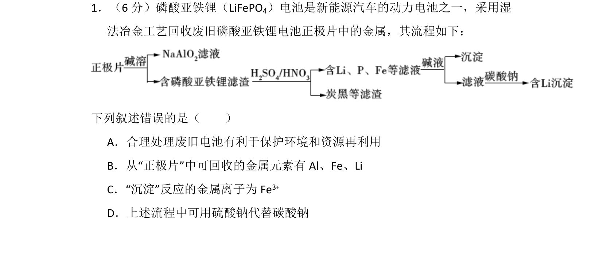
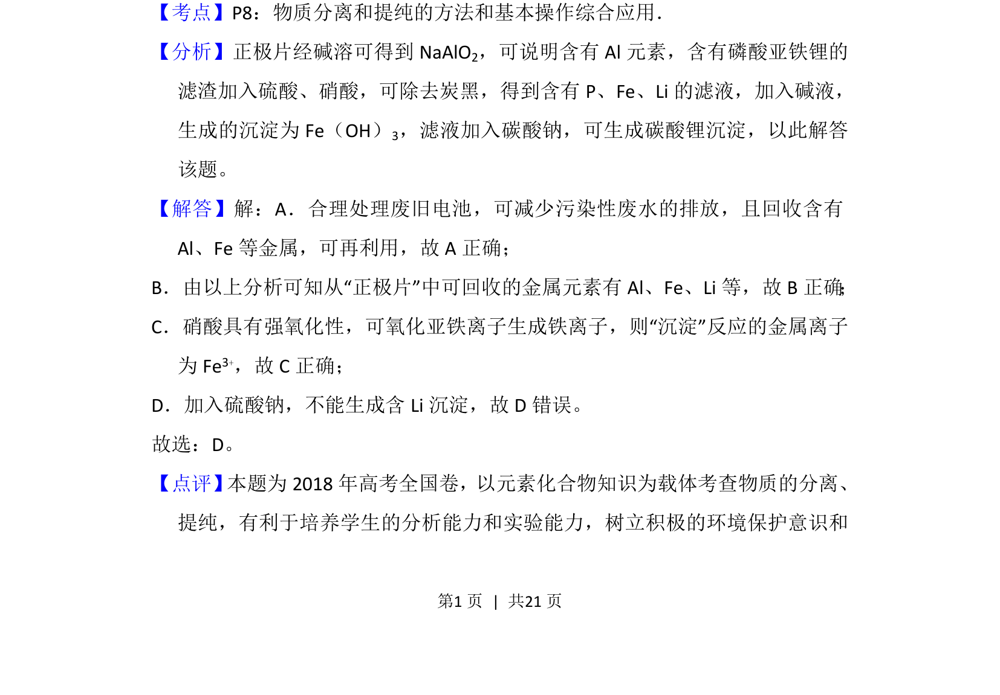

## 题面

## 摘要

该题考查废旧锂电池正极片中有价金属的回收工艺流程，涉及物质分离和提纯方法判断。

## 关联考点

- [[775-物质性质与处理|物质分离与提纯]]
- [[856-金属回收|金属回收]]
- [[162-氧化还原反应|氧化还原反应]]
- [[沉淀法]]

## 答案与解析

> 📄 原 PDF 第 1 页：`素材/真题/湖南/2008-2024·（湖南）化学高考真题/2018年高考化学试卷（新课标Ⅰ）（解析卷）.pdf`
