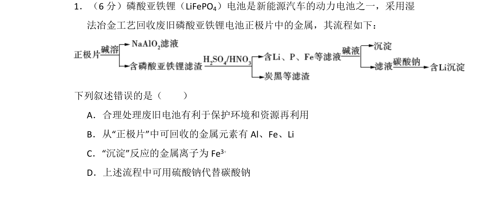
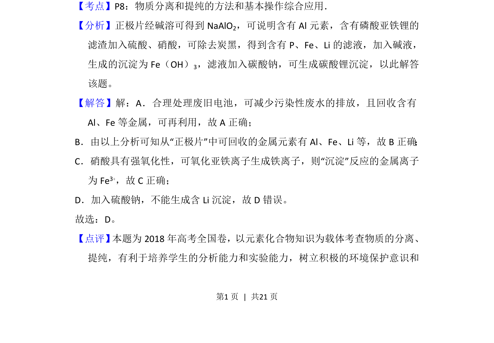
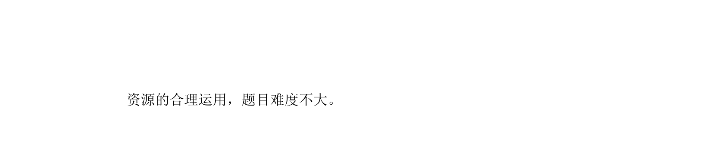

## 题面

## 摘要

该题考查废旧锂电池正极片中有价金属的回收工艺流程，涉及物质分离和提纯方法判断。

## 关联考点

- [[775-物质性质与处理|物质分离与提纯]]
- [[856-金属回收|金属回收]]
- [[162-氧化还原反应|氧化还原反应]]
- [[沉淀法]]

## 答案与解析

> 📄 原 PDF 第 1 页：`素材/真题/湖南/2008-2024·（湖南）化学高考真题/2018年高考化学试卷（新课标Ⅰ）（解析卷）.pdf`

<!-- 题干文本-start -->
## 题干文本
1．（6分）磷酸亚铁锂（LiFePO 4）电池是新能源汽车的动力电池之一，采用湿
法冶金工艺回收废旧磷酸亚铁锂电池正极片中的金属，其流程如下：
下列叙述错误的是（　　）
A．合理处理废旧电池有利于保护环境和资源再利用
B．从“正极片”中可回收的金属元素有Al、Fe、Li
C．“沉淀”反应的金属离子为Fe 3+
D．上述流程中可用硫酸钠代替碳酸钠
<!-- 题干文本-end -->

<!-- 解析文本-start -->
## 解析文本
【考点】P8：物质分离和提纯的方法和基本操作综合应用．菁优网版权所有
【分析】正极片经碱溶可得到NaAlO 2，可说明含有Al元素，含有磷酸亚铁锂的
滤渣加入硫酸、硝酸，可除去炭黑，得到含有P、Fe、Li的滤液，加入碱液，
生成的沉淀为Fe（OH） 3，滤液加入碳酸钠，可生成碳酸锂沉淀，以此解答
该题。
【解答】解：A．合理处理废旧电池，可减少污染性废水的排放，且回收含有
Al、Fe等金属，可再利用，故A正确；
B．由以上分析可知从“正极片”中可回收的金属元素有Al、Fe、Li等，故B正确；
C．硝酸具有强氧化性，可氧化亚铁离子生成铁离子，则“沉淀”反应的金属离子
为Fe 3+，故C正确；
D．加入硫酸钠，不能生成含Li沉淀，故D错误。
故选：D。
【点评】 本题为2018年高考全国卷，以元素化合物知识为载体考查物质的分离、
提纯，有利于培养学生的分析能力和实验能力，树立积极的环境保护意识和
<!-- 解析文本-end -->
