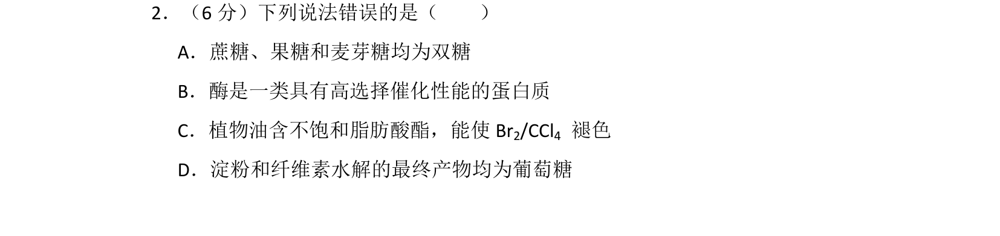
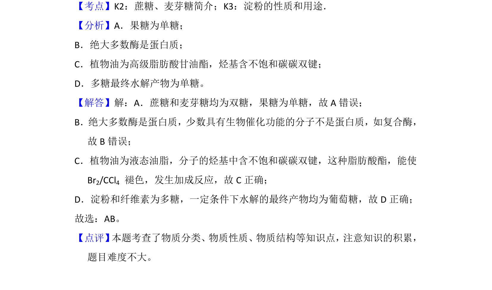

## 题面

## 摘要

考查糖类物质分类、酶的本质、油脂性质及多糖水解。

## 关联考点

- [[蔗糖与麦芽糖]]
- [[酶与蛋白质]]
- [[油脂不饱和键]]
- [[多糖水解]]

## 答案与解析

> 📄 原 PDF 第 2 页：`素材/真题/湖南/2008-2024·（湖南）化学高考真题/2018年高考化学试卷（新课标Ⅰ）（解析卷）.pdf`

<!-- 题干文本-start -->
## 题干文本
2．（6分）下列说法错误的是（　　）
A．蔗糖、果糖和麦芽糖均为双糖
B．酶是一类具有高选择催化性能的蛋白质
C．植物油含不饱和脂肪酸酯，能使Br 2/CCl4 褪色
D．淀粉和纤维素水解的最终产物均为葡萄糖
<!-- 题干文本-end -->

<!-- 解析文本-start -->
## 解析文本
【考点】K2：蔗糖、麦芽糖简介；K3：淀粉的性质和用途．菁优网版权所有
【分析】A．果糖为单糖；
B．绝大多数酶是蛋白质；
C．植物油为高级脂肪酸甘油酯，烃基含不饱和碳碳双键；
D．多糖最终水解产物为单糖。
【解答】解：A．蔗糖和麦芽糖均为双糖，果糖为单糖，故A错误；
B．绝大多数酶是蛋白质，少数具有生物催化功能的分子不是蛋白质，如复合酶，
故B错误；
C．植物油为液态油脂，分子的烃基中含不饱和碳碳双键，这种脂肪酸酯，能使
Br2/CCl4 褪色，发生加成反应，故C正确；
D．淀粉和纤维素为多糖，一定条件下水解的最终产物均为葡萄糖，故D正确；
故选：AB。
【点评】 本题考查了物质分类、物质性质、物质结构等知识点，注意知识的积累，
题目难度不大。
<!-- 解析文本-end -->
