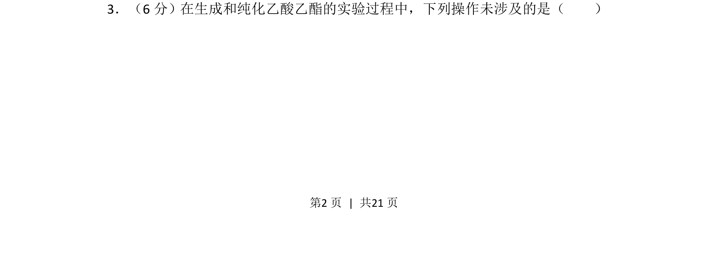
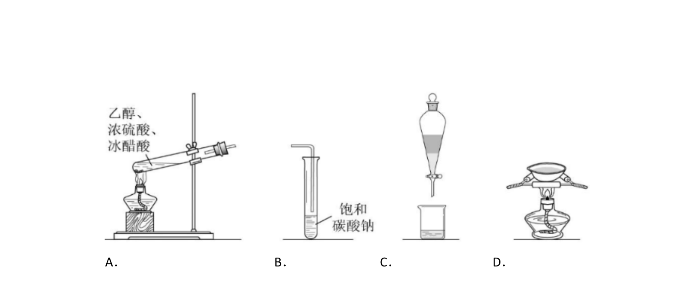
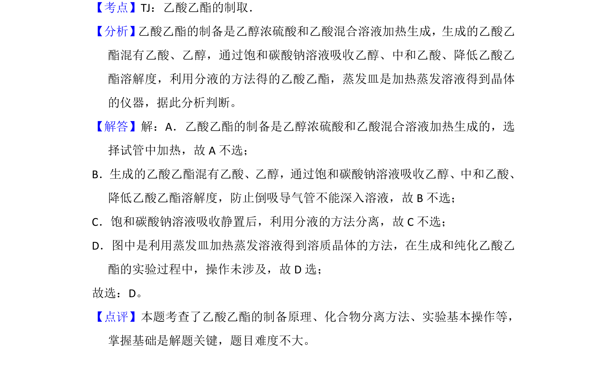

## 题面

## 摘要

考查乙酸乙酯制备与纯化过程中的实验操作识别。

## 关联考点

- [[乙酸乙酯制备]]
- [[079-蒸馏|蒸馏]]
- [[606-分液|分液]]
- [[995-实验基本操作|实验基本操作]]

## 答案与解析

> 📄 原 PDF 第 2 页：`素材/真题/湖南/2008-2024·（湖南）化学高考真题/2018年高考化学试卷（新课标Ⅰ）（解析卷）.pdf`
