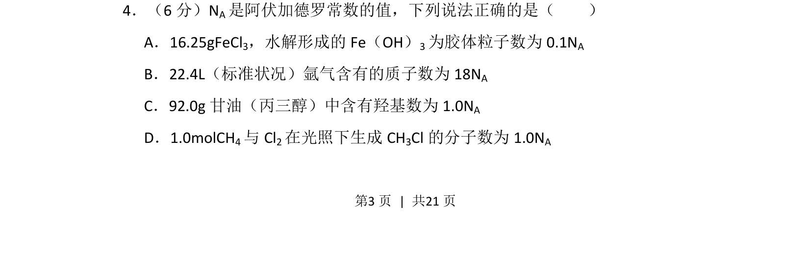
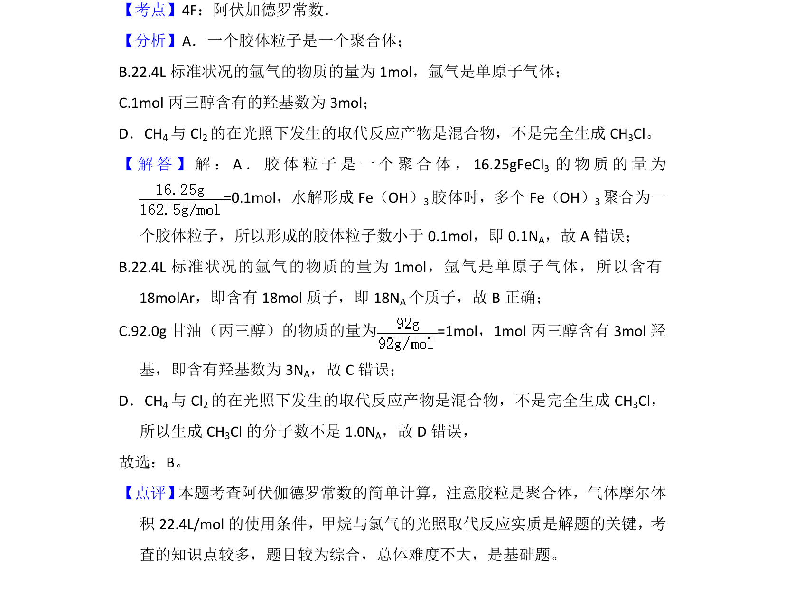

## 题面

## 摘要

NA 相关计算正误判断，涉及水解、胶体粒子、气体质子数、羟基数目及有机反应

## 关联考点

- [[450-阿伏伽德罗常数|阿伏加德罗常数]]
- [[828-胶体性质|胶体性质]]
- [[727-气体摩尔体积|气体摩尔体积]]
- [[有机官能团计量]]

## 答案与解析

> 📄 原 PDF 第 3 页：`素材/真题/湖南/2008-2024·（湖南）化学高考真题/2018年高考化学试卷（新课标Ⅰ）（解析卷）.pdf`
