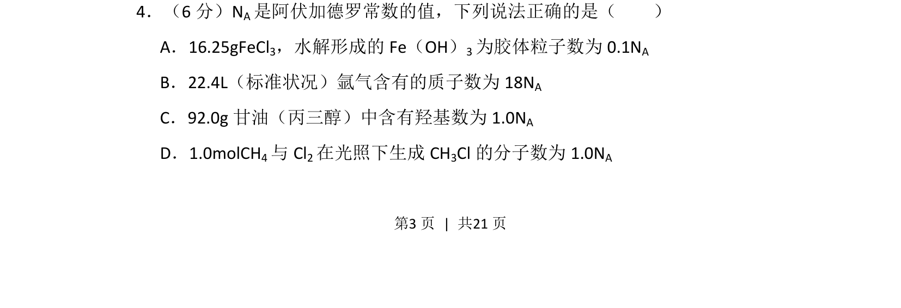
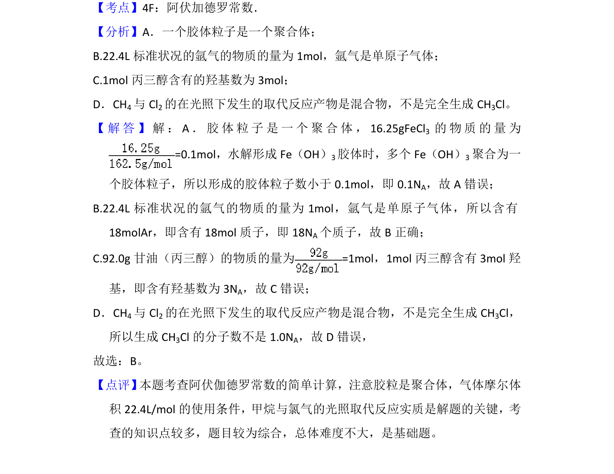

## 题面

## 摘要

NA 相关计算正误判断，涉及水解、胶体粒子、气体质子数、羟基数目及有机反应

## 关联考点

- [[450-阿伏伽德罗常数|阿伏加德罗常数]]
- [[828-胶体性质|胶体性质]]
- [[727-气体摩尔体积|气体摩尔体积]]
- [[有机官能团计量]]

## 答案与解析

> 📄 原 PDF 第 3 页：`素材/真题/湖南/2008-2024·（湖南）化学高考真题/2018年高考化学试卷（新课标Ⅰ）（解析卷）.pdf`

<!-- 题干文本-start -->
## 题干文本
4．（6分）N A是阿伏加德罗常数的值，下列说法正确的是（　　）
A．16.25gFeCl3，水解形成的Fe（OH） 3为胶体粒子数为0.1N A
B．22.4L（标准状况）氩气含有的质子数为18N A
C．92.0g甘油（丙三醇）中含有羟基数为1.0N A
D．1.0molCH4与Cl 2在光照下生成CH 3Cl的分子数为1.0N A
<!-- 题干文本-end -->

<!-- 解析文本-start -->
## 解析文本

<!-- 解析文本-end -->
