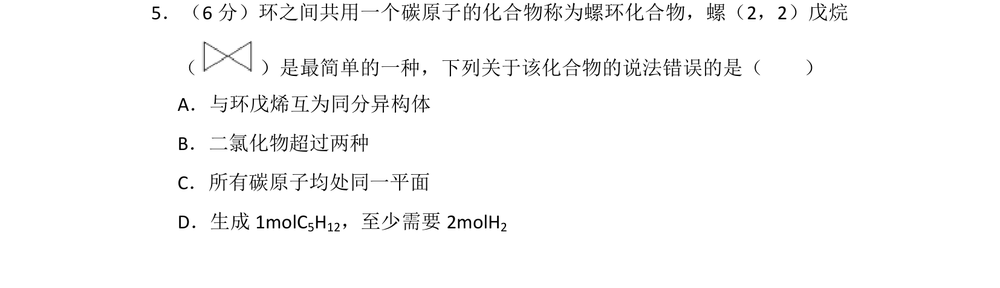
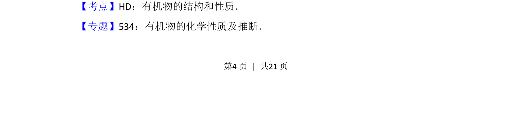
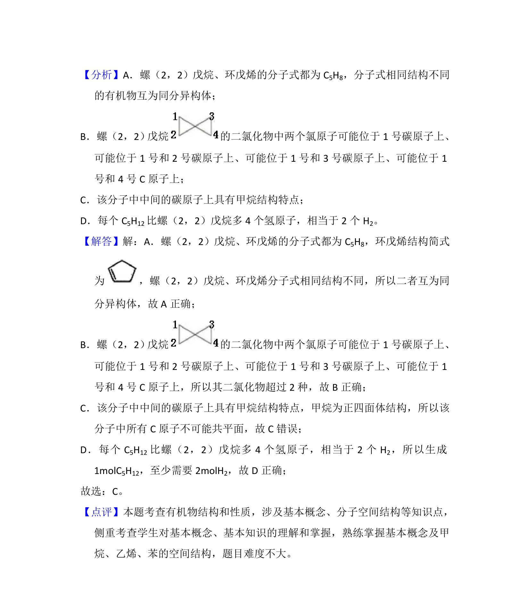

## 题面

## 摘要

考查螺环化合物的结构、同分异构体、二氯代物数目、碳原子共面及加成反应

## 关联考点

- [[螺环化合物]]
- [[446-同分异构体|同分异构体]]
- [[二氯代物]]
- [[碳原子共平面]]
- [[233-乙烯加成反应|加成反应]]

## 答案与解析

> 📄 原 PDF 第 4 页：`素材/真题/湖南/2008-2024·（湖南）化学高考真题/2018年高考化学试卷（新课标Ⅰ）（解析卷）.pdf`
