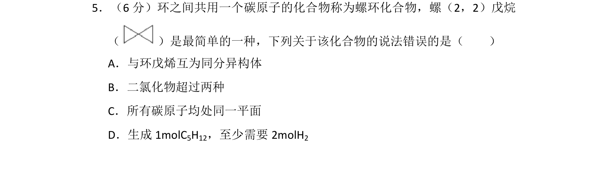
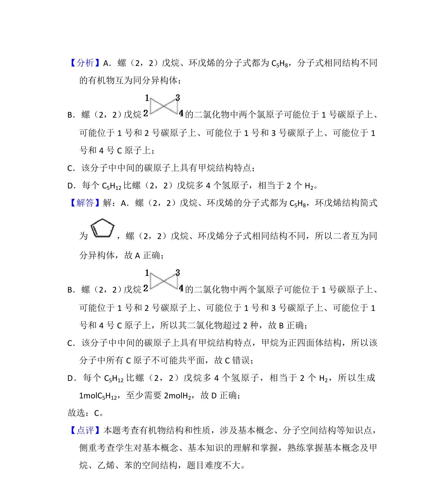

## 题面

## 摘要

考查螺环化合物的结构、同分异构体、二氯代物数目、碳原子共面及加成反应

## 关联考点

- [[螺环化合物]]
- [[446-同分异构体|同分异构体]]
- [[二氯代物]]
- [[碳原子共平面]]
- [[233-乙烯加成反应|加成反应]]

## 答案与解析

> 📄 原 PDF 第 4 页：`素材/真题/湖南/2008-2024·（湖南）化学高考真题/2018年高考化学试卷（新课标Ⅰ）（解析卷）.pdf`

<!-- 题干文本-start -->
## 题干文本
5．（6分）环之间共用一个碳原子的化合物称为螺环化合物，螺（2，2）戊烷
（ ）是最简单的一种，下列关于该化合物的说法错误的是（　　）
A．与环戊烯互为同分异构体
B．二氯化物超过两种
C．所有碳原子均处同一平面
D．生成1molC 5H12，至少需要2molH 2
<!-- 题干文本-end -->

<!-- 解析文本-start -->
## 解析文本
【考点】HD：有机物的结构和性质．菁优网版权所有
【专题】534：有机物的化学性质及推断．
<!-- 解析文本-end -->
