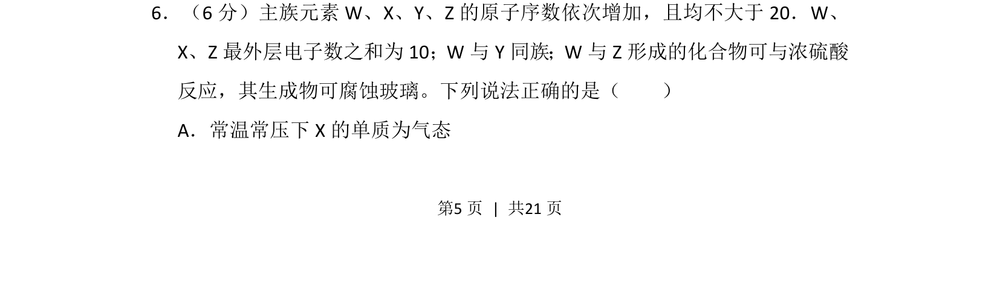
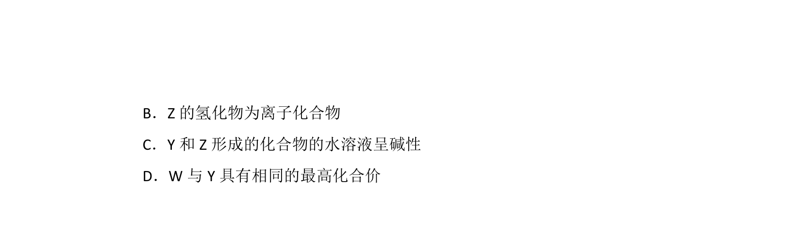
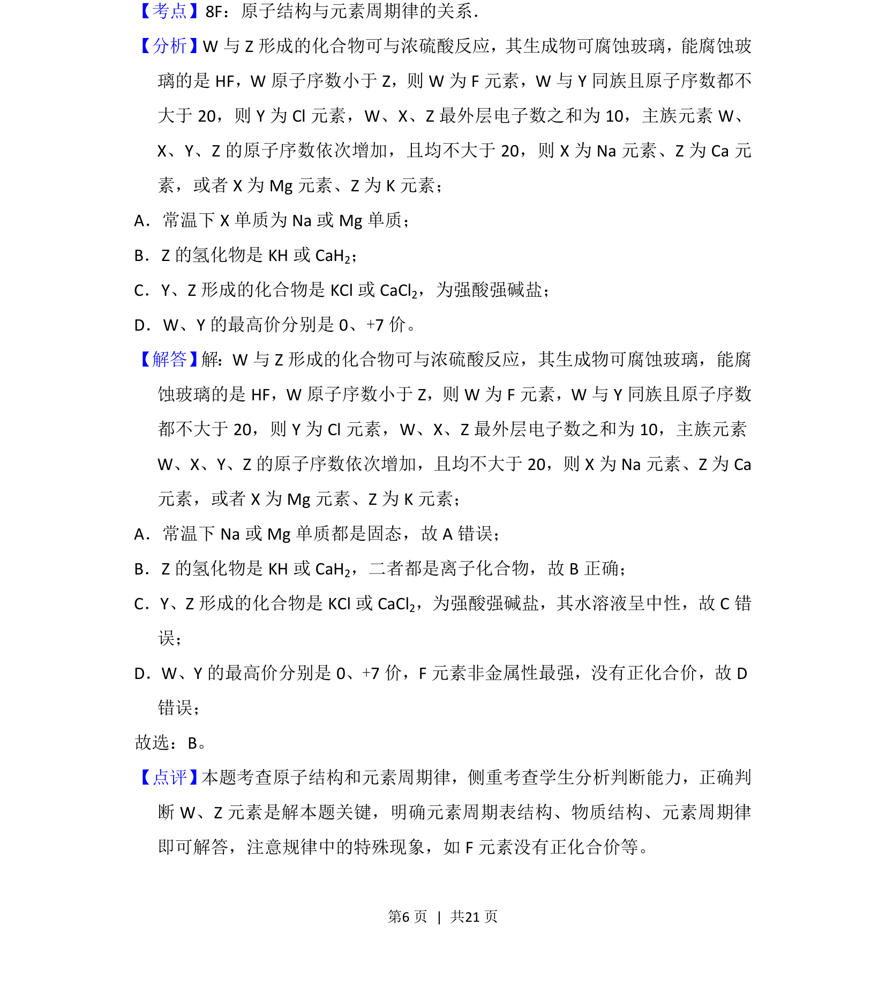

## 题面

## 摘要

推断元素周期表位置与性质，结合氢氟酸腐蚀玻璃的反应特征进行元素辨识

## 关联考点

- [[252-元素周期律|元素周期律]]
- [[638-原子结构与元素推断|原子结构与元素推断]]
- [[596-元素化合物性质|元素化合物性质]]
- [[氢氟酸与玻璃反应]]

## 答案与解析

> 📄 原 PDF 第 5 页：`素材/真题/湖南/2008-2024·（湖南）化学高考真题/2018年高考化学试卷（新课标Ⅰ）（解析卷）.pdf`

<!-- 题干文本-start -->
## 题干文本
6．（6分）主族元素W、X、Y、Z的原子序数依次增加，且均不大于20．W、
X、Z最外层电子数之和为10；W与Y同族；W与Z形成的化合物可与浓硫酸
反应，其生成物可腐蚀玻璃。下列说法正确的是（　　）
A．常温常压下X的单质为气态
<!-- 题干文本-end -->

<!-- 解析文本-start -->
## 解析文本

<!-- 解析文本-end -->
