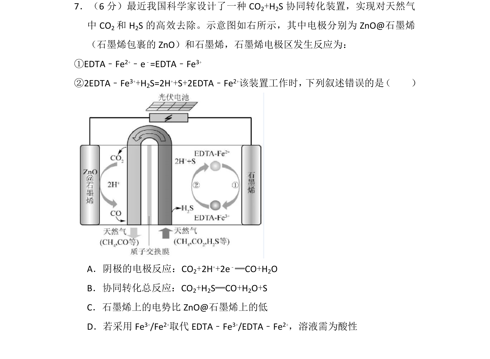
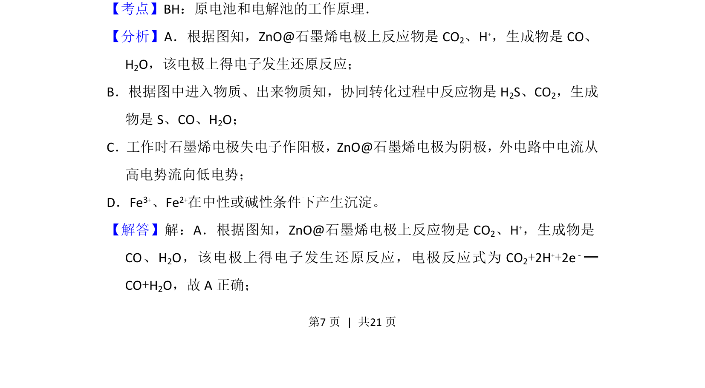
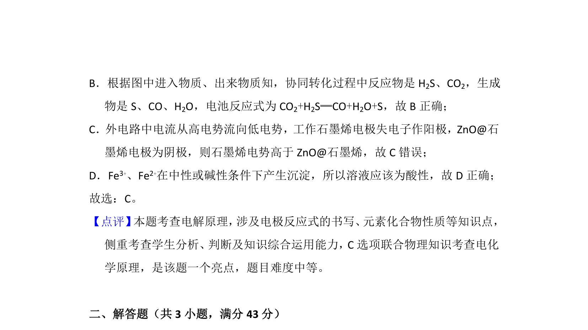

## 题面

## 摘要

电化学装置协同转化CO₂和H₂S，判断电极反应和总反应等说法的正误。

## 关联考点

- [[287-原电池|原电池]]
- [[368-电解池|电解池]]
- [[793-电极反应|电极反应]]
- [[162-氧化还原反应|氧化还原反应]]

## 答案与解析

> 📄 原 PDF 第 7 页：`素材/真题/湖南/2008-2024·（湖南）化学高考真题/2018年高考化学试卷（新课标Ⅰ）（解析卷）.pdf`
