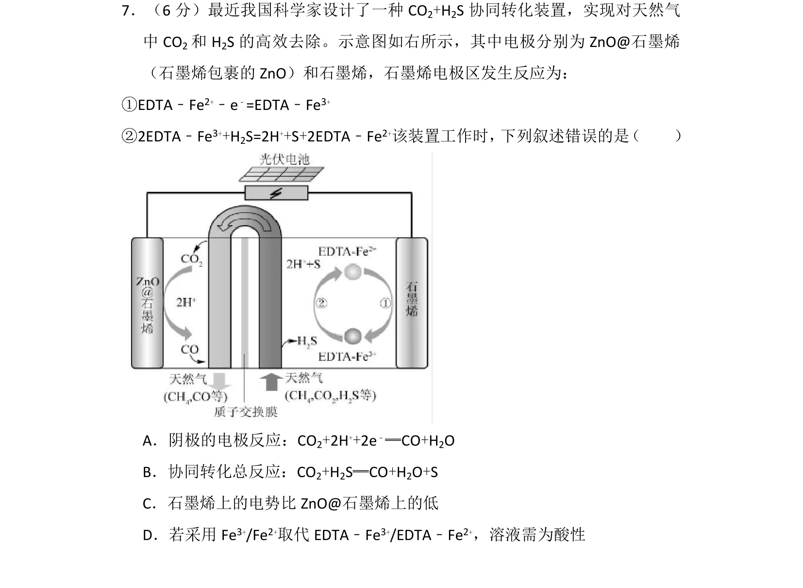
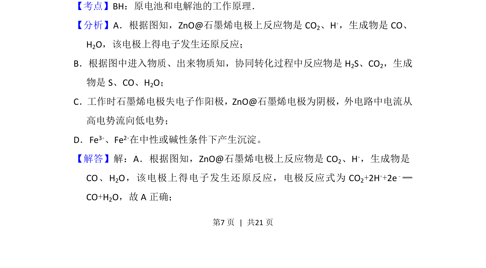
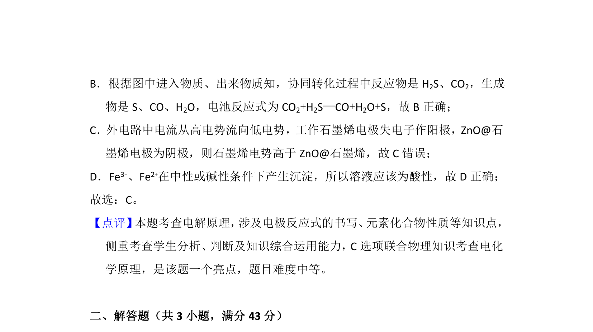

## 题面

## 摘要

电化学装置协同转化CO₂和H₂S，判断电极反应和总反应等说法的正误。

## 关联考点

- [[287-原电池|原电池]]
- [[368-电解池|电解池]]
- [[793-电极反应|电极反应]]
- [[162-氧化还原反应|氧化还原反应]]

## 答案与解析

> 📄 原 PDF 第 7 页：`素材/真题/湖南/2008-2024·（湖南）化学高考真题/2018年高考化学试卷（新课标Ⅰ）（解析卷）.pdf`

<!-- 题干文本-start -->
## 题干文本
7．（6分）最近我国科学家设计了一种CO 2+H2S协同转化装置，实现对天然气
中CO 2和H 2S的高效去除。示意图如右所示，其中电极分别为ZnO@石墨烯
（石墨烯包裹的ZnO）和石墨烯，石墨烯电极区发生反应为：
①EDTA﹣Fe2+﹣e﹣=EDTA﹣Fe3+
②2EDTA﹣Fe3++H2S=2H++S+2EDTA﹣Fe2+该装置工作时， 下列叙述错误的是 （　　）
A．阴极的电极反应：CO2+2H++2e﹣═CO+H2O
B．协同转化总反应：CO2+H2S═CO+H2O+S
C．石墨烯上的电势比ZnO@石墨烯上的低
D．若采用Fe 3+/Fe2+取代EDTA﹣Fe 3+/EDTA﹣Fe2+，溶液需为酸性
<!-- 题干文本-end -->

<!-- 解析文本-start -->
## 解析文本
【考点】BH：原电池和电解池的工作原理．菁优网版权所有
【分析】A．根据图知，ZnO@石墨烯电极上反应物是CO 2、H+，生成物是CO、
H2O，该电极上得电子发生还原反应；
B．根据图中进入物质、出来物质知，协同转化过程中反应物是H 2S、CO2，生成
物是S、CO、H 2O；
C．工作时石墨烯电极失电子作阳极，ZnO@石墨烯电极为阴极，外电路中电流从
高电势流向低电势；
D．Fe3+、Fe2+在中性或碱性条件下产生沉淀。
【解答】解：A．根据图知，ZnO@石墨烯电极上反应物是CO 2、H+，生成物是
CO、H 2O，该电极上得电子发生还原反应，电极反应式为CO 2+2H++2e﹣═
CO+H2O，故A正确；
<!-- 解析文本-end -->
