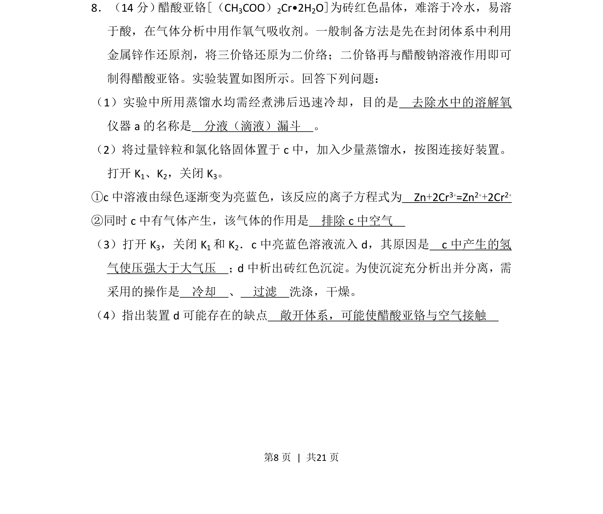
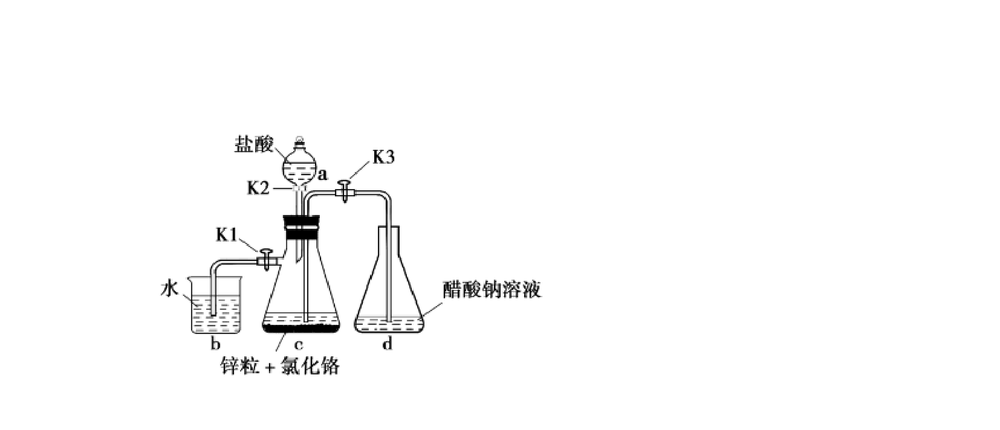
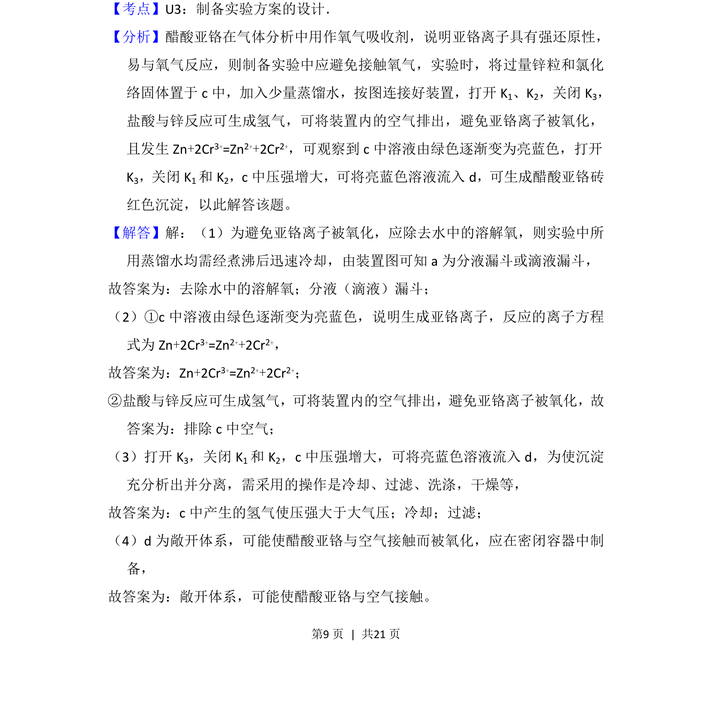
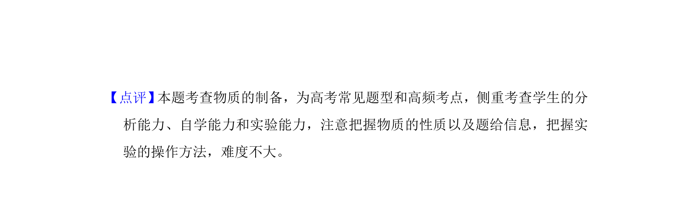

## 题面

## 摘要

醋酸亚铬的制备实验，考查离子方程式、实验操作与装置评价。

## 关联考点

- [[物质的制备]]
- [[580-实验操作|实验操作]]
- [[170-离子方程式|离子方程式]]
- [[实验评价]]

## 答案与解析

> 📄 原 PDF 第 8 页：`素材/真题/湖南/2008-2024·（湖南）化学高考真题/2018年高考化学试卷（新课标Ⅰ）（解析卷）.pdf`
