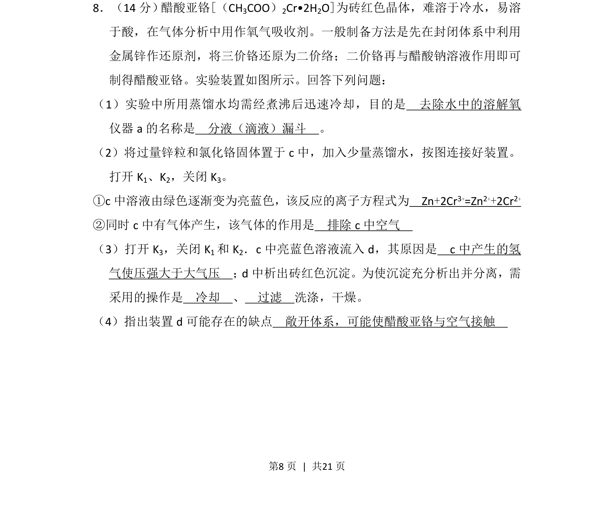
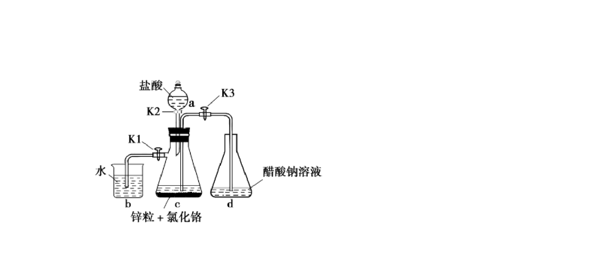
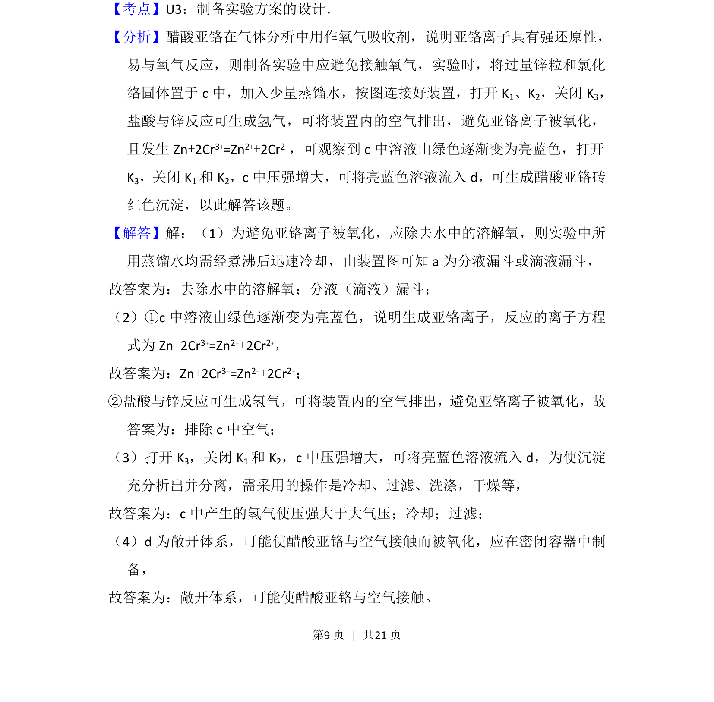
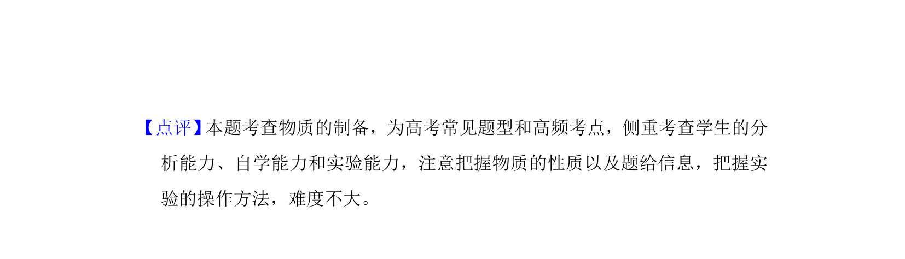

## 题面

## 摘要

醋酸亚铬的制备实验，考查离子方程式、实验操作与装置评价。

## 关联考点

- [[物质的制备]]
- [[580-实验操作|实验操作]]
- [[170-离子方程式|离子方程式]]
- [[实验评价]]

## 答案与解析

> 📄 原 PDF 第 8 页：`素材/真题/湖南/2008-2024·（湖南）化学高考真题/2018年高考化学试卷（新课标Ⅰ）（解析卷）.pdf`

<!-- 题干文本-start -->
## 题干文本
8．（14分） 醋酸亚铬[（CH3COO）2Cr•2H2O]为砖红色晶体，难溶于冷水，易溶
于酸，在气体分析中用作氧气吸收剂。一般制备方法是先在封闭体系中利用
金属锌作还原剂，将三价铬还原为二价络；二价铬再与醋酸钠溶液作用即可
制得醋酸亚铬。实验装置如图所示。回答下列问题：
（1）实验中所用蒸馏水均需经煮沸后迅速冷却，目的是　去除水中的溶解氧　
仪器a的名称是　分液（滴液）漏斗　。
（2）将过量锌粒和氯化铬固体置于c中，加入少量蒸馏水，按图连接好装置。
打开K 1、K2，关闭K 3。
①c中溶液由绿色逐渐变为亮蓝色，该反应的离子方程式为　Zn+2Cr 3+=Zn2++2Cr2+　
②同时c中有气体产生，该气体的作用是　排除c中空气　
（3）打开K 3，关闭K 1和K 2．c中亮蓝色溶液流入d，其原因是　c中产生的氢
气使压强大于大气压　；d中析出砖红色沉淀。为使沉淀充分析出并分离，需
采用的操作是　冷却　、　过滤　洗涤，干燥。
（4）指出装置d可能存在的缺点　敞开体系，可能使醋酸亚铬与空气接触
<!-- 题干文本-end -->

<!-- 解析文本-start -->
## 解析文本

<!-- 解析文本-end -->
