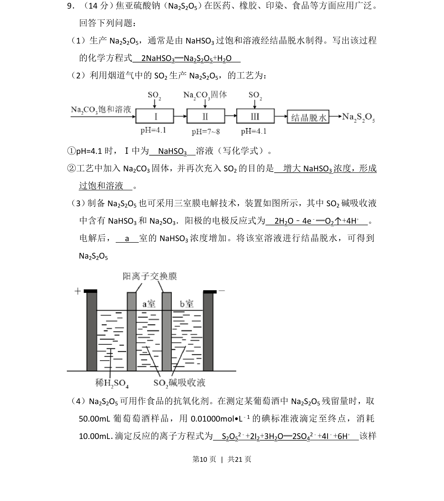
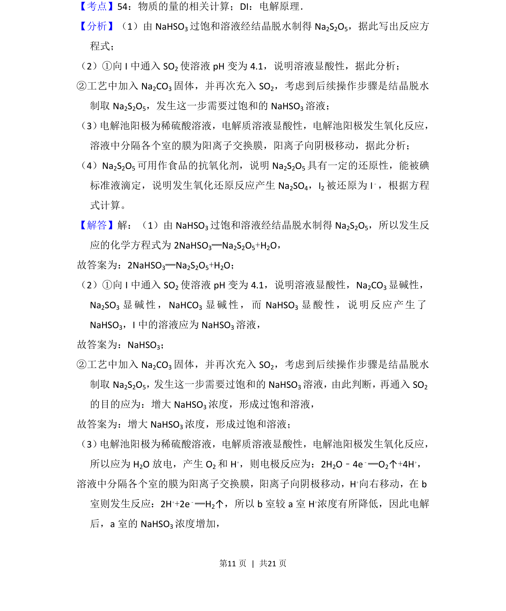
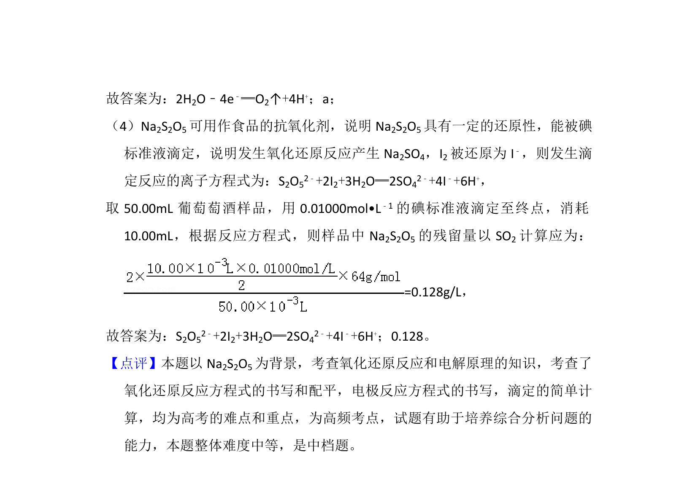

## 题面

## 摘要

考查焦亚硫酸钠的制备工艺、电解原理及滴定残留量测定。

## 关联考点

- [[焦亚硫酸钠]]
- [[368-电解池|电解池]]
- [[548-氧化还原滴定|氧化还原滴定]]
- [[052-化学方程式|化学方程式]]

## 答案与解析

> 📄 原 PDF 第 10 页：`素材/真题/湖南/2008-2024·（湖南）化学高考真题/2018年高考化学试卷（新课标Ⅰ）（解析卷）.pdf`
