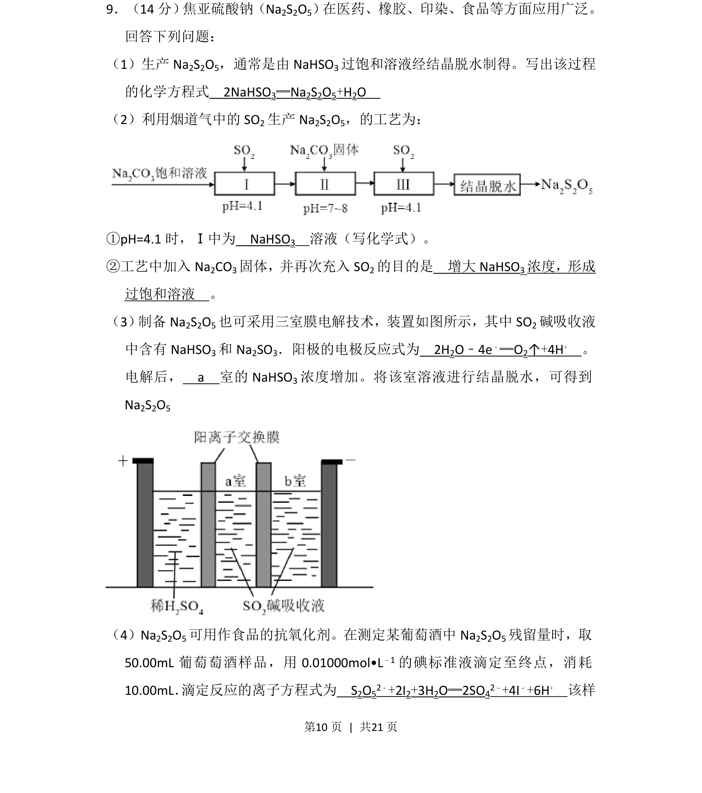
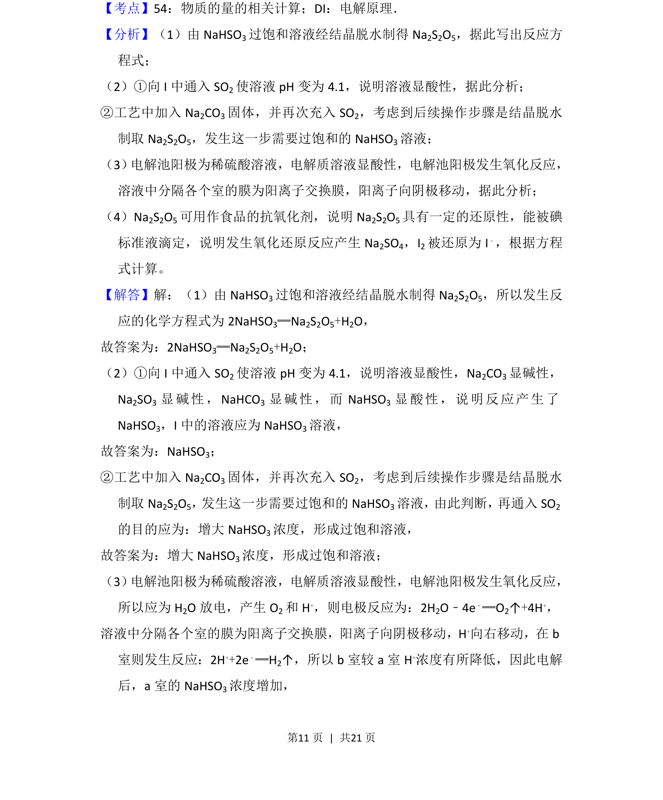
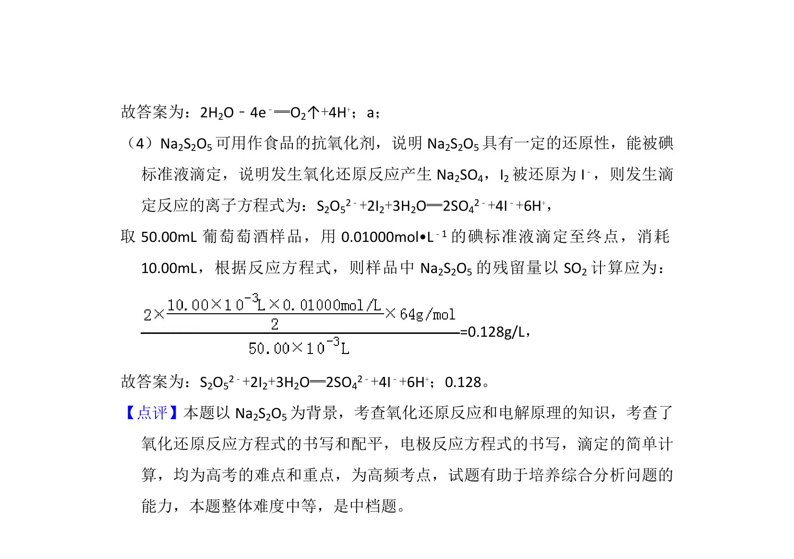

## 题面

## 摘要

考查焦亚硫酸钠的制备工艺、电解原理及滴定残留量测定。

## 关联考点

- [[焦亚硫酸钠]]
- [[368-电解池|电解池]]
- [[548-氧化还原滴定|氧化还原滴定]]
- [[052-化学方程式|化学方程式]]

## 答案与解析

> 📄 原 PDF 第 10 页：`素材/真题/湖南/2008-2024·（湖南）化学高考真题/2018年高考化学试卷（新课标Ⅰ）（解析卷）.pdf`

<!-- 题干文本-start -->
## 题干文本
9．（14分） 焦亚硫酸钠（Na2S2O5） 在医药、橡胶、印染、食品等方面应用广泛。
回答下列问题：
（1）生产Na 2S2O5，通常是由NaHSO 3过饱和溶液经结晶脱水制得。写出该过程
的化学方程式　2NaHSO3═Na2S2O5+H2O　
（2）利用烟道气中的SO 2生产Na 2S2O5，的工艺为：
①pH=4.1时，Ⅰ中为　NaHSO 3　溶液（写化学式）。
②工艺中加入Na 2CO3固体，并再次充入SO 2的目的是　增大NaHSO 3浓度，形成
过饱和溶液　。
（3） 制备Na2S2O5也可采用三室膜电解技术，装置如图所示，其中SO2碱吸收液
中含有NaHSO 3和Na 2SO3．阳极的电极反应式为　2H2O﹣4e﹣═O2↑+4H+　。
电解后，　a　室的NaHSO 3浓度增加。将该室溶液进行结晶脱水，可得到
Na2S2O5
（4）Na2S2O5可用作食品的抗氧化剂。在测定某葡萄酒中Na 2S2O5残留量时，取
50.00mL葡萄萄酒样品，用0.01000mol•L ﹣1的碘标准液滴定至终点，消耗
<!-- 题干文本-end -->

<!-- 解析文本-start -->
## 解析文本

<!-- 解析文本-end -->
