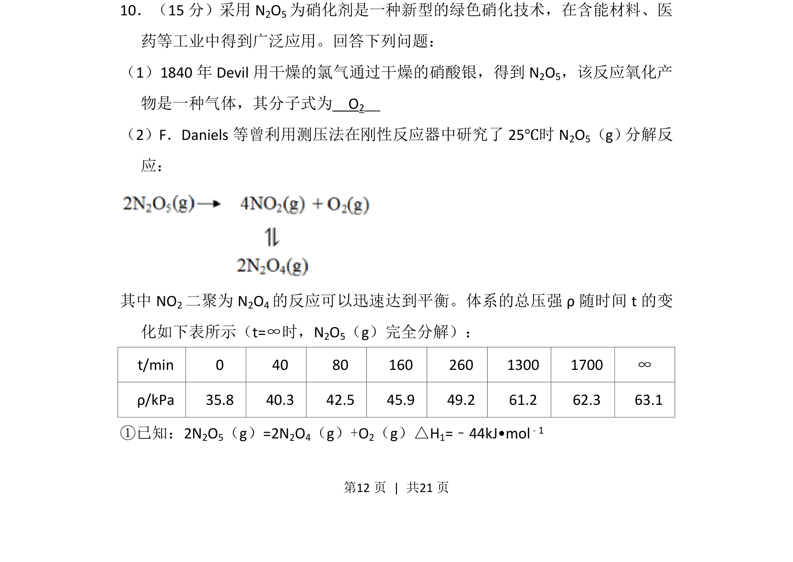
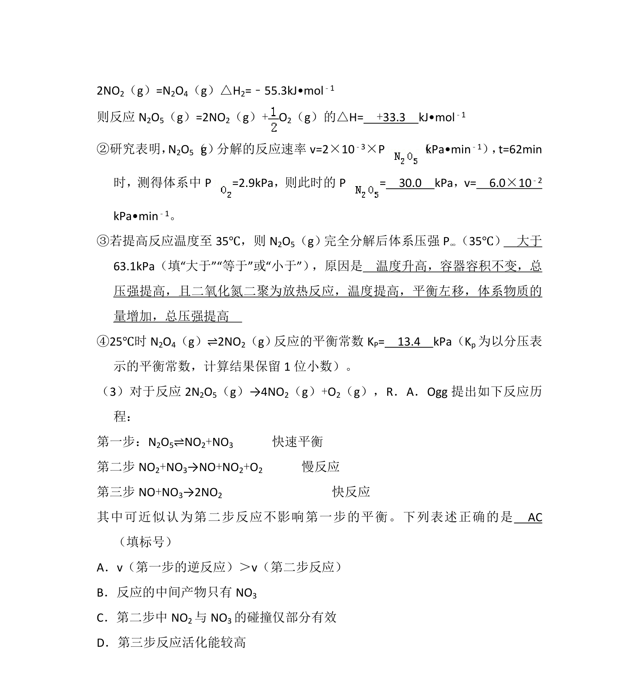
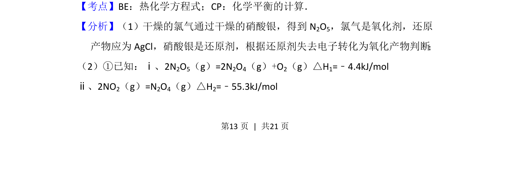
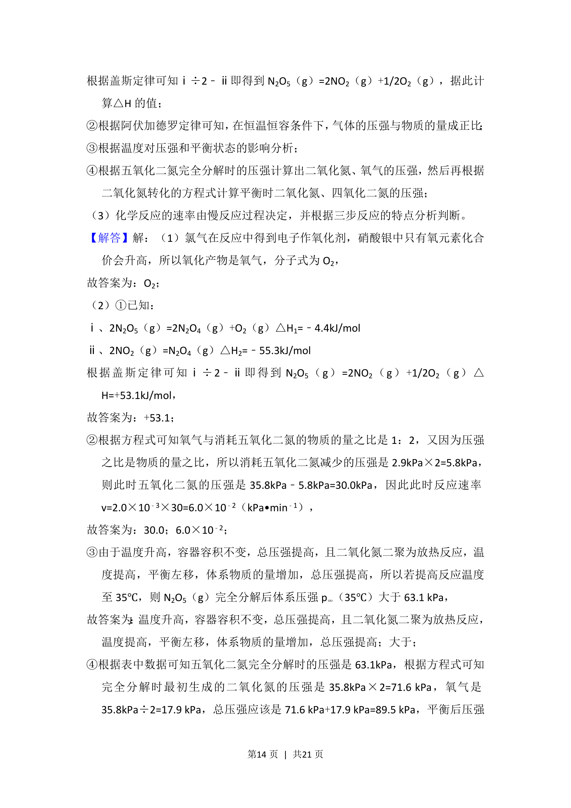
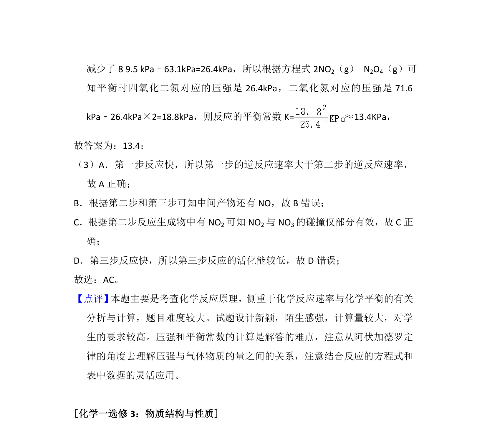

## 题面

## 摘要

N2O5的制备与分解反应，涉及氧化产物判断及分解反应中压强与平衡分析。

## 关联考点

- [[162-氧化还原反应|氧化还原反应]]
- [[284-化学平衡|化学平衡]]
- [[气体分压]]
- [[288-反应热|反应热]]

## 答案与解析

> 📄 原 PDF 第 12 页：`素材/真题/湖南/2008-2024·（湖南）化学高考真题/2018年高考化学试卷（新课标Ⅰ）（解析卷）.pdf`
