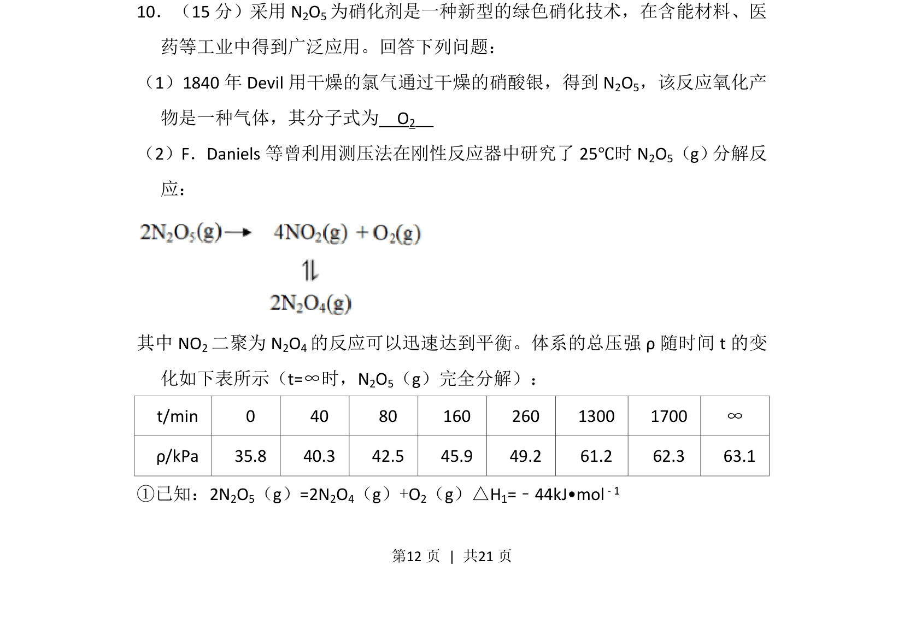
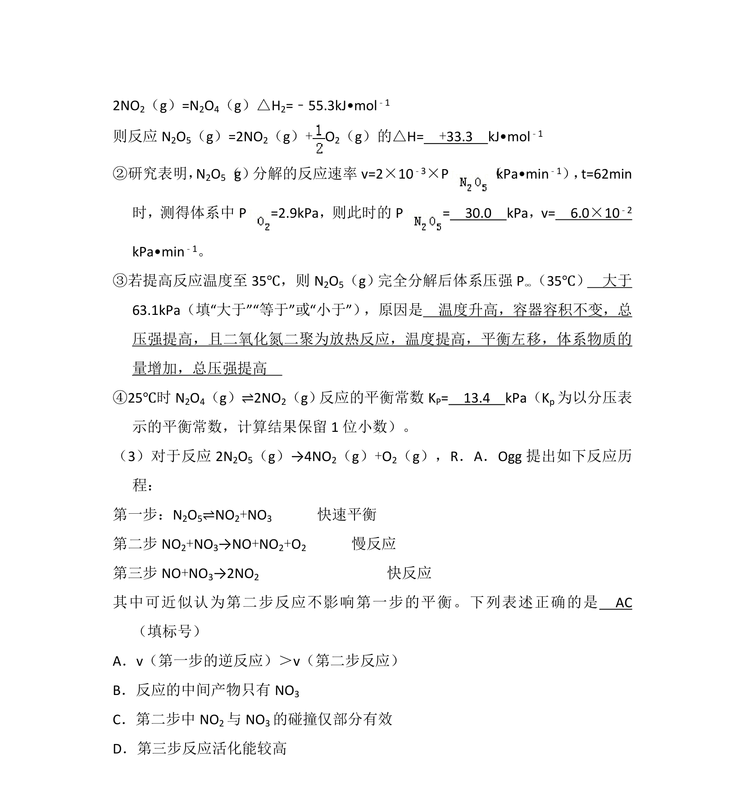
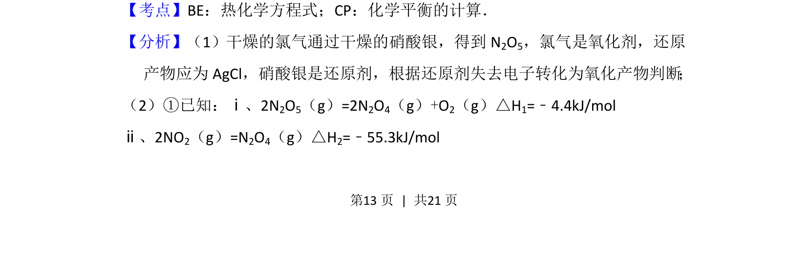
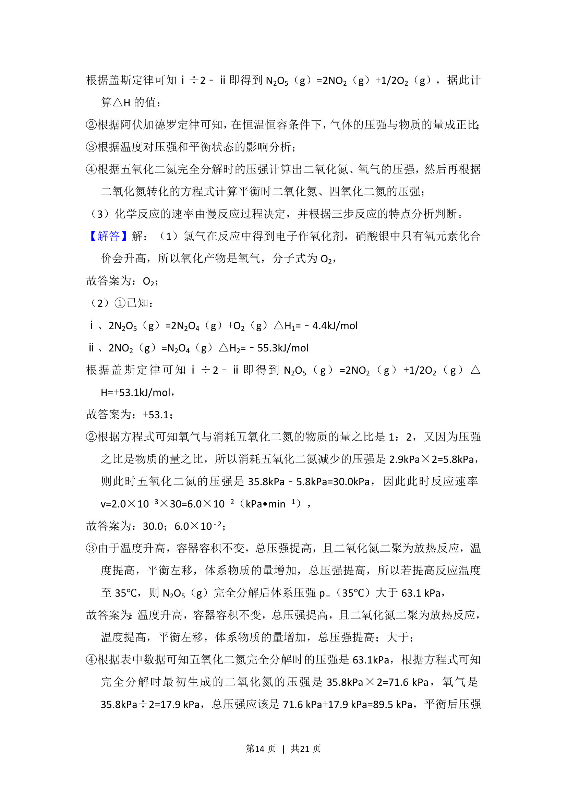
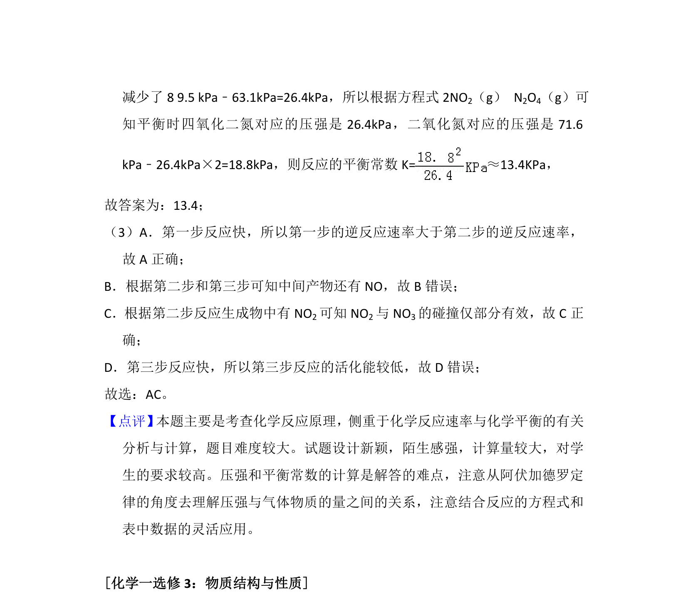

## 题面

## 摘要

N2O5的制备与分解反应，涉及氧化产物判断及分解反应中压强与平衡分析。

## 关联考点

- [[162-氧化还原反应|氧化还原反应]]
- [[284-化学平衡|化学平衡]]
- [[气体分压]]
- [[288-反应热|反应热]]

## 答案与解析

> 📄 原 PDF 第 12 页：`素材/真题/湖南/2008-2024·（湖南）化学高考真题/2018年高考化学试卷（新课标Ⅰ）（解析卷）.pdf`

<!-- 题干文本-start -->
## 题干文本
10.00mL，根据反应方程式，则样品中Na 2S2O5的残留量以SO 2计算应为：
=0.128g/L，
故答案为：S2O52﹣+2I2+3H2O═2SO42﹣+4I﹣+6H+；0.128。
<!-- 题干文本-end -->

<!-- 解析文本-start -->
## 解析文本
【点评】本题以Na 2S2O5为背景，考查氧化还原反应和电解原理的知识，考查了
氧化还原反应方程式的书写和配平，电极反应方程式的书写，滴定的简单计
算，均为高考的难点和重点，为高频考点，试题有助于培养综合分析问题的
能力，本题整体难度中等，是中档题。
　
10．（15分）采用N 2O5为硝化剂是一种新型的绿色硝化技术，在含能材料、医
药等工业中得到广泛应用。回答下列问题：
（1）1840年Devil用干燥的氯气通过干燥的硝酸银，得到N 2O5，该反应氧化产
物是一种气体，其分子式为　O2　
（2）F．Daniels等曾利用测压法在刚性反应器中研究了25℃时N 2O5（g） 分解反
应：
其中NO 2二聚为N 2O4的反应可以迅速达到平衡。体系的总压强ρ随时间t的变
化如下表所示（t=∞时，N2O5（g）完全分解）：
 t/min  0  40  80  160  260  1300  1700 ∞
 ρ/kPa  35.8  40.3  42.5  45.9  49.2  61.2  62.3  63.1
①已知：2N2O5（g）=2N2O4（g）+O2（g）△H1=﹣44kJ•mol﹣1
<!-- 解析文本-end -->
