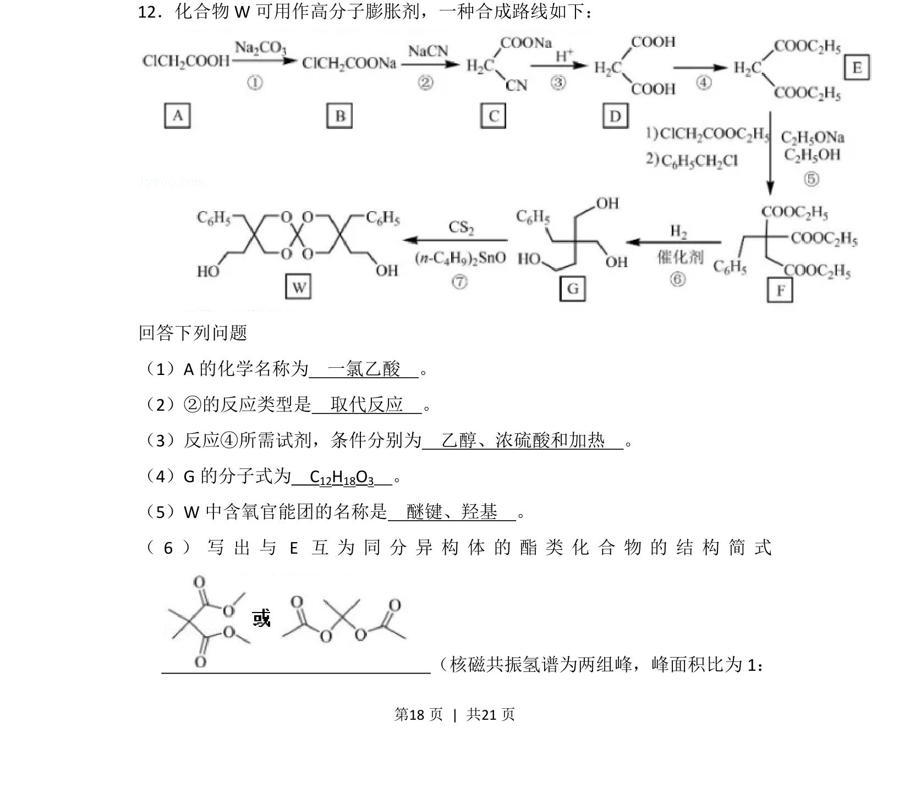
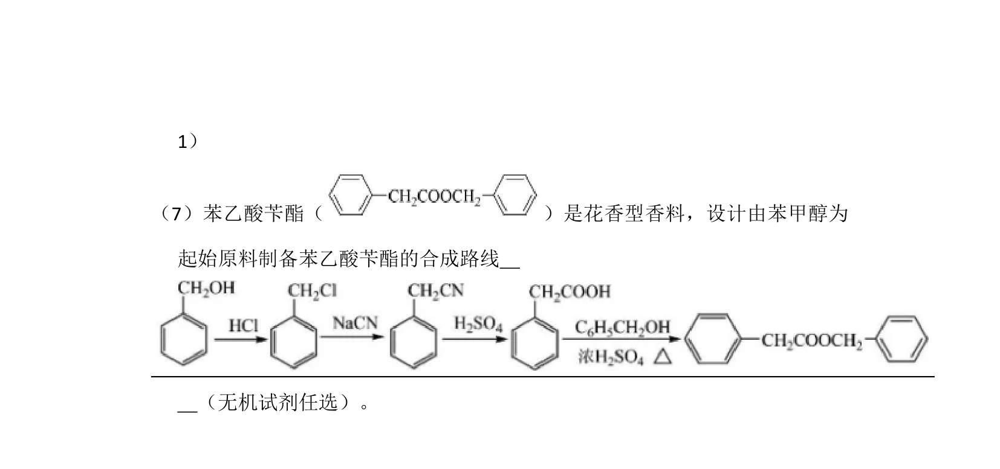
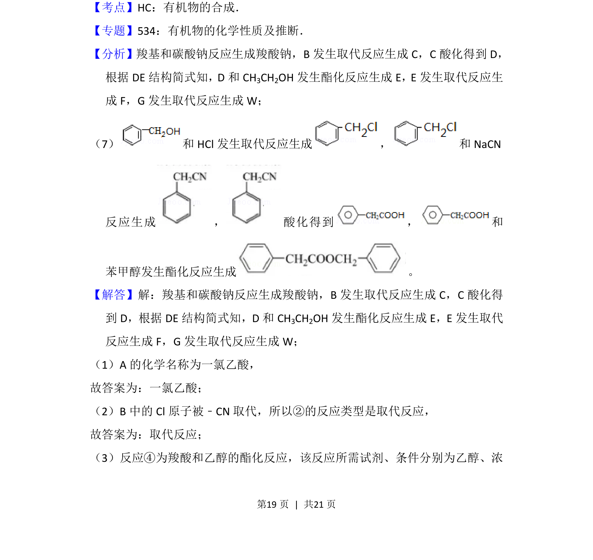
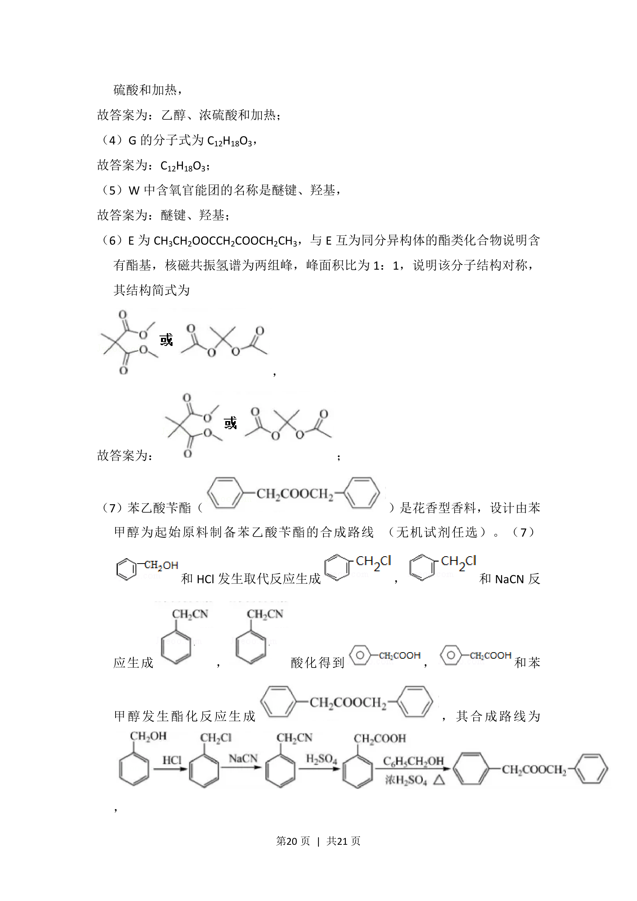
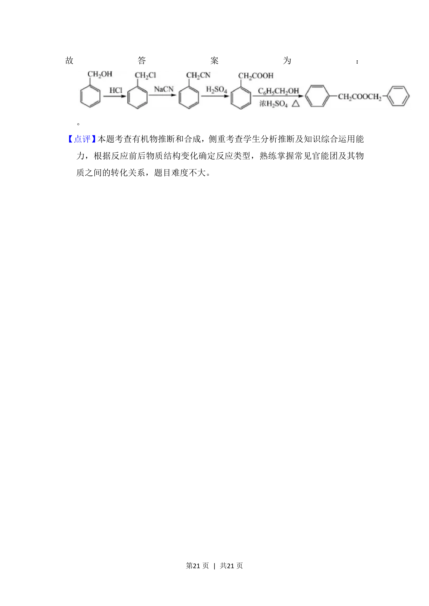

## 题面

## 摘要

本题为有机合成流程推断，考查命名、反应类型、试剂条件、分子式、官能团及同分异构体书写。

## 关联考点

- [[271-化学合成|有机合成]]
- [[448-官能团|官能团]]
- [[646-反应类型|反应类型]]
- [[446-同分异构体|同分异构体]]

## 答案与解析

> 📄 原 PDF 第 18 页：`素材/真题/湖南/2008-2024·（湖南）化学高考真题/2018年高考化学试卷（新课标Ⅰ）（解析卷）.pdf`
