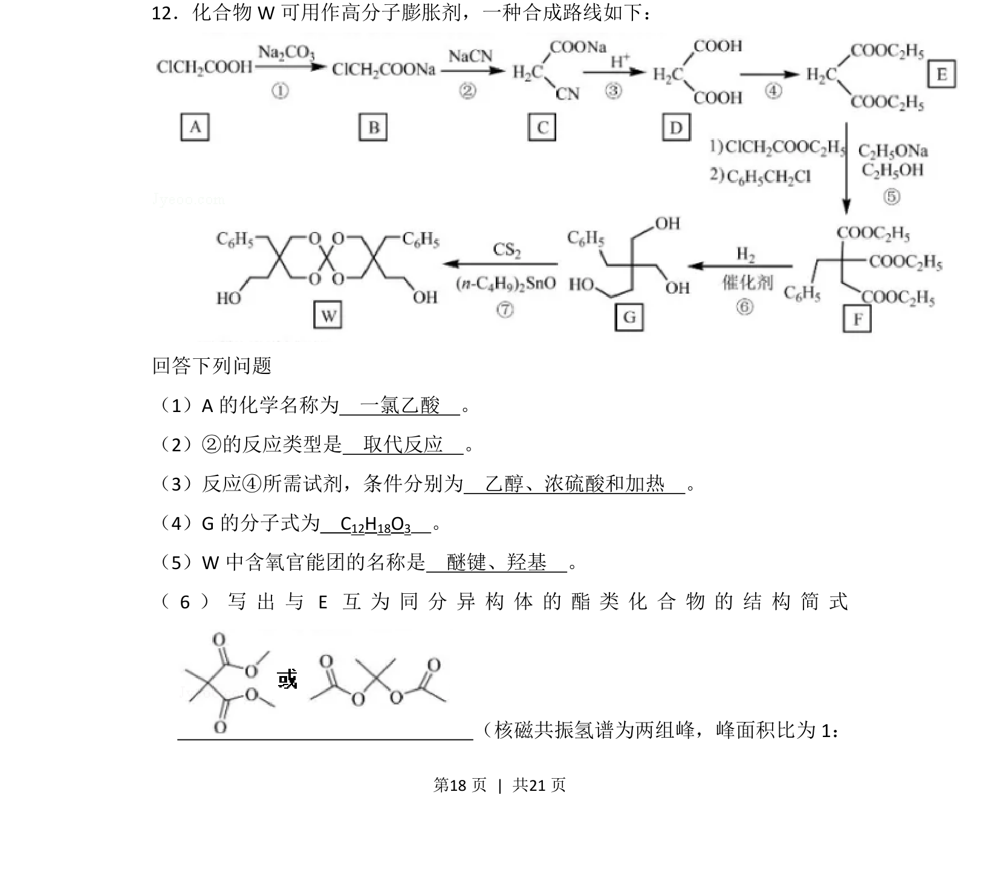
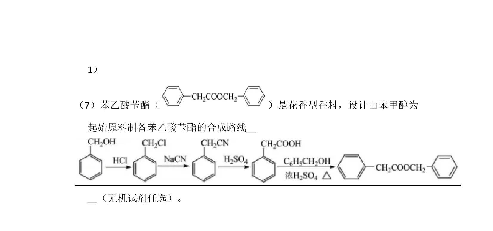
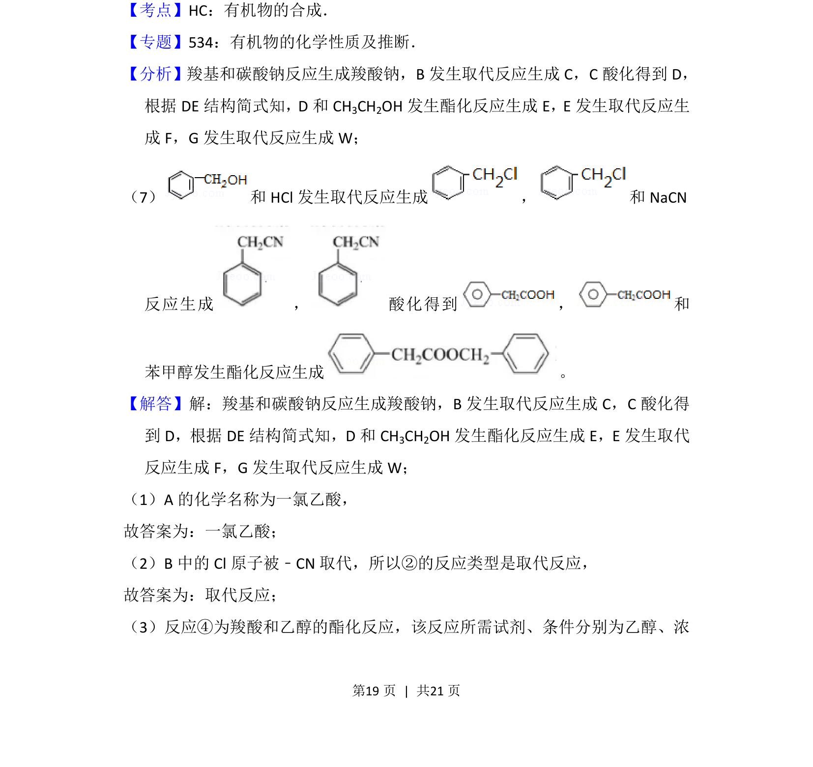
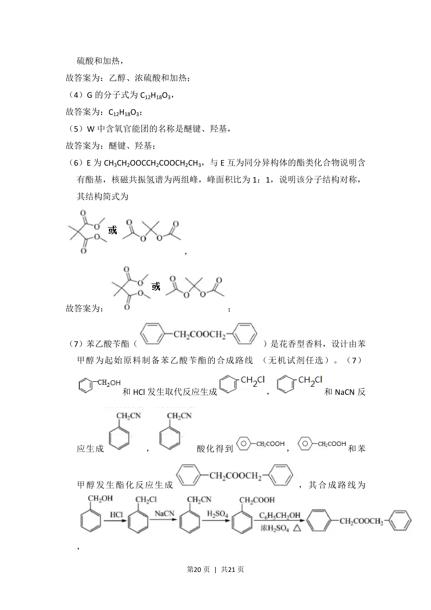
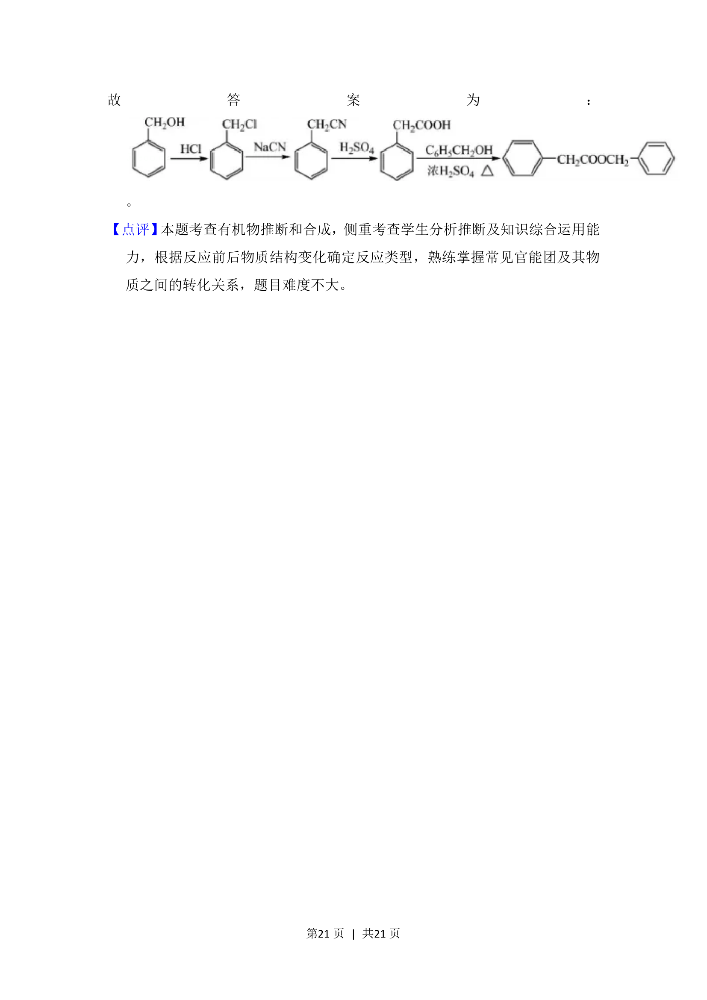

## 题面

## 摘要

本题为有机合成流程推断，考查命名、反应类型、试剂条件、分子式、官能团及同分异构体书写。

## 关联考点

- [[271-化学合成|有机合成]]
- [[448-官能团|官能团]]
- [[646-反应类型|反应类型]]
- [[446-同分异构体|同分异构体]]

## 答案与解析

> 📄 原 PDF 第 18 页：`素材/真题/湖南/2008-2024·（湖南）化学高考真题/2018年高考化学试卷（新课标Ⅰ）（解析卷）.pdf`

<!-- 题干文本-start -->
## 题干文本
12．化合物W可用作高分子膨胀剂，一种合成路线如下：
回答下列问题
（1）A的化学名称为　一氯乙酸　。
（2）②的反应类型是　取代反应　。
（3）反应④所需试剂，条件分别为　乙醇、浓硫酸和加热　。
（4）G的分子式为　C 12H18O3　。
（5）W中含氧官能团的名称是　醚键、羟基　。
（6） 写 出 与E互 为 同 分 异 构 体 的 酯 类 化 合 物 的 结 构 简 式 　
　（核磁共振氢谱为两组峰，峰面积比为1：
<!-- 题干文本-end -->

<!-- 解析文本-start -->
## 解析文本

<!-- 解析文本-end -->
