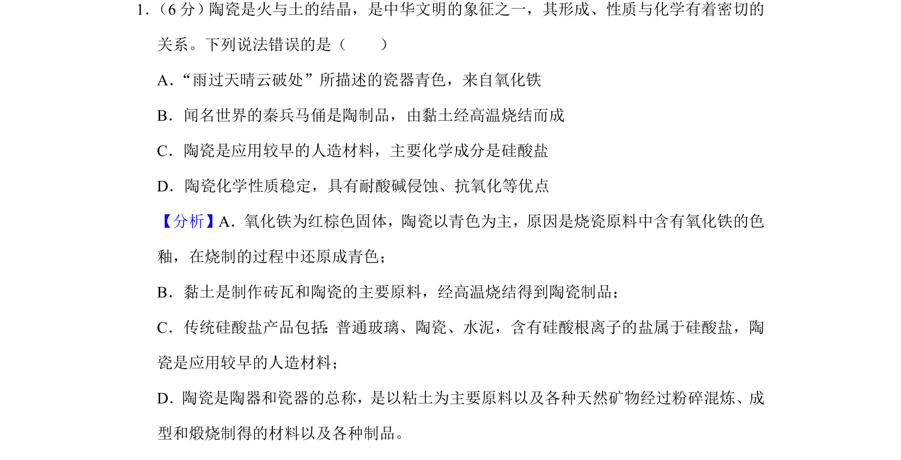
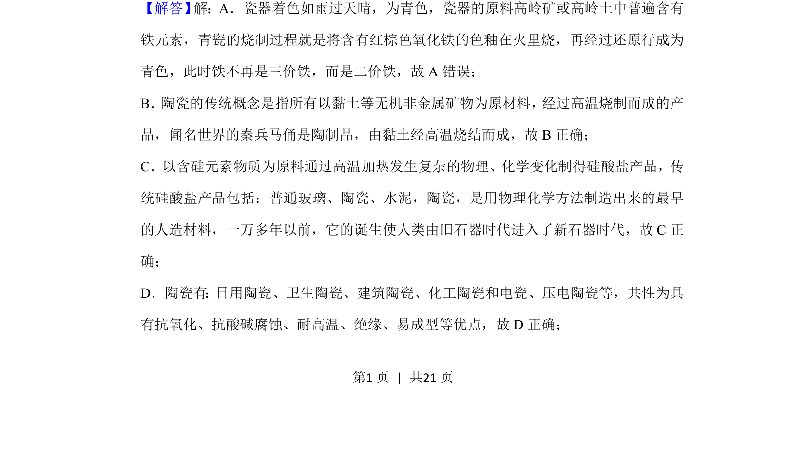
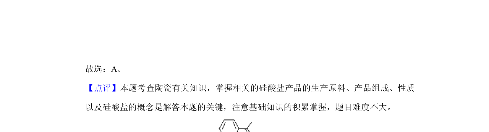

## 题面

## 摘要

考查陶瓷的化学成分、性质及制备，辨析瓷器青色来源

## 关联考点

- [[226-硅酸盐|硅酸盐]]
- [[陶瓷]]
- [[121-铁锈|氧化铁]]
- [[传统无机非金属材料]]

## 答案与解析

> 📄 原 PDF 第 1 页：`素材/真题/湖南/2008-2024·（湖南）化学高考真题/2019年高考化学试卷（新课标Ⅰ）（解析卷）.pdf`

<!-- 题干文本-start -->
## 题干文本
1． （6分）陶瓷是火与土的结晶，是中华文明的象征之一，其形成、性质与化学有着密切的
关系。下列说法错误的是（　　）
A．“雨过天晴云破处”所描述的瓷器青色，来自氧化铁
B．闻名世界的秦兵马俑是陶制品，由黏土经高温烧结而成
C．陶瓷是应用较早的人造材料，主要化学成分是硅酸盐
D．陶瓷化学性质稳定，具有耐酸碱侵蚀、抗氧化等优点
<!-- 题干文本-end -->

<!-- 解析文本-start -->
## 解析文本
【分析】A．氧化铁为红棕色固体，陶瓷以青色为主，原因是烧瓷原料中含有氧化铁的色
釉，在烧制的过程中还原成青色；
B．黏土是制作砖瓦和陶瓷的主要原料，经高温烧结得到陶瓷制品；
C．传统硅酸盐产品包括：普通玻璃、陶瓷、水泥，含有硅酸根离子的盐属于硅酸盐，陶
瓷是应用较早的人造材料；
D．陶瓷是陶器和瓷器的总称，是以粘土为主要原料以及各种天然矿物经过粉碎混炼、成
型和煅烧制得的材料以及各种制品。
【解答】 解：A．瓷器着色如雨过天晴，为青色，瓷器的原料高岭矿或高岭土中普遍含有
铁元素，青瓷的烧制过程就是将含有红棕色氧化铁的色釉在火里烧，再经过还原行成为
青色，此时铁不再是三价铁，而是二价铁，故A错误；
B．陶瓷的传统概念是指所有以黏土等无机非金属矿物为原材料，经过高温烧制而成的产
品，闻名世界的秦兵马俑是陶制品，由黏土经高温烧结而成，故B正确；
C．以含硅元素物质为原料通过高温加热发生复杂的物理、化学变化制得硅酸盐产品，传
统硅酸盐产品包括：普通玻璃、陶瓷、水泥，陶瓷，是用物理化学方法制造出来的最早
的人造材料，一万多年以前，它的诞生使人类由旧石器时代进入了新石器时代，故C正
确；
D．陶瓷有：日用陶瓷、卫生陶瓷、建筑陶瓷、化工陶瓷和电瓷、压电陶瓷等，共性为具
有抗氧化、抗酸碱腐蚀、耐高温、绝缘、易成型等优点，故D正确；
<!-- 解析文本-end -->
