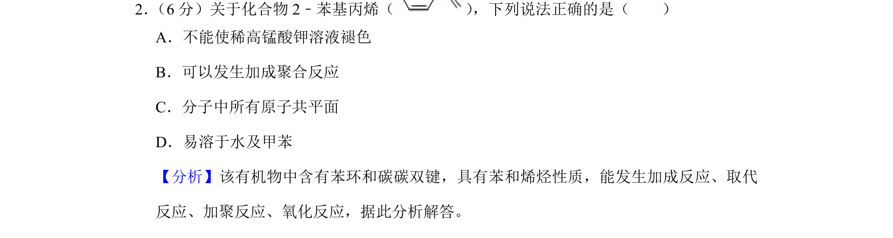
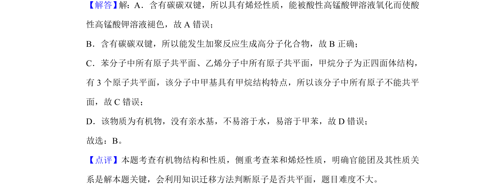

## 题面

## 摘要

考查2-苯基丙烯结构性质，涉及官能团反应、共平面和溶解性判断

## 关联考点

- [[999-烯烃性质|烯烃性质]]
- [[1003-苯的同系物性质|苯的同系物性质]]
- [[原子共平面判断]]
- [[有机物溶解性]]

## 答案与解析

> 📄 原 PDF 第 2 页：`素材/真题/湖南/2008-2024·（湖南）化学高考真题/2019年高考化学试卷（新课标Ⅰ）（解析卷）.pdf`

<!-- 题干文本-start -->
## 题干文本
2． （6分）关于化合物2﹣苯基丙烯（ ） ，下列说法正确的是（　　）
A．不能使稀高锰酸钾溶液褪色
B．可以发生加成聚合反应
C．分子中所有原子共平面
D．易溶于水及甲苯
<!-- 题干文本-end -->

<!-- 解析文本-start -->
## 解析文本
【分析】该有机物中含有苯环和碳碳双键，具有苯和烯烃性质，能发生加成反应、取代
反应、加聚反应、氧化反应，据此分析解答。
【解答】 解：A．含有碳碳双键，所以具有烯烃性质，能被酸性高锰酸钾溶液氧化而使酸
性高锰酸钾溶液褪色，故A错误；
B．含有碳碳双键，所以能发生加聚反应生成高分子化合物，故B正确；
C．苯分子中所有原子共平面、乙烯分子中所有原子共平面，甲烷分子为正四面体结构，
有3个原子共平面，该分子中甲基具有甲烷结构特点，所以该分子中所有原子不能共平
面，故C错误；
D．该物质为有机物，没有亲水基，不易溶于水，易溶于甲苯，故D错误；
故选：B。
【点评】本题考查有机物结构和性质，侧重考查苯和烯烃性质，明确官能团及其性质关
系是解本题关键，会利用知识迁移方法判断原子是否共平面，题目难度不大。
<!-- 解析文本-end -->
