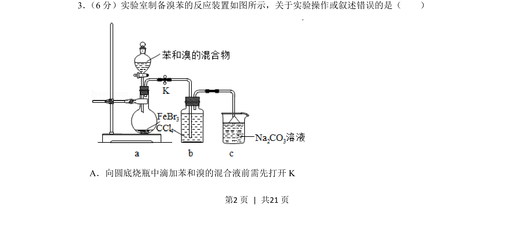
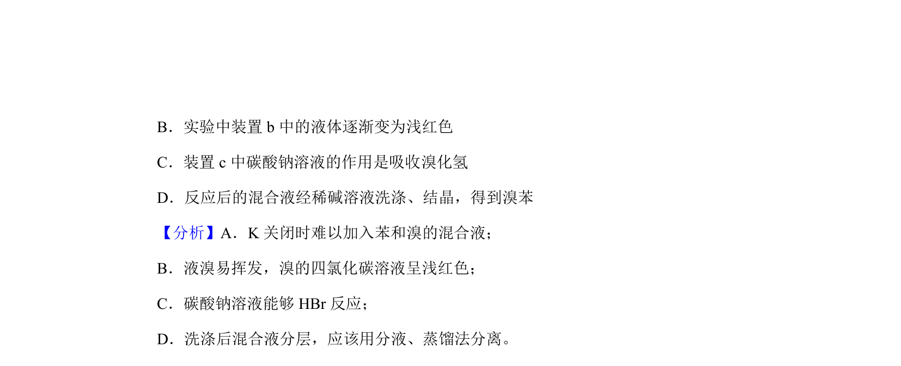
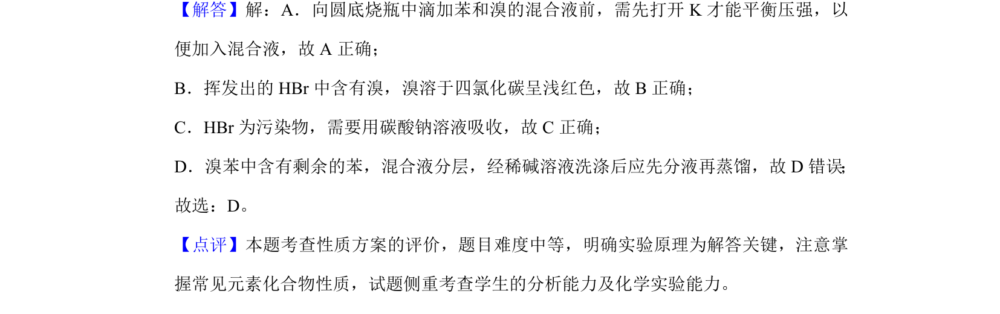

## 题面

## 摘要

实验室制备溴苯的实验装置与操作正误判断

## 关联考点

- [[溴苯制备]]
- [[580-实验操作|实验操作]]
- [[反应装置]]
- [[安全操作]]

## 答案与解析

> 📄 原 PDF 第 2 页：`素材/真题/湖南/2008-2024·（湖南）化学高考真题/2019年高考化学试卷（新课标Ⅰ）（解析卷）.pdf`

<!-- 题干文本-start -->
## 题干文本
3． （6分）实验室制备溴苯的反应装置如图所示，关于实验操作或叙述错误的是（　　）
A．向圆底烧瓶中滴加苯和溴的混合液前需先打开K
<!-- 题干文本-end -->

<!-- 解析文本-start -->
## 解析文本

<!-- 解析文本-end -->
