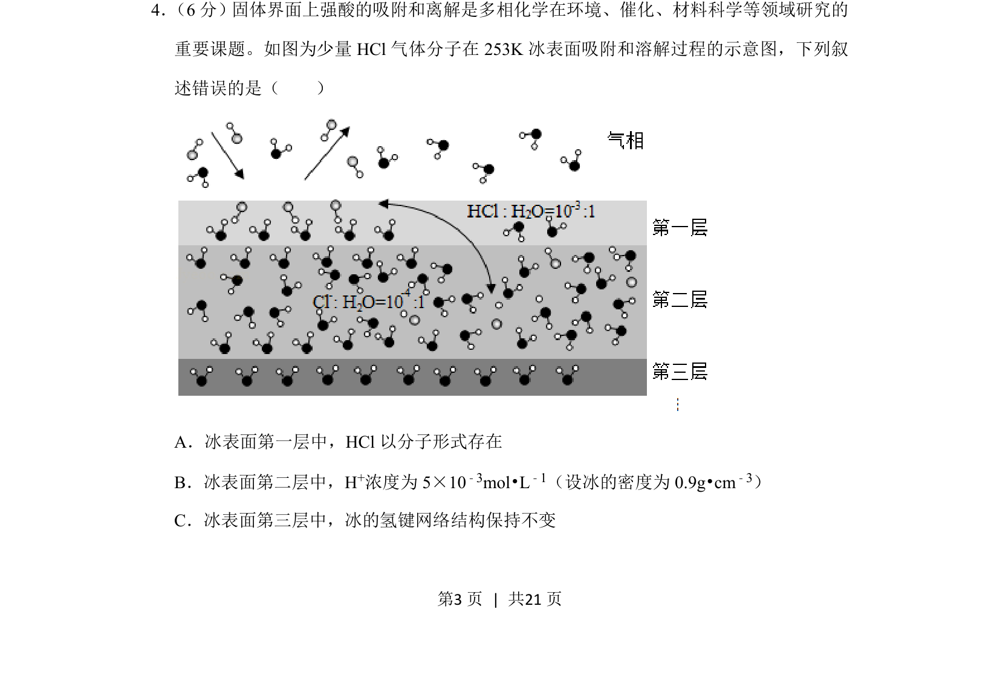
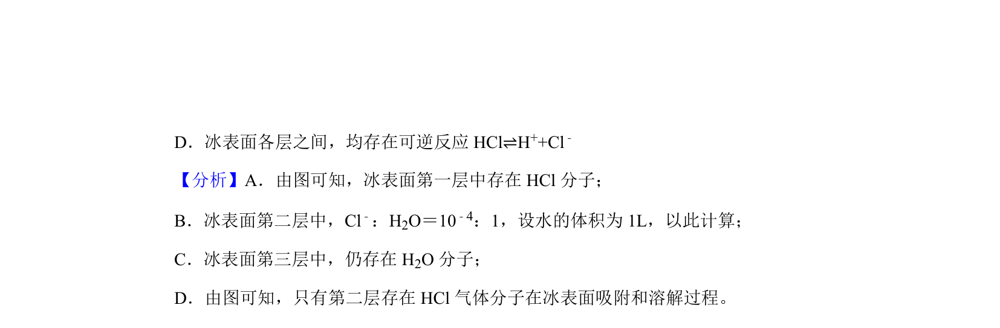
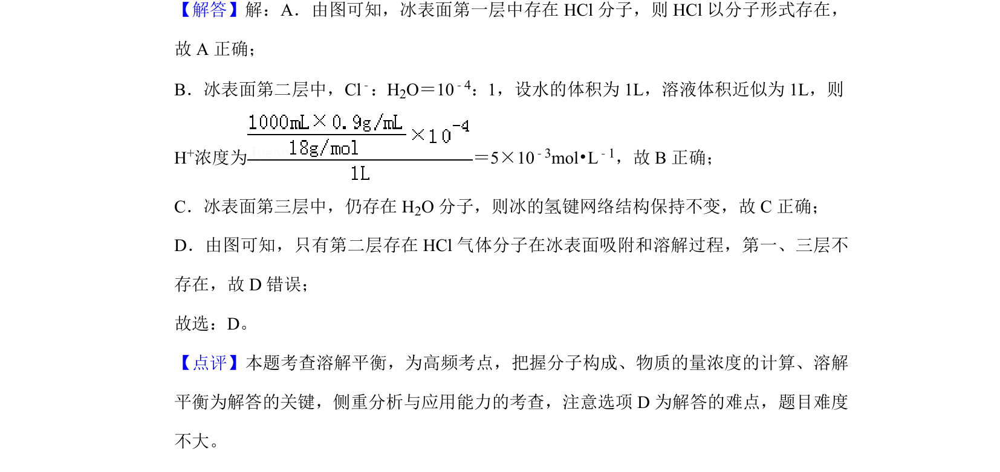

## 题面

## 摘要

HCl在冰表面吸附与溶解的存在形式、H⁺浓度计算及氢键网络变化的判断

## 关联考点

- [[071-吸附|吸附]]
- [[离解]]
- [[氢键网络]]
- [[氢离子浓度计算]]

## 答案与解析

> 📄 原 PDF 第 3 页：`素材/真题/湖南/2008-2024·（湖南）化学高考真题/2019年高考化学试卷（新课标Ⅰ）（解析卷）.pdf`

<!-- 题干文本-start -->
## 题干文本
4． （6分）固体界面上强酸的吸附和离解是多相化学在环境、催化、材料科学等领域研究的
重要课题。如图为少量HCl气体分子在253K冰表面吸附和溶解过程的示意图，下列叙
述错误的是（　　）
A．冰表面第一层中，HCl以分子形式存在
B．冰表面第二层中，H+浓度为5×10 ﹣3mol•L﹣1（设冰的密度为0.9g•cm ﹣3）
C．冰表面第三层中，冰的氢键网络结构保持不变
<!-- 题干文本-end -->

<!-- 解析文本-start -->
## 解析文本

<!-- 解析文本-end -->
