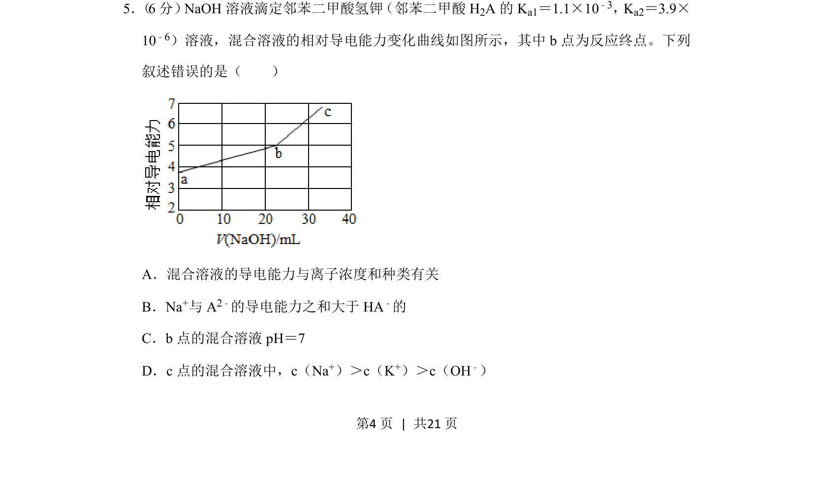
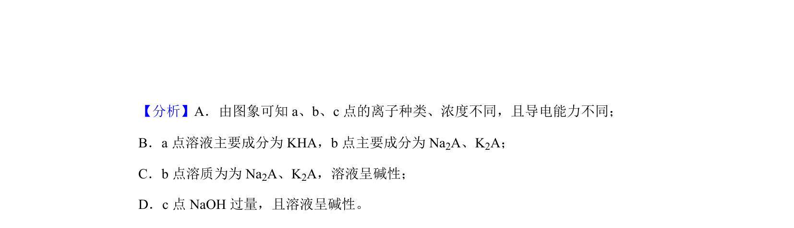
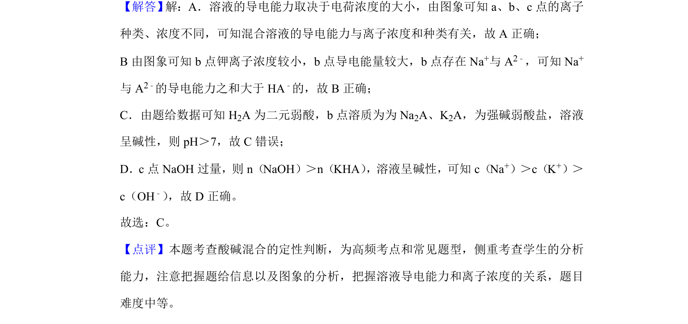

## 题面

## 摘要

NaOH滴定邻苯二甲酸氢钾溶液的导电能力变化与离子浓度关系分析

## 关联考点

- [[340-酸碱中和滴定|酸碱中和滴定]]
- [[979-溶液导电性|溶液导电性]]
- [[544-弱电解质电离平衡|弱电解质电离平衡]]
- [[337-离子浓度比较|离子浓度比较]]

## 答案与解析

> 📄 原 PDF 第 4 页：`素材/真题/湖南/2008-2024·（湖南）化学高考真题/2019年高考化学试卷（新课标Ⅰ）（解析卷）.pdf`
