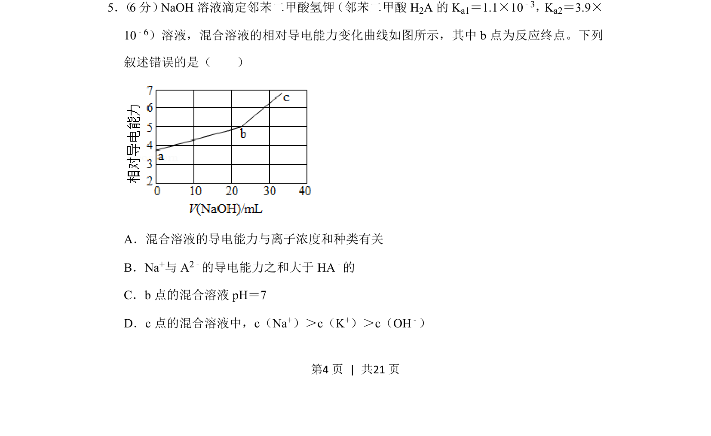
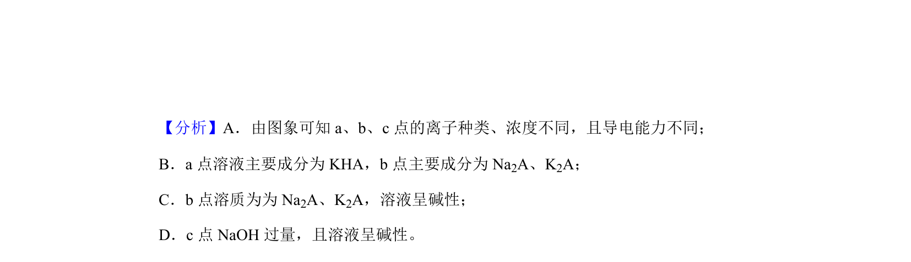
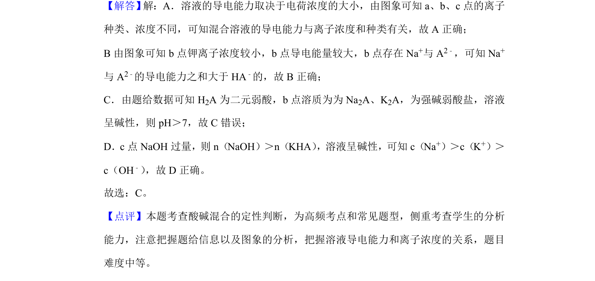

## 题面

## 摘要

NaOH滴定邻苯二甲酸氢钾溶液的导电能力变化与离子浓度关系分析

## 关联考点

- [[340-酸碱中和滴定|酸碱中和滴定]]
- [[979-溶液导电性|溶液导电性]]
- [[928-弱电解质的电离平衡|弱电解质电离平衡]]
- [[337-离子浓度比较|离子浓度比较]]

## 答案与解析

> 📄 原 PDF 第 4 页：`素材/真题/湖南/2008-2024·（湖南）化学高考真题/2019年高考化学试卷（新课标Ⅰ）（解析卷）.pdf`

<!-- 题干文本-start -->
## 题干文本
5． （6分）NaOH溶液滴定邻苯二甲酸氢钾 （邻苯二甲酸H2A的K a1＝1.1×10﹣3，Ka2＝3.9×
10﹣6）溶液，混合溶液的相对导电能力变化曲线如图所示，其中b点为反应终点。下列
叙述错误的是（　　）
A．混合溶液的导电能力与离子浓度和种类有关
B．Na+与A 2﹣的导电能力之和大于HA ﹣的
C．b点的混合溶液pH＝7
D．c点的混合溶液中，c（Na +）＞c（K+）＞c（OH﹣）
<!-- 题干文本-end -->

<!-- 解析文本-start -->
## 解析文本

<!-- 解析文本-end -->
