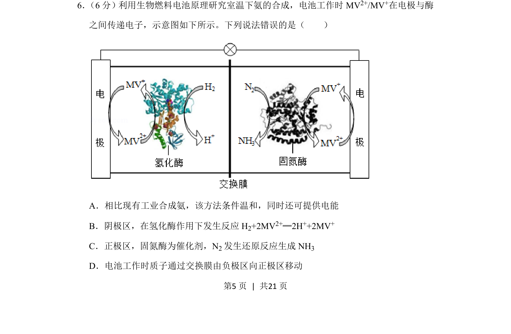
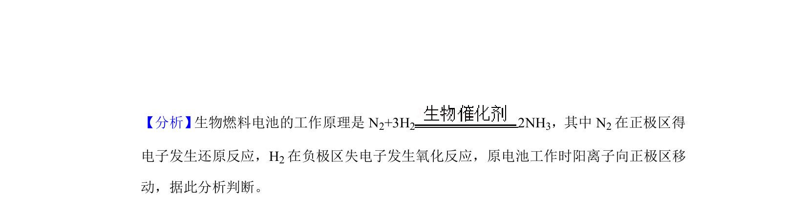
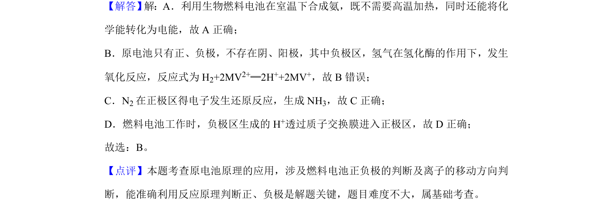

## 题面

## 摘要

该题以生物燃料电池合成氨为情境，考查原电池工作原理及电极反应判断。

## 关联考点

- [[641-原电池原理|原电池原理]]
- [[794-电极反应式|电极反应式]]
- [[离子移动方向]]
- [[合成氨条件]]

## 答案与解析

> 📄 原 PDF 第 5 页：`素材/真题/湖南/2008-2024·（湖南）化学高考真题/2019年高考化学试卷（新课标Ⅰ）（解析卷）.pdf`
