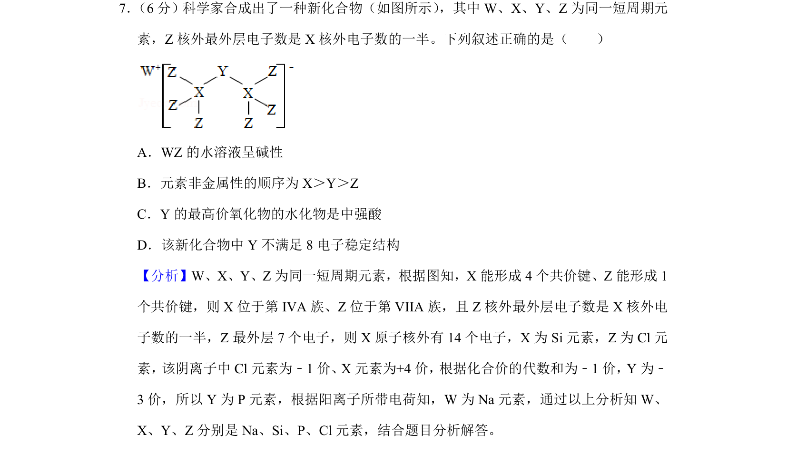
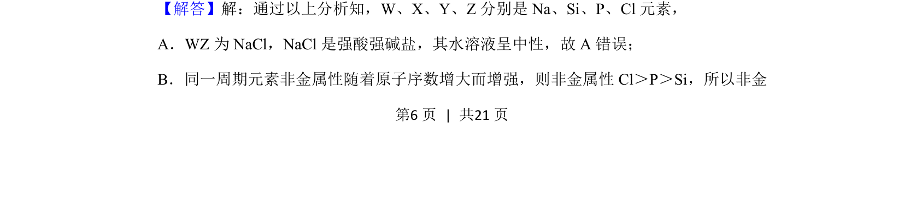
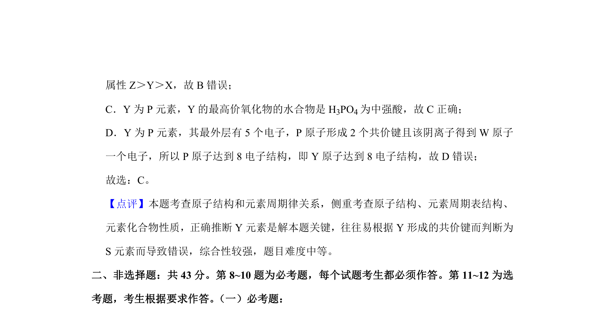

## 题面

## 摘要

本题通过短周期元素推断考查元素周期律、物质结构与性质的应用。

## 关联考点

- [[252-元素周期律|元素周期律]]
- [[426-原子结构|原子结构]]
- [[784-物质结构|物质结构]]
- [[525-化合物性质|化合物性质]]

## 答案与解析

> 📄 原 PDF 第 6 页：`素材/真题/湖南/2008-2024·（湖南）化学高考真题/2019年高考化学试卷（新课标Ⅰ）（解析卷）.pdf`
