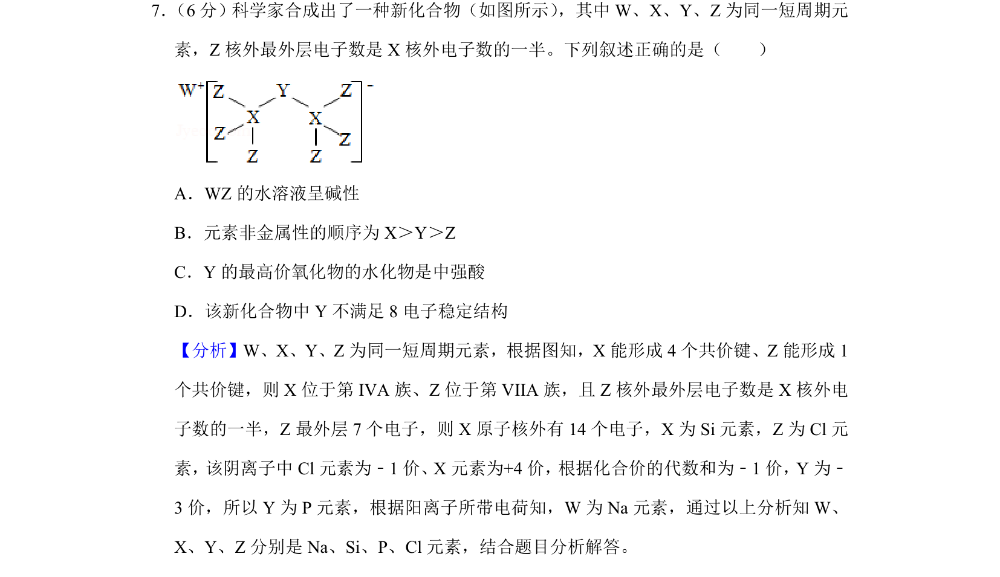
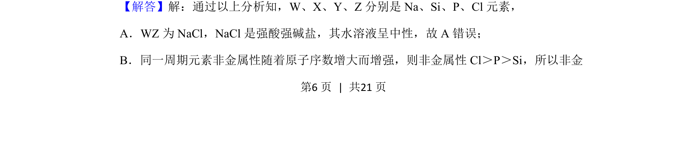
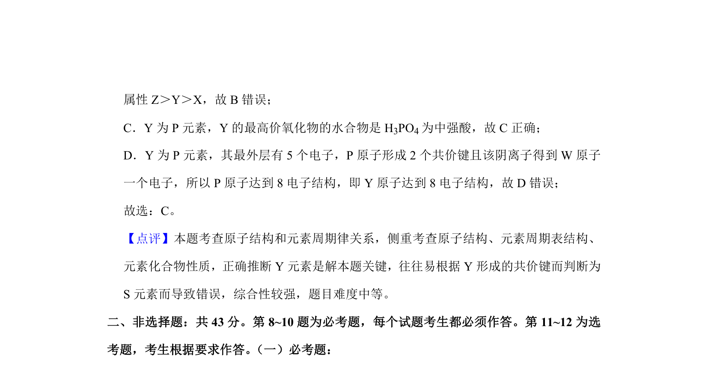

## 题面

## 摘要

本题通过短周期元素推断考查元素周期律、物质结构与性质的应用。

## 关联考点

- [[252-元素周期律|元素周期律]]
- [[426-原子结构|原子结构]]
- [[784-物质结构|物质结构]]
- [[525-化合物性质|化合物性质]]

## 答案与解析

> 📄 原 PDF 第 6 页：`素材/真题/湖南/2008-2024·（湖南）化学高考真题/2019年高考化学试卷（新课标Ⅰ）（解析卷）.pdf`

<!-- 题干文本-start -->
## 题干文本
7． （6分）科学家合成出了一种新化合物（如图所示） ，其中W、X、Y、Z为同一短周期元
素，Z核外最外层电子数是X核外电子数的一半。下列叙述正确的是（　　）
A．WZ的水溶液呈碱性
B．元素非金属性的顺序为X＞Y＞Z
C．Y的最高价氧化物的水化物是中强酸
D．该新化合物中Y不满足8电子稳定结构
<!-- 题干文本-end -->

<!-- 解析文本-start -->
## 解析文本
【分析】W、X、Y、Z为同一短周期元素，根据图知，X能形成4个共价键、Z能形成1
个共价键，则X位于第IVA族、Z位于第VIIA族，且Z核外最外层电子数是X核外电
子数的一半，Z最外层7个电子，则X原子核外有14个电子，X为Si元素，Z为Cl元
素， 该阴离子中Cl元素为﹣1价、X元素为+4价， 根据化合价的代数和为﹣1价，Y为﹣
3价，所以Y为P元素，根据阳离子所带电荷知，W为Na元素，通过以上分析知W、
X、Y、Z分别是Na、Si、P、Cl元素，结合题目分析解答。
【解答】解：通过以上分析知，W、X、Y、Z分别是Na、Si、P、Cl元素，
A．WZ为NaCl，NaCl是强酸强碱盐，其水溶液呈中性，故A错误；
B．同一周期元素非金属性随着原子序数增大而增强，则非金属性Cl＞P＞Si，所以非金
<!-- 解析文本-end -->
