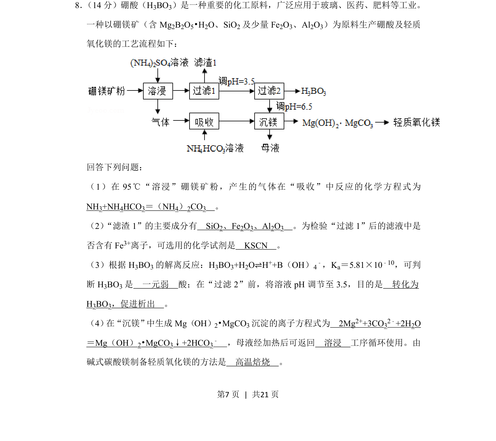
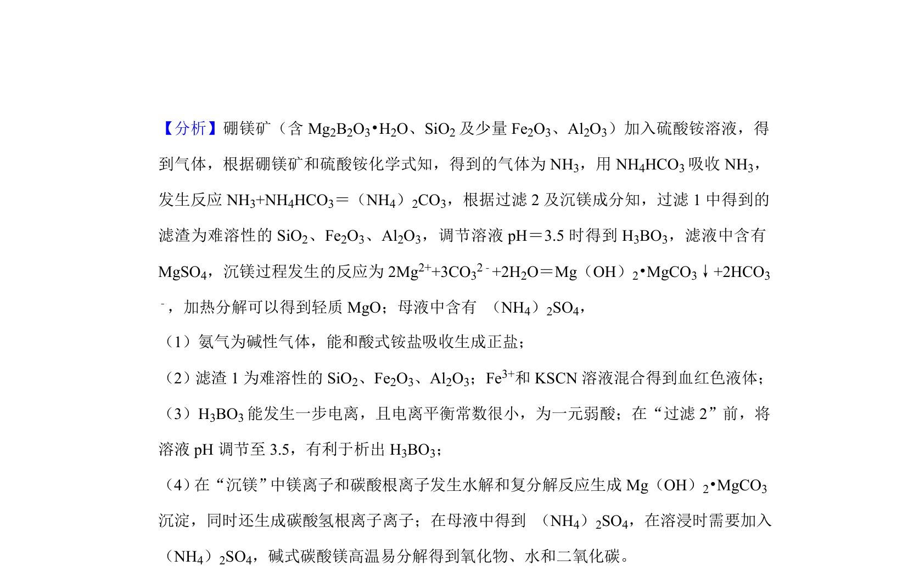
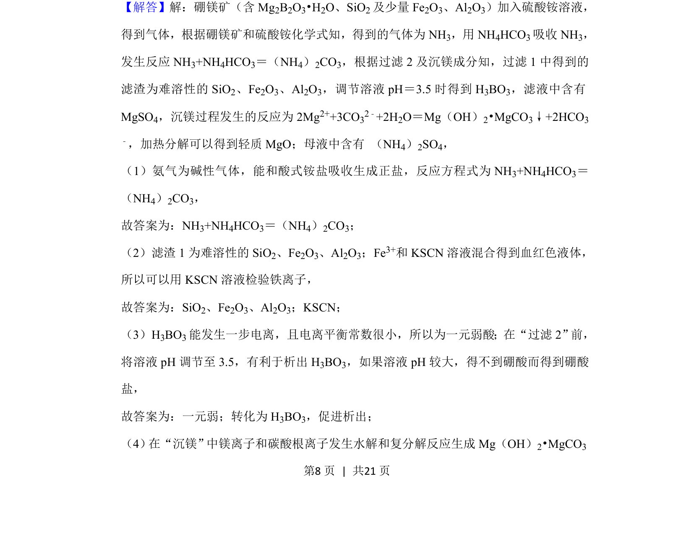
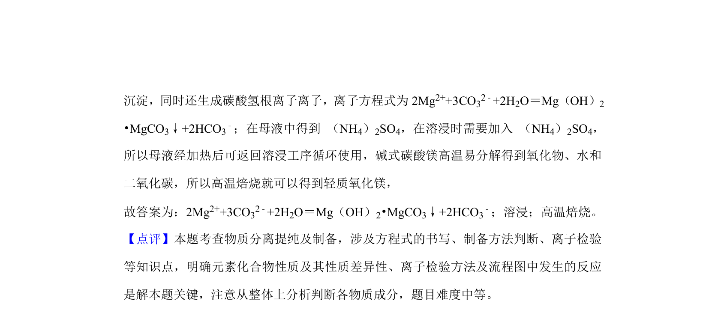

## 题面

## 摘要

以硼镁矿为原料的工艺流程，考查溶浸、分离提纯、离子检验及方程式书写等综合实验分析。

## 关联考点

- [[775-物质性质与处理|物质分离与提纯]]
- [[682-常见离子的检验方法|离子检验]]
- [[322-弱电解质电离|弱电解质电离]]
- [[806-离子方程式书写|离子方程式书写]]

## 答案与解析

> 📄 原 PDF 第 7 页：`素材/真题/湖南/2008-2024·（湖南）化学高考真题/2019年高考化学试卷（新课标Ⅰ）（解析卷）.pdf`
