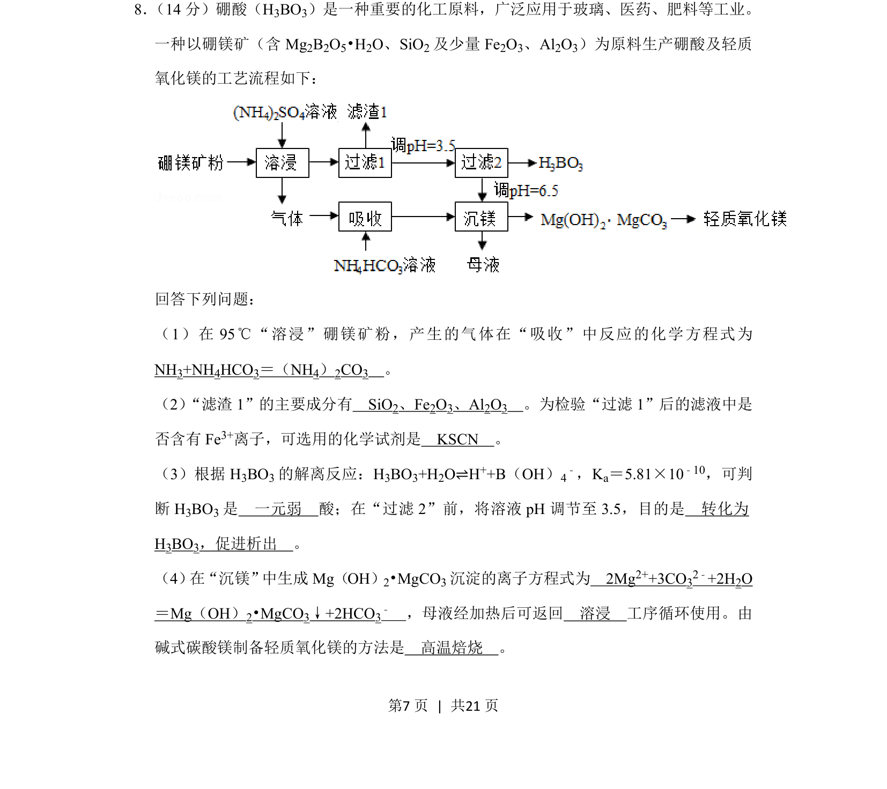
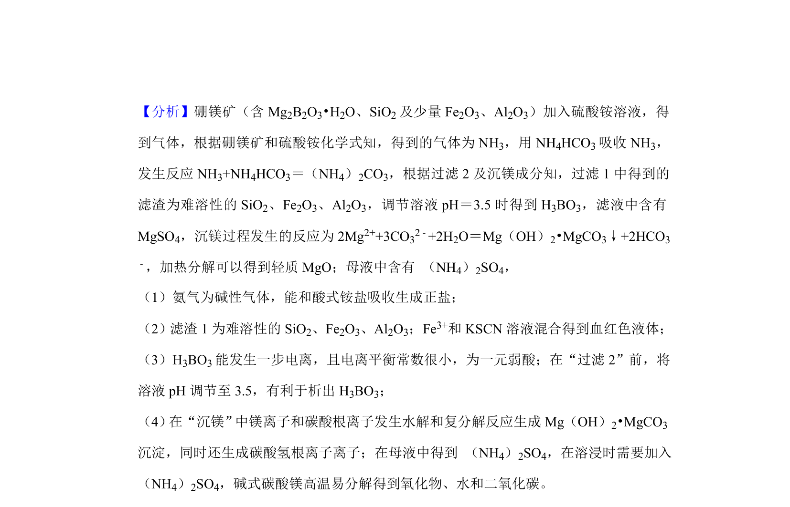
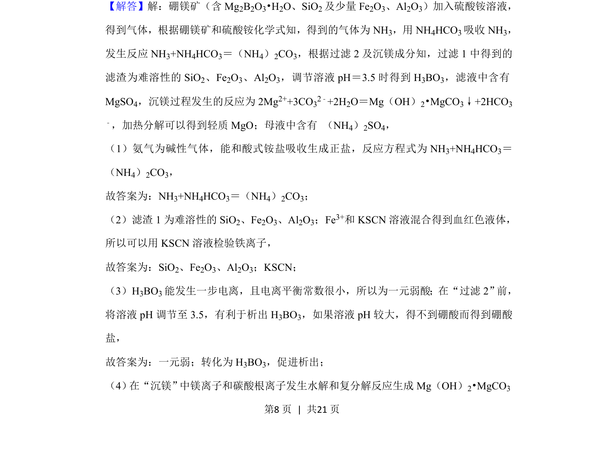
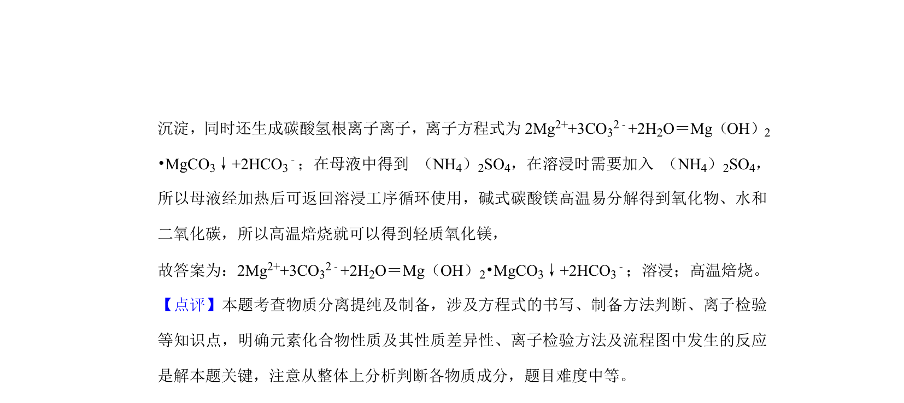

## 题面

## 摘要

以硼镁矿为原料的工艺流程，考查溶浸、分离提纯、离子检验及方程式书写等综合实验分析。

## 关联考点

- [[775-物质性质与处理|物质分离与提纯]]
- [[682-常见离子的检验方法|离子检验]]
- [[322-弱电解质电离|弱电解质电离]]
- [[807-离子方程式的书写|离子方程式书写]]

## 答案与解析

> 📄 原 PDF 第 7 页：`素材/真题/湖南/2008-2024·（湖南）化学高考真题/2019年高考化学试卷（新课标Ⅰ）（解析卷）.pdf`

<!-- 题干文本-start -->
## 题干文本
8． （14分）硼酸（H3BO3）是一种重要的化工原料，广泛应用于玻璃、医药、肥料等工业。
一种以硼镁矿（含Mg 2B2O5•H2O、SiO2及少量Fe 2O3、Al2O3）为原料生产硼酸及轻质
氧化镁的工艺流程如下：
回答下列问题：
（1）在95℃“溶浸”硼镁矿粉，产生的气体在“吸收”中反应的化学方程式为　
NH3+NH4HCO3＝（NH4）2CO3　。
（2）“滤渣1”的主要成分有　SiO2、Fe2O3、Al2O3　。为检验“过滤1”后的滤液中是
否含有Fe 3+离子，可选用的化学试剂是　KSCN　。
（3）根据H 3BO3的解离反应：H3BO3+H2O⇌H++B（OH）4
﹣，Ka＝5.81×10﹣10，可判
断H 3BO3是　一元弱　酸；在“过滤2”前，将溶液pH调节至3.5，目的是　转化为
H3BO3，促进析出　。
（4） 在“沉镁”中生成Mg（OH）2•MgCO3沉淀的离子方程式为　2Mg2++3CO32﹣+2H2O
＝Mg（OH）2•MgCO3↓+2HCO3
﹣　，母液经加热后可返回　溶浸　工序循环使用。由
碱式碳酸镁制备轻质氧化镁的方法是　高温焙烧　。
<!-- 题干文本-end -->

<!-- 解析文本-start -->
## 解析文本

<!-- 解析文本-end -->
