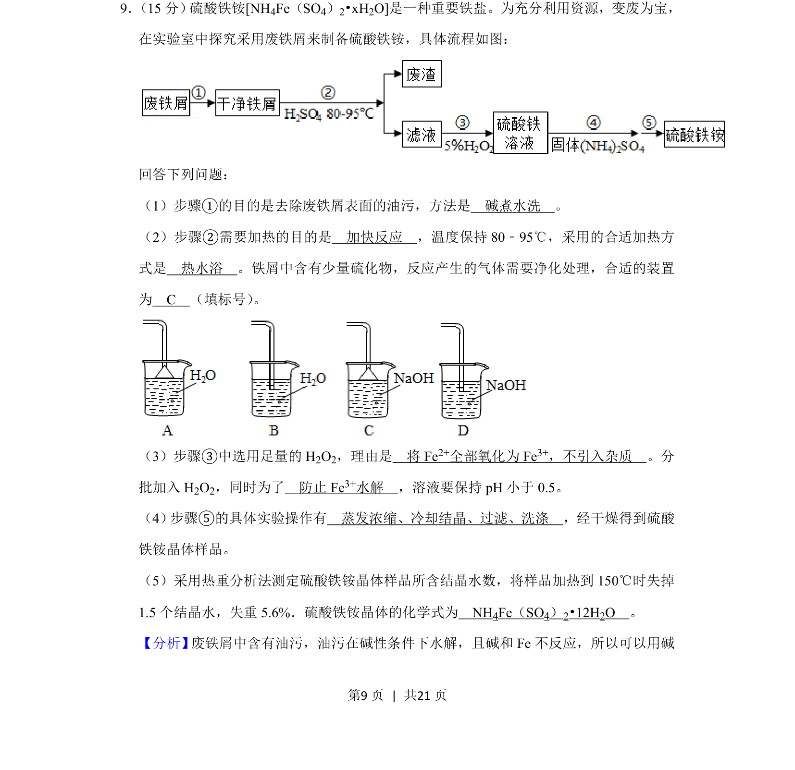
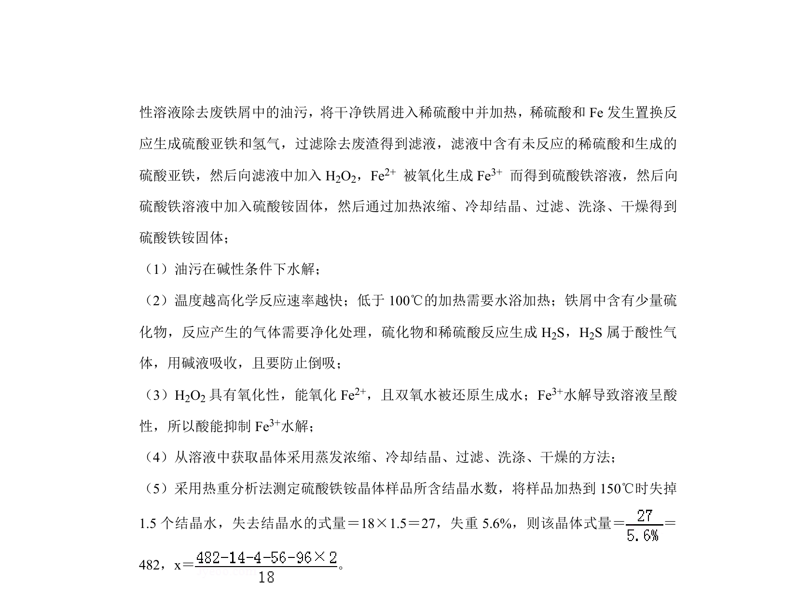
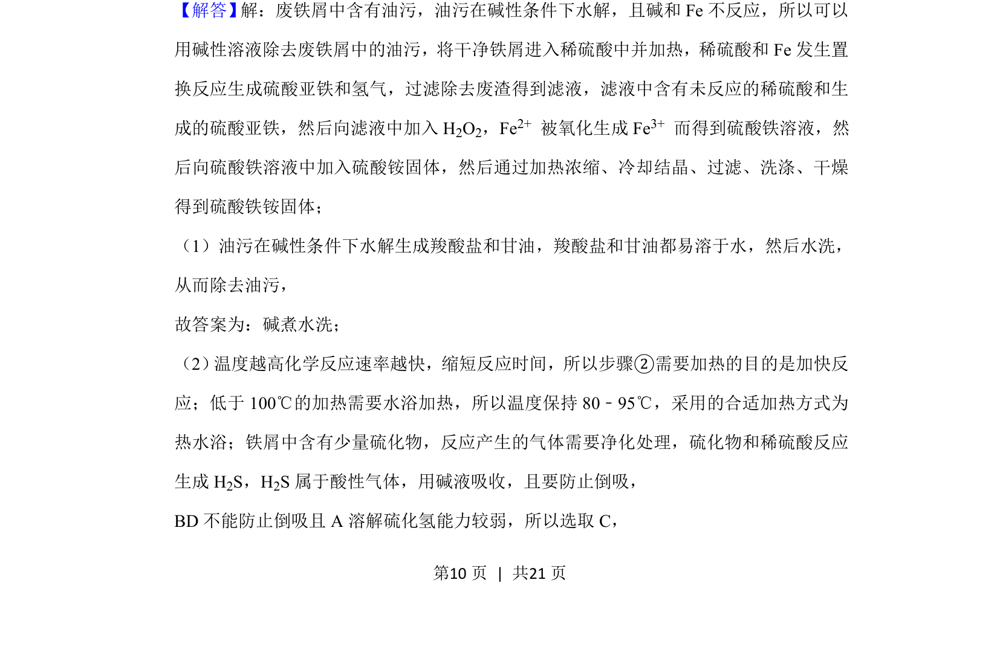
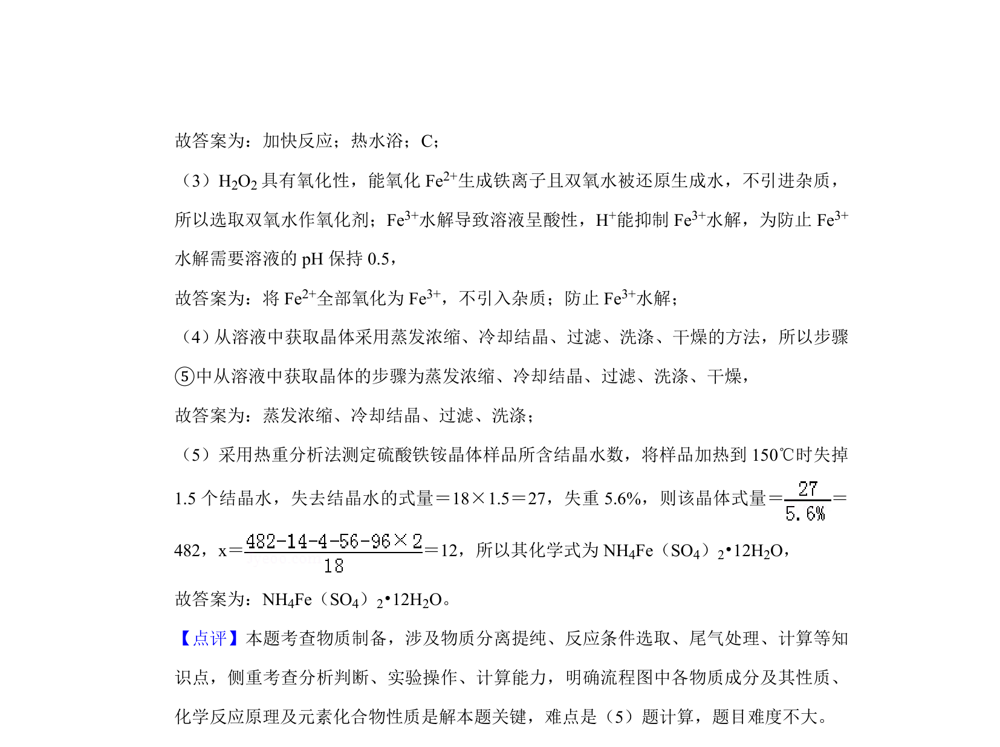

## 题面

## 摘要

以废铁屑制备硫酸铁铵的流程考查实验操作、条件控制与结晶水计算。

## 关联考点

- [[物质制备实验]]
- [[162-氧化还原反应|氧化还原反应]]
- [[防水解与pH控制]]
- [[结晶水计算]]

## 答案与解析

> 📄 原 PDF 第 9 页：`素材/真题/湖南/2008-2024·（湖南）化学高考真题/2019年高考化学试卷（新课标Ⅰ）（解析卷）.pdf`
