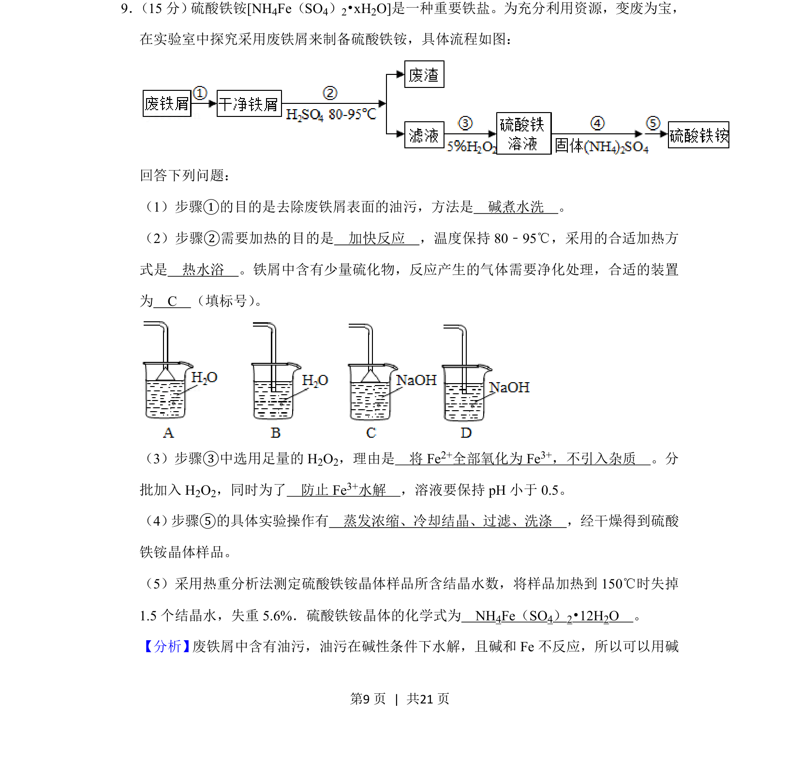
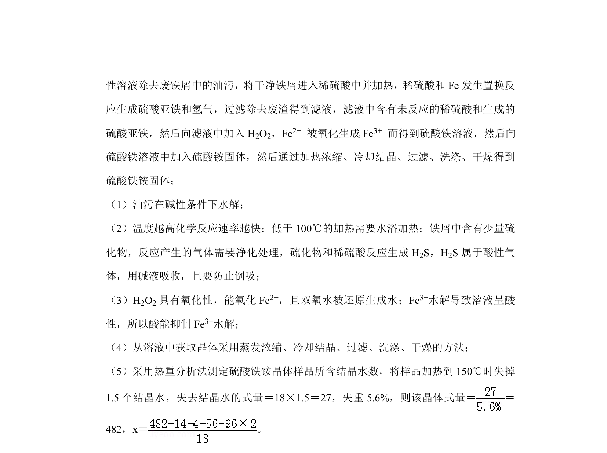
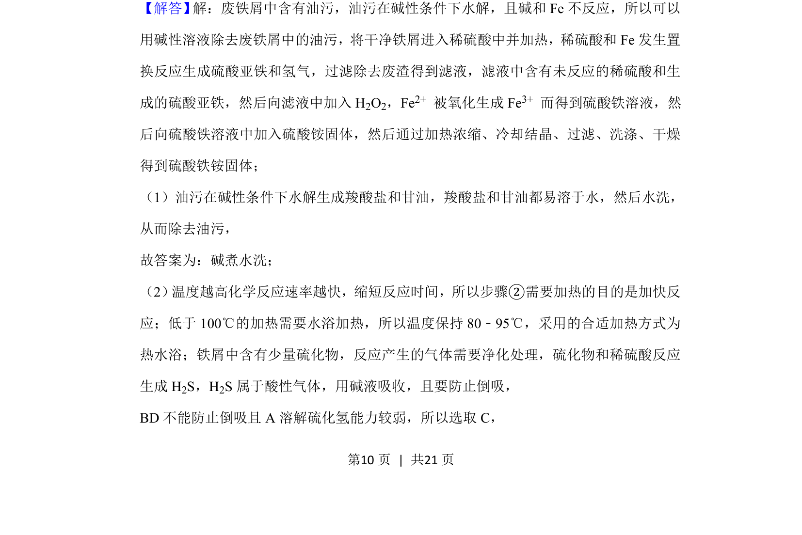
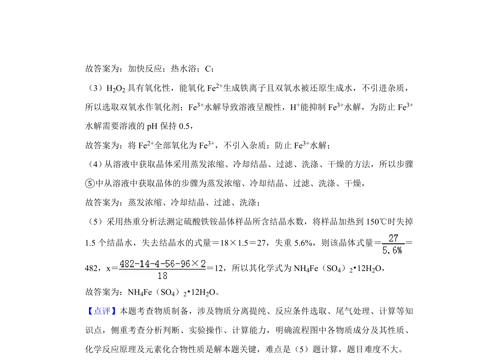

## 题面

## 摘要

以废铁屑制备硫酸铁铵的流程考查实验操作、条件控制与结晶水计算。

## 关联考点

- [[物质制备实验]]
- [[162-氧化还原反应|氧化还原反应]]
- [[防水解与pH控制]]
- [[结晶水计算]]

## 答案与解析

> 📄 原 PDF 第 9 页：`素材/真题/湖南/2008-2024·（湖南）化学高考真题/2019年高考化学试卷（新课标Ⅰ）（解析卷）.pdf`

<!-- 题干文本-start -->
## 题干文本
9． （15分） 硫酸铁铵[NH4Fe（SO4）2•xH2O]是一种重要铁盐。为充分利用资源，变废为宝，
在实验室中探究采用废铁屑来制备硫酸铁铵，具体流程如图：
回答下列问题：
（1）步骤①的目的是去除废铁屑表面的油污，方法是　碱煮水洗　。
（2）步骤②需要加热的目的是　加快反应　，温度保持80﹣95℃，采用的合适加热方
式是　热水浴　。铁屑中含有少量硫化物，反应产生的气体需要净化处理，合适的装置
为　C　（填标号） 。
（3）步骤③中选用足量的H 2O2，理由是　将Fe 2+全部氧化为Fe 3+，不引入杂质　。分
批加入H 2O2，同时为了　防止Fe 3+水解　，溶液要保持pH小于0.5。
（4） 步骤⑤的具体实验操作有　蒸发浓缩、冷却结晶、过滤、洗涤　，经干燥得到硫酸
铁铵晶体样品。
（5）采用热重分析法测定硫酸铁铵晶体样品所含结晶水数，将样品加热到150℃时失掉
1.5个结晶水，失重5.6%．硫酸铁铵晶体的化学式为　NH 4Fe（SO4）2•12H2O　。
<!-- 题干文本-end -->

<!-- 解析文本-start -->
## 解析文本
【分析】 废铁屑中含有油污，油污在碱性条件下水解，且碱和Fe不反应，所以可以用碱
<!-- 解析文本-end -->
