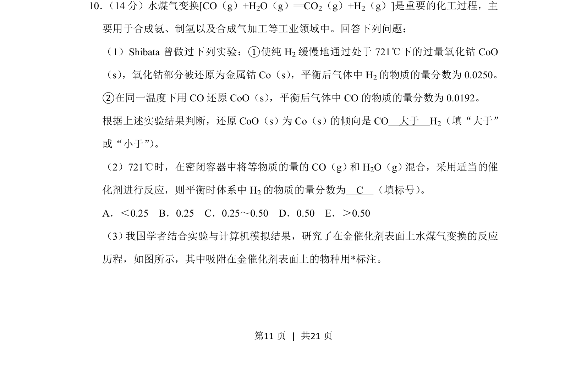
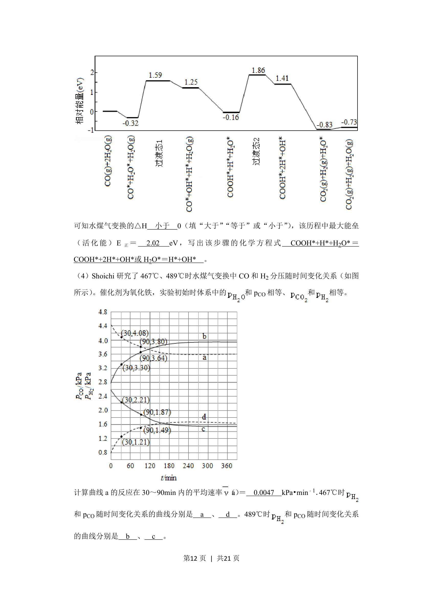
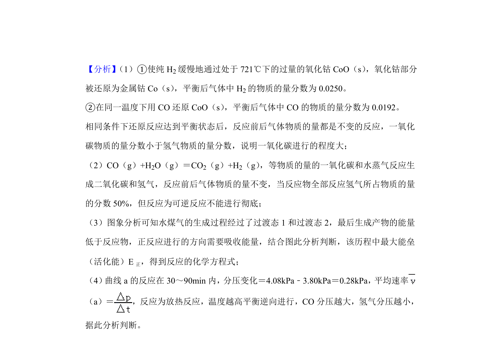
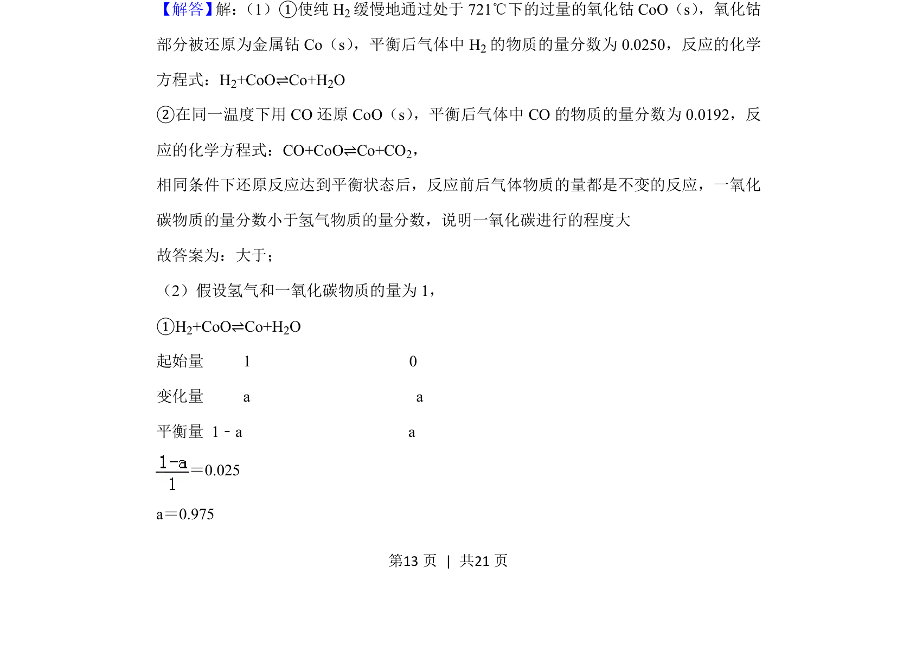
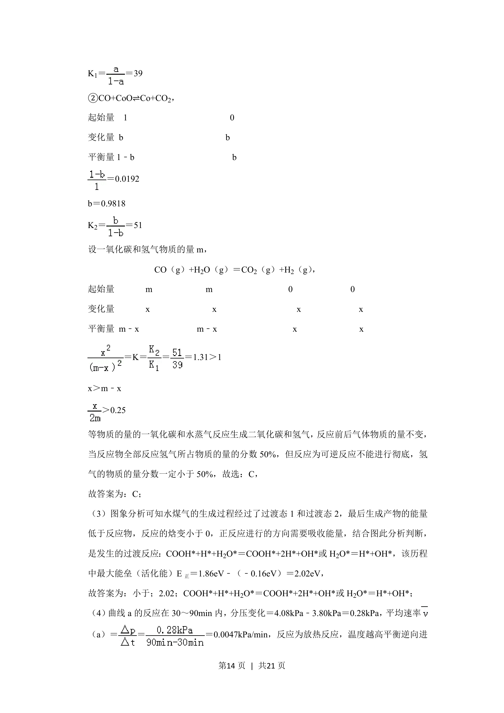
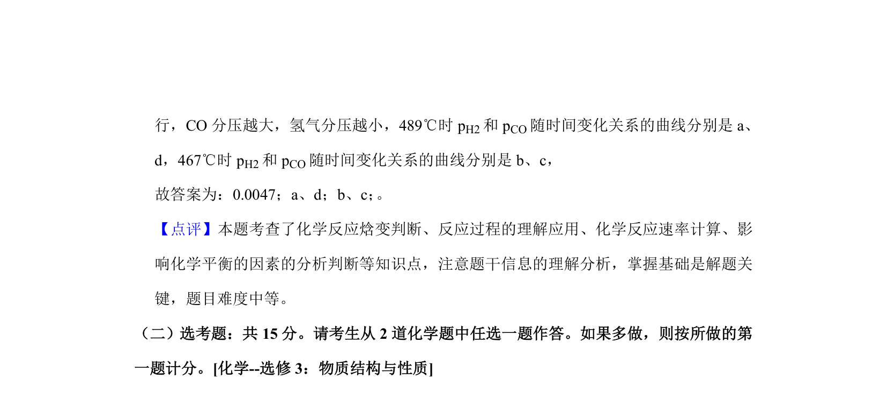

## 题面

## 摘要

水煤气变换反应中还原性比较、平衡分数计算与反应历程分析

## 关联考点

- [[284-化学平衡|化学平衡]]
- [[还原性比较]]
- [[物质的量分数]]
- [[993-反应历程|反应历程]]

## 答案与解析

> 📄 原 PDF 第 11 页：`素材/真题/湖南/2008-2024·（湖南）化学高考真题/2019年高考化学试卷（新课标Ⅰ）（解析卷）.pdf`
