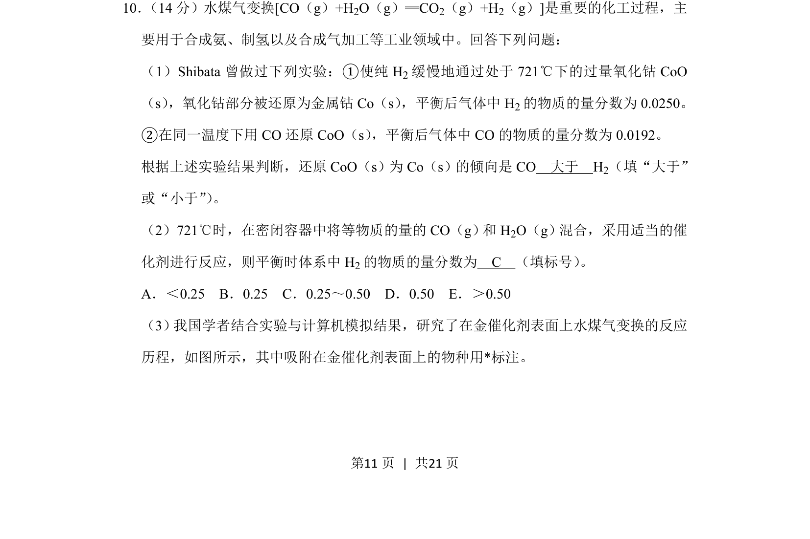
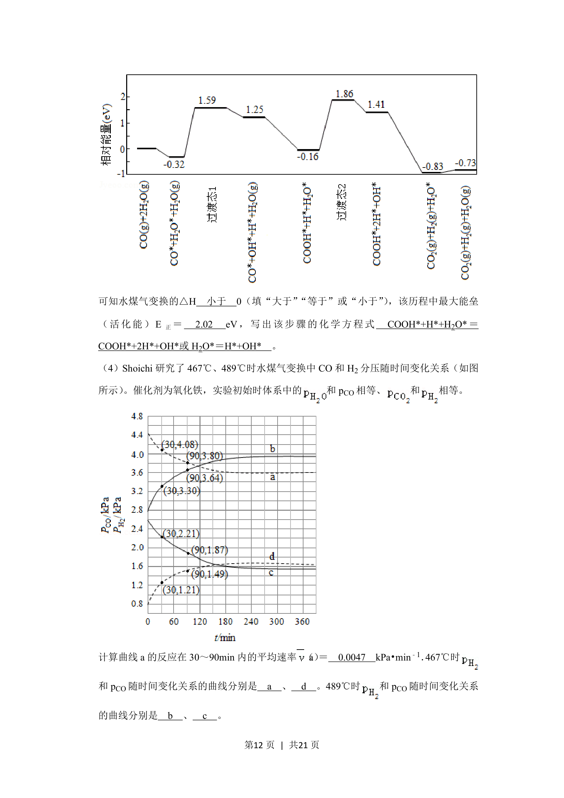
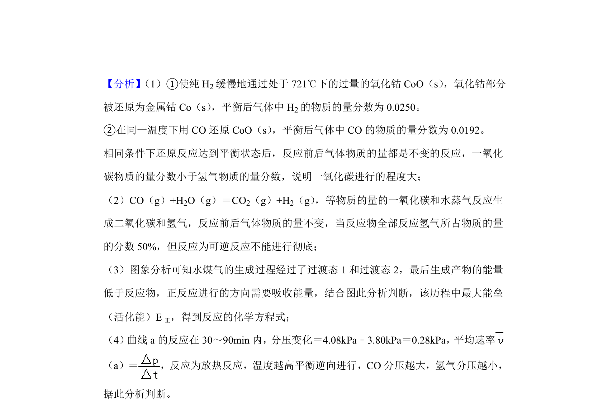
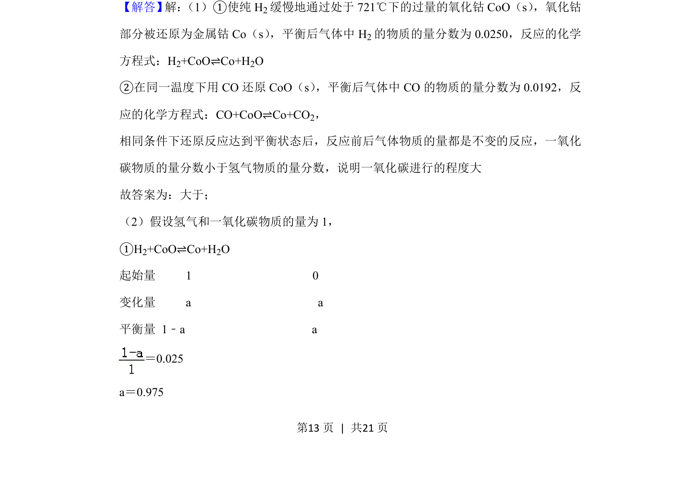
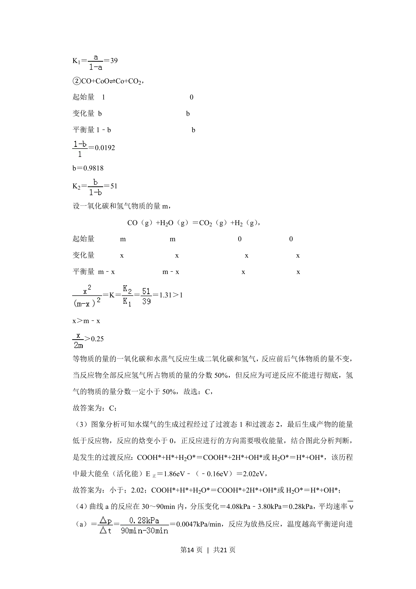
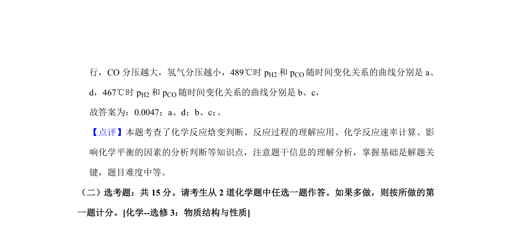

## 题面

## 摘要

水煤气变换反应中还原性比较、平衡分数计算与反应历程分析

## 关联考点

- [[284-化学平衡|化学平衡]]
- [[还原性比较]]
- [[物质的量分数]]
- [[993-反应历程|反应历程]]

## 答案与解析

> 📄 原 PDF 第 11 页：`素材/真题/湖南/2008-2024·（湖南）化学高考真题/2019年高考化学试卷（新课标Ⅰ）（解析卷）.pdf`

<!-- 题干文本-start -->
## 题干文本
10． （14分）水煤气变换[CO（g）+H2O（g）═CO2（g）+H2（g）]是重要的化工过程，主
要用于合成氨、制氢以及合成气加工等工业领域中。回答下列问题：
（1）Shibata曾做过下列实验：①使纯H 2缓慢地通过处于721℃下的过量氧化钴CoO
（s） ，氧化钴部分被还原为金属钴Co（s） ，平衡后气体中H2的物质的量分数为0.0250。
②在同一温度下用CO还原CoO（s） ，平衡后气体中CO的物质的量分数为0.0192。
根据上述实验结果判断，还原CoO（s）为Co（s）的倾向是CO　大于　H 2（填“大于”
或“小于”） 。
（2）721℃时，在密闭容器中将等物质的量的CO（g）和H 2O（g）混合，采用适当的催
化剂进行反应，则平衡时体系中H 2的物质的量分数为　C　（填标号） 。
A．＜0.25  B．0.25  C．0.25～0.50  D．0.50  E．＞0.50
（3） 我国学者结合实验与计算机模拟结果，研究了在金催化剂表面上水煤气变换的反应
历程，如图所示，其中吸附在金催化剂表面上的物种用*标注。
<!-- 题干文本-end -->

<!-- 解析文本-start -->
## 解析文本

<!-- 解析文本-end -->
