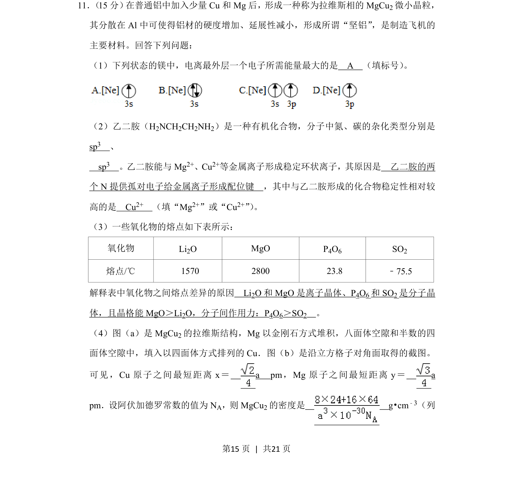
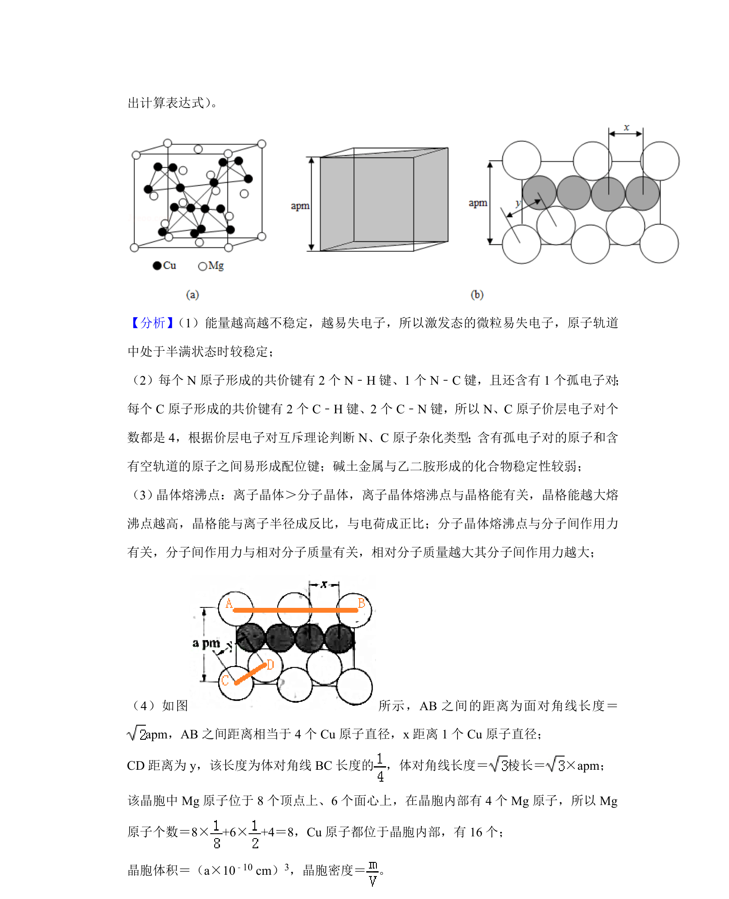
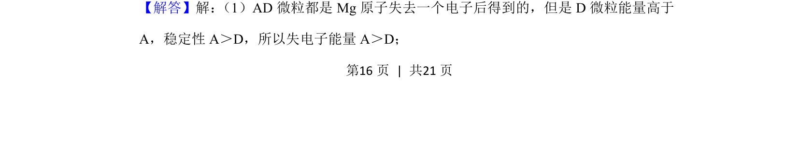
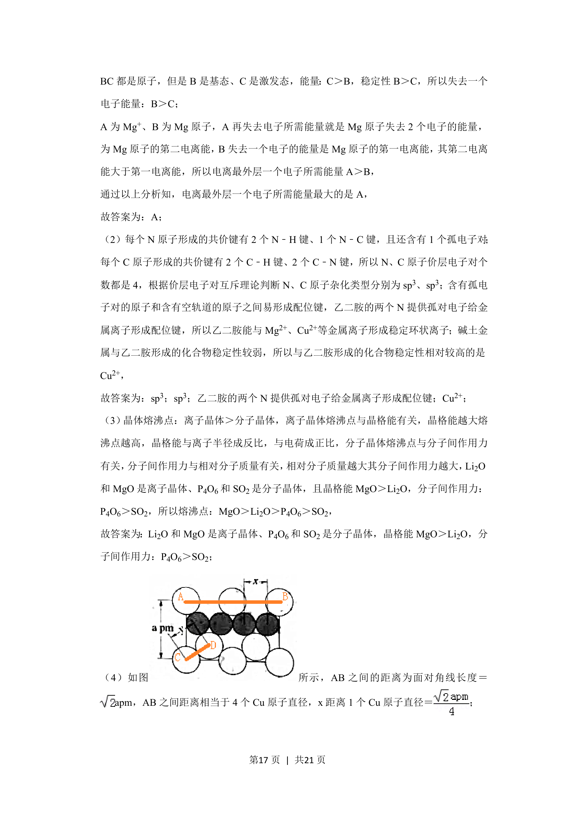
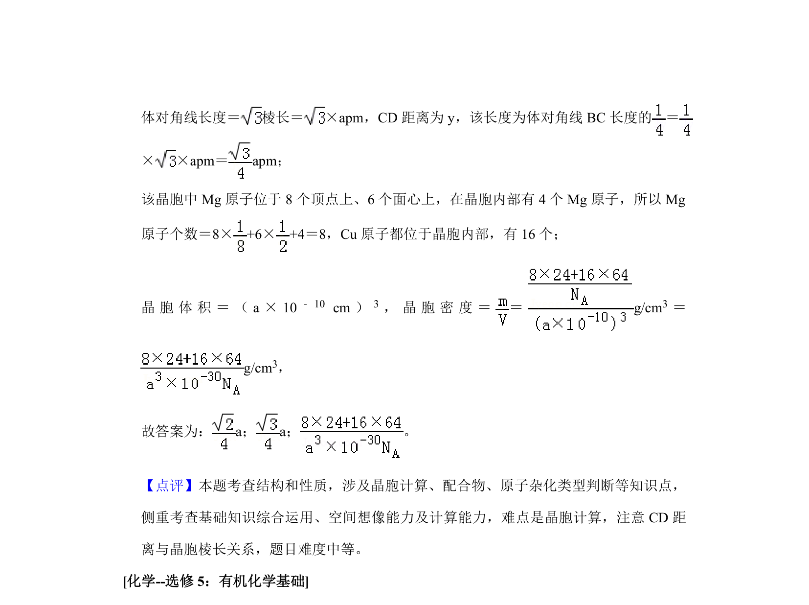

## 题面

## 摘要

考查拉维斯相MgCu2相关物质结构，涉及电离能、杂化、配位、晶体性质与晶胞计算。

## 关联考点

- [[390-电离能|电离能]]
- [[720-杂化轨道|杂化轨道]]
- [[440-配位键|配位键]]
- [[411-晶体类型|晶体类型]]
- [[702-晶胞计算|晶胞计算]]

## 答案与解析

> 📄 原 PDF 第 15 页：`素材/真题/湖南/2008-2024·（湖南）化学高考真题/2019年高考化学试卷（新课标Ⅰ）（解析卷）.pdf`
