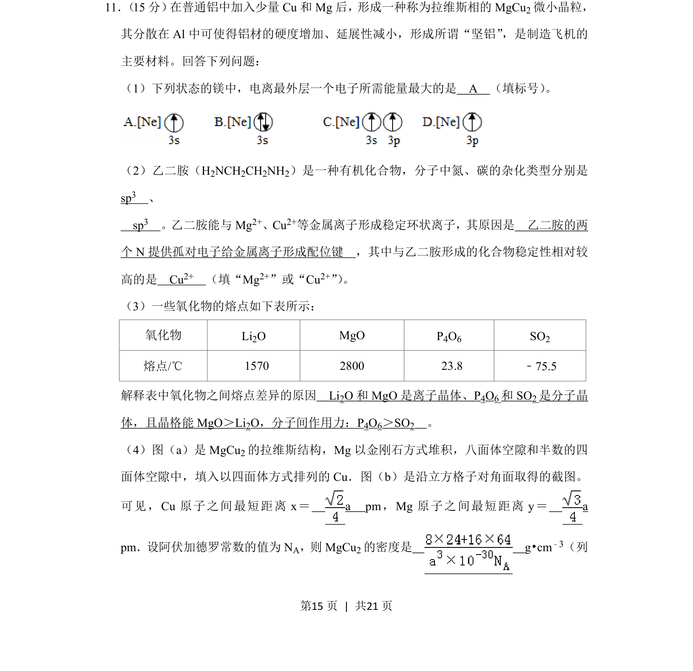
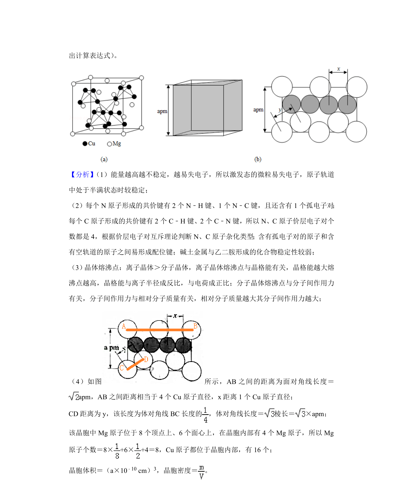
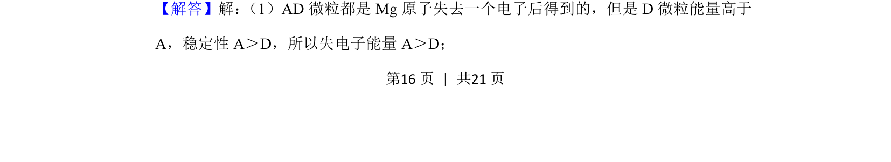
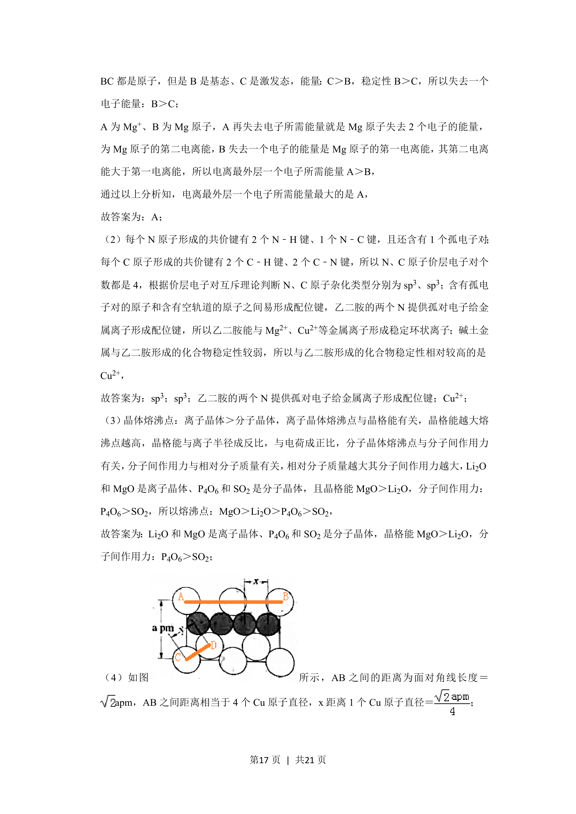
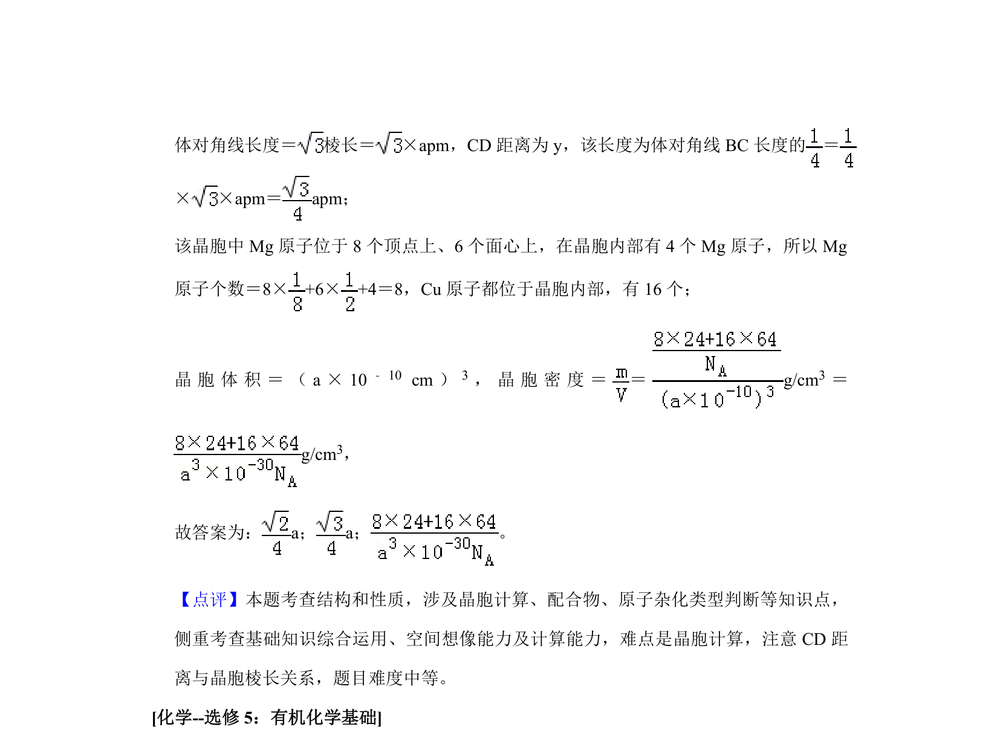

## 题面

## 摘要

考查拉维斯相MgCu2相关物质结构，涉及电离能、杂化、配位、晶体性质与晶胞计算。

## 关联考点

- [[390-电离能|电离能]]
- [[720-杂化轨道|杂化轨道]]
- [[440-配位键|配位键]]
- [[411-晶体类型|晶体类型]]
- [[702-晶胞计算|晶胞计算]]

## 答案与解析

> 📄 原 PDF 第 15 页：`素材/真题/湖南/2008-2024·（湖南）化学高考真题/2019年高考化学试卷（新课标Ⅰ）（解析卷）.pdf`

<!-- 题干文本-start -->
## 题干文本
11． （15分） 在普通铝中加入少量Cu和Mg后，形成一种称为拉维斯相的MgCu2微小晶粒，
其分散在Al中可使得铝材的硬度增加、延展性减小，形成所谓“坚铝”，是制造飞机的
主要材料。回答下列问题：
（1）下列状态的镁中，电离最外层一个电子所需能量最大的是　A　（填标号） 。
（2）乙二胺（H 2NCH2CH2NH2）是一种有机化合物，分子中氮、碳的杂化类型分别是　
sp3　、
　sp3　。乙二胺能与Mg 2+、Cu2+等金属离子形成稳定环状离子，其原因是　乙二胺的两
个N提供孤对电子给金属离子形成配位键　，其中与乙二胺形成的化合物稳定性相对较
高的是　Cu2+　（填“Mg2+”或“Cu2+”） 。
（3）一些氧化物的熔点如下表所示：
氧化物 Li2O MgO P4O6 SO2
熔点/℃  1570 2800  23.8 ﹣75.5
解释表中氧化物之间熔点差异的原因　Li2O和MgO是离子晶体、P 4O6和SO 2是分子晶
体，且晶格能MgO＞Li 2O，分子间作用力：P4O6＞SO2　。
（4）图（a）是MgCu 2的拉维斯结构，Mg以金刚石方式堆积，八面体空隙和半数的四
面体空隙中，填入以四面体方式排列的Cu．图（b）是沿立方格子对角面取得的截图。
可见，Cu原子之间最短距离x＝　 a　pm，Mg原子之间最短距离y＝　 a　
pm．设阿伏加德罗常数的值为N A，则MgCu 2的密度是　 　g•cm﹣3（列
<!-- 题干文本-end -->

<!-- 解析文本-start -->
## 解析文本

<!-- 解析文本-end -->
